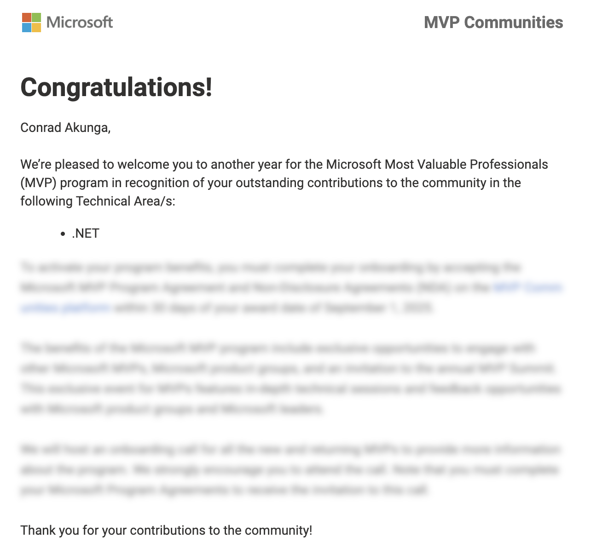
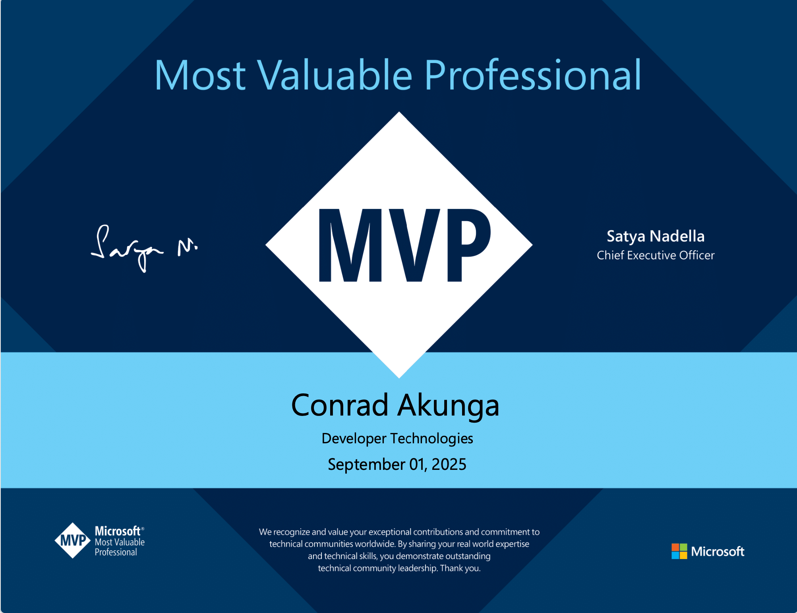
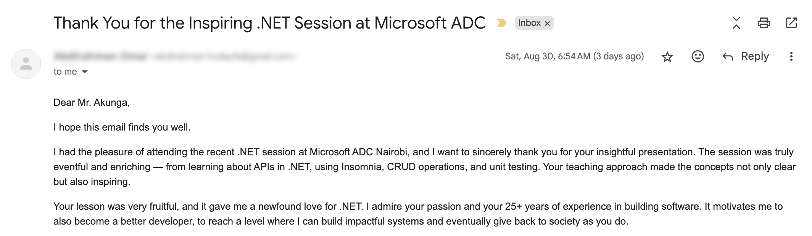

I was pleasantly surprised to get this email earlier today.

I have been admitted into the [Microsoft MVP Program](https://mvp.microsoft.com/).

Re-admitted, I should say, because I was a member for many years (from **2005**, if memory serves me right) until I voluntarily exited for personal reasons (had a motorcycle **accident** and recuperation)  in **2021**.

If I am not wrong, I was the first C# MVP from Kenya, and the third ever (**Edgar Okioga** and **Michael Owuor** were the first, in VB, if I recall right).

It came with the obligatory certificate.

The important takeaway for me is the recognition of **community work**. 

This year, I have written **243** blog posts on various software development topics. One for each day of the year.

I have always been, and will continue to be, an **avid advocate for the growth of local software development and technical communities in general**.

In a world that optimizes for YouTube Shorts, TikTok, LinkedIn, and algorithms, I strongly believe there will always be value in writing (blogging).

Writing is:

1. Easy to **search**
2. Easy to **skim** through
3. Requires almost no investment in **equipment**
4. Easy to **organize**
5. **Cheap**
6. Easily **cross-referencable**

It is also wholly hosted on **infrastructure** I control (hosting), in a **format** I control (Markdown), in a **location** I control (my domain).

How much impact have I had on the community?

I have no idea. Nor do I think it is possible to accurately measure.

But once in a while, I get an email like this that reminds me that everything you do, whether you know it or not, whether you can measure it or not, has an impact.

**And that is reason enough for me.**

Happy hacking!
