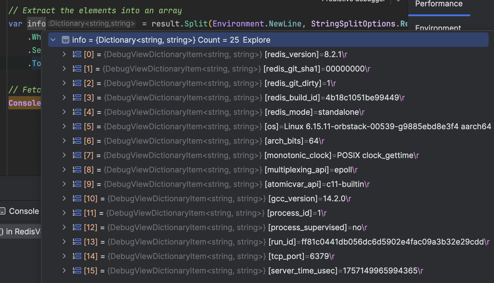

In our previous post, "[Getting the Version of Redis Connected in C# & .NET]()", we looked at how to get the version of the Redis instance we are connected to using the [StackExchange.Redis](https://github.com/StackExchange/StackExchange.Redis) package.

The caveat was that we needed to connect with **admin access** to call the `INFO` method natively in the library.

In this post, we will explore how to achieve the same result **without requiring admin access**.

Since we cannot natively call the `Info` method of the `Server` object, we need to change our approach slightly.

We can call the `Execute` method of the `Database` object and use that to directly run the `INFO` command.

This returns a long `string` with all of the configuration information as follows:

```plaintext
# Server
redis_version:8.2.1
redis_git_sha1:00000000
redis_git_dirty:1
redis_build_id:4b18c1051be99449
redis_mode:standalone
os:Linux 6.15.11-orbstack-00539-g9885ebd8e3f4 aarch64
arch_bits:64
monotonic_clock:POSIX clock_gettime
multiplexing_api:epoll
atomicvar_api:c11-builtin
gcc_version:14.2.0
process_id:1
process_supervised:no
run_id:ff81c0441db056dc6d5902e4fac09a3b32e29cdd
tcp_port:6379
server_time_usec:1757148739172274
uptime_in_seconds:395229
uptime_in_days:4
hz:10
configured_hz:10
lru_clock:12318275
executable:/data/redis-server
config_file:
io_threads_active:0
listener0:name=tcp,bind=*,bind=-::*,port=6379
```

From this, we can extract the line we want, which starts with `redis_version`.

One way to approach this is to extract the large `string` into a `Dictionary`, which will be easier to examine and query.

The code will look something like this:

```c#
using StackExchange.Redis;

// Connect to Redis instance
await using var connection =
    await ConnectionMultiplexer.ConnectAsync("localhost:6379,password=YourStrongPassword123");

var db = connection.GetDatabase();

// Run INFO Server command, casting result into a string
var result = (string)(await db.ExecuteAsync("INFO", "Server"))!;

// Extract the elements into an array
var info = result.Split(Environment.NewLine, StringSplitOptions.RemoveEmptyEntries)
    .Where(line => line.Contains(':')) // only consider attribute lines 
    .Select(line => line.Split(':')) // project into attribute-value
    .ToDictionary(parts => parts[0], parts => parts[1]); // Convert to dictionary

// Fetch the value from the dictionary
Console.WriteLine(info["redis_version"]);
```

In the debugger, the `info` data structure looks like this, showing all the captured server configurations:



The code will print something like this to the console:

```plaintext
8.2.1
```

### TLDR

**You can directly execute the `INFO` command against the `Database` object to retrieve Redis configurations.**

The code is in my GitHub.

Happy hacking!
