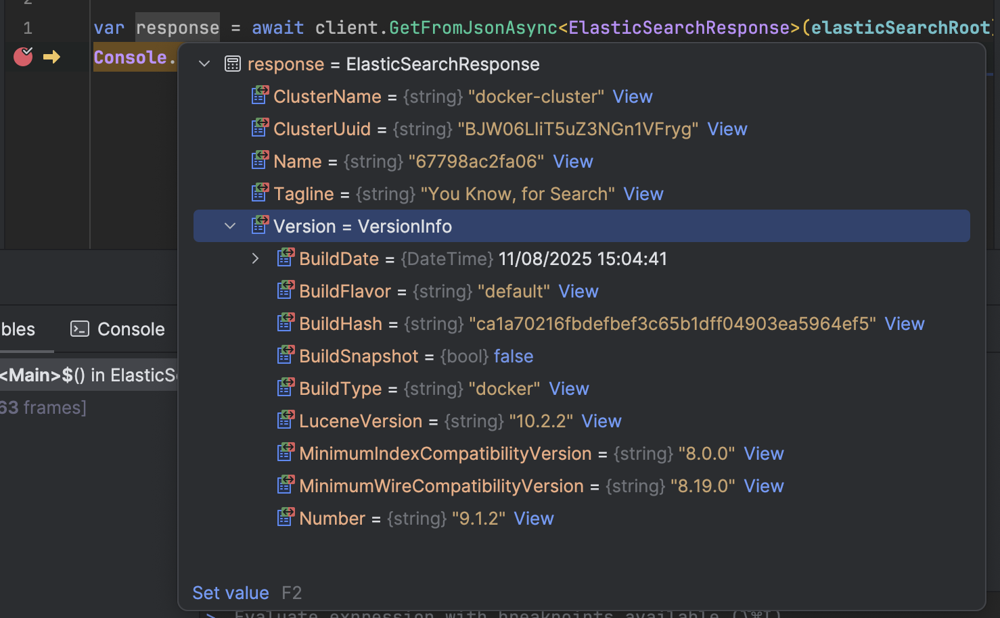
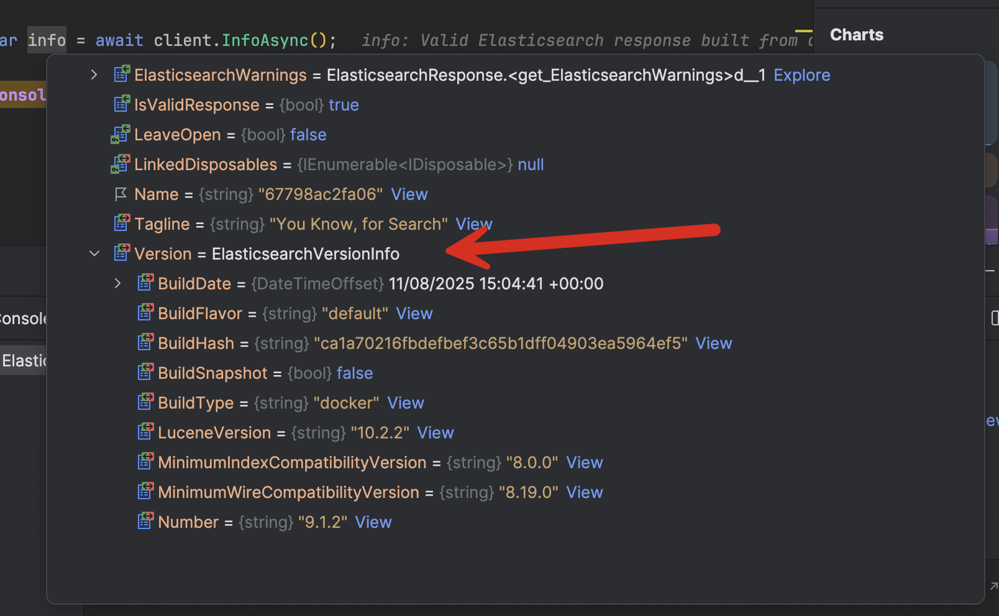

In the previous post, "[Getting the Version of Redis Connected in C# & .NET]()", we looked at how to get the version of [Redis](https://redis.io/) we are connected to without requiring a connection with admin privileges.

In this post, we will look at how to get the version of [ElasticSearch](https://www.elastic.co/elasticsearch) we are connected to.

This is pretty straightforward to achieve.

We can make use of the fact that when we connect to the root of the `ElasticSearch` URL, we get the following response:

```json
{
  "name": "67798ac2fa06",
  "cluster_name": "docker-cluster",
  "cluster_uuid": "BJW06LIiT5uZ3NGn1VFryg",
  "version": {
    "number": "9.1.2",
    "build_flavor": "default",
    "build_type": "docker",
    "build_hash": "ca1a70216fbdefbef3c65b1dff04903ea5964ef5",
    "build_date": "2025-08-11T15:04:41.449624592Z",
    "build_snapshot": false,
    "lucene_version": "10.2.2",
    "minimum_wire_compatibility_version": "8.19.0",
    "minimum_index_compatibility_version": "8.0.0"
  },
  "tagline": "You Know, for Search"
}
```

We can build a C# type to represent this.

First, the root type, `ElasticSearchResponse`

```c#
public sealed class ElasticSearchResponse
{
    [JsonPropertyName("name")] public string Name { get; set; } = string.Empty;
    [JsonPropertyName("cluster_name")] public string ClusterName { get; set; } = string.Empty;
    [JsonPropertyName("cluster_uuid")] public string ClusterUuid { get; set; } = string.Empty;
    [JsonPropertyName("version")] public VersionInfo Version { get; set; } = new();
    [JsonPropertyName("tagline")] public string Tagline { get; set; } = string.Empty;
}
```

We then have the inner, **nested** type, `VersionInfo`.

```c#
public sealed class VersionInfo
{
    [JsonPropertyName("number")] public string Number { get; set; } = string.Empty;
    [JsonPropertyName("build_flavor")] public string BuildFlavor { get; set; } = string.Empty;
    [JsonPropertyName("build_type")] public string BuildType { get; set; } = string.Empty;
    [JsonPropertyName("build_hash")] public string BuildHash { get; set; } = string.Empty;
    [JsonPropertyName("build_date")] public DateTime BuildDate { get; set; }
    [JsonPropertyName("build_snapshot")] public bool BuildSnapshot { get; set; }
    [JsonPropertyName("lucene_version")] public string LuceneVersion { get; set; } = string.Empty;
    [JsonPropertyName("minimum_wire_compatibility_version")] public string MinimumWireCompatibilityVersion { get; set; } = string.Empty;
    [JsonPropertyName("minimum_index_compatibility_version")] public string MinimumIndexCompatibilityVersion { get; set; } = string.Empty;
}
```

With these types in place, we can now make an HTTP request to `ElasticSearch` and serialize the response.

```c#
using System.Net.Http.Json;
using ElasticSearchVersion;

var client = new HttpClient();
const string elasticSearchRoot = "http://localhost:9200/";

var response = await client.GetFromJsonAsync<ElasticSearchResponse>(elasticSearchRoot);
Console.WriteLine(response!.Version.Number);
```

This will print something like this:

```plaintext
9.1.2
```

If we visualize the returned type in the debugger, we see the following:



The reason I've done it this way is that there is a lot of other useful information that you may want to use.

This method is a bit **brittle** in the sense that the `ElasticSearch` response can **change** between versions.

A more **reliable**, future-proof way is to make use of the `ElasticSearchClient`.

This has a method, `InfoAsync()`, that will retrieve for you the required information in a type `InfoResponse`.

The `InfoResponse` object has a property, `Version,` that contains the properties we are interested in.

We start by installing the package:

```bash
dotnet add package Elastic.Clients.Elasticsearch
```

We then update our code as follows:

```c#
var client = new ElasticsearchClient(settings);

var info = await client.InfoAsync();

Console.WriteLine($"Version: {info.Version.Number}");
```

If we rum this code, it will print the following:

```plaintext
Version: 9.1.2
```

If we view the `InfoResponse` object in the debugger, we can see that it has the **same properties** as those returned by the `ElasticSearch` response.



### TLDR

**We can use the `ElasticSearchClient` and its `InfoAsyc()` method to get various properties of the *ElasticSearch* instance we are connected to.**

The code is in my [GitHub](https://github.com/conradakunga/BlogCode/tree/master/2025-09-06%20-%20ElasticSearchVersion).

Happy hacking!
