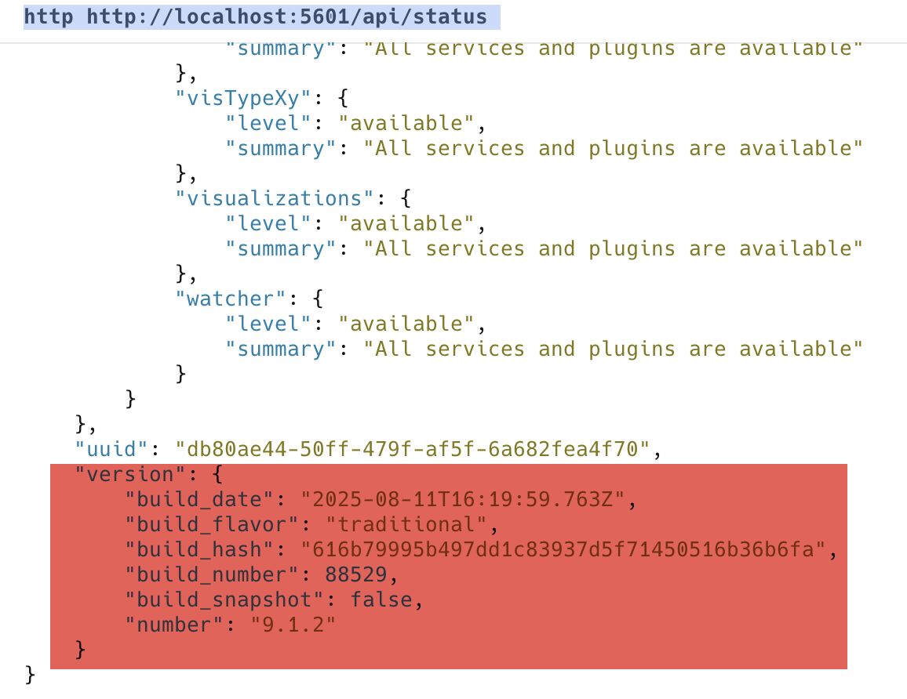
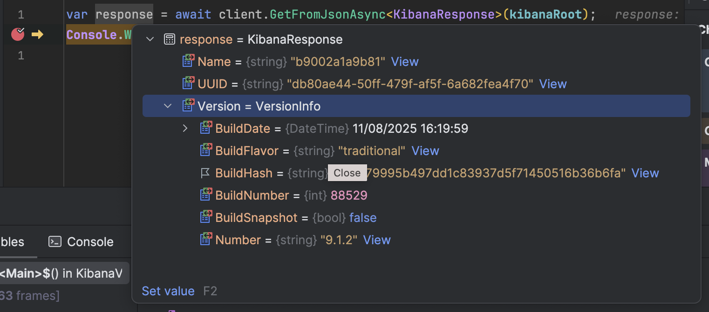

In the previous post, "Getting the Version of ElasticSearch Connected in C# & .NET", we looked at how to get the version of ElasticSearch connected using either the raw JSON returned by the endpoint or the ElasticSearch Client.

In this post, we shall look at how to do the same for Kibana.

Unlike its counterpart ElasticSearch, the only way to retrieve the connected version is to call an endpoint on Kibana and parse the returned JSON.

This end point is /api/status.

So in a console, we can do the following using Httpie (or whatever utility you prefer - curl, wget, etc)

```bash
http http://localhost:5601/api/status
```

This returns a very large JSON document, whose tail end looks something like this:



We can build a type to encapsulate this information.

First, the root.

```c#
public sealed class KibanaResponse
{
    [JsonPropertyName("name")] public string Name { get; set; } = string.Empty;
    [JsonPropertyName("uuid")] public string UUID { get; set; } = string.Empty;
    [JsonPropertyName("version")] public VersionInfo Version { get; set; } = new();
}
```

Then the `VersionInfo`:

```c#
public sealed class VersionInfo
{
    [JsonPropertyName("build_date")] public DateTime BuildDate { get; set; }
    [JsonPropertyName("build_flavor")] public string BuildFlavor { get; set; } = string.Empty;
    [JsonPropertyName("build_hash")] public string BuildHash { get; set; } = string.Empty;
    [JsonPropertyName("build_number")] public int BuildNumber { get; set; }
    [JsonPropertyName("build_snapshot")] public bool BuildSnapshot { get; set; }
    [JsonPropertyName("number")] public string Number { get; set; } = string.Empty;
}
```

We can then get this information like this:

```c#
var client = new HttpClient();
const string kibanaRoot = "http://localhost:5601/api/status";

var response = await client.GetFromJsonAsync<KibanaResponse>(kibanaRoot);
Console.WriteLine(response!.Version.Number);
```

This will print something like this:

```plaintext
9.1.2
```

If we view the `response` object in the debugger:



All our properties are available.

If you are really in a hurry and don't care about all the other properties now and in the future, you can deal with raw JSON and extract only what you want.

Like this:

```c#
// Get the version by parsing the raw Json
var jsonString = await client.GetStringAsync("http://localhost:5601/api/status");
var json = JsonDocument.Parse(jsonString);
Console.WriteLine($"Version: {json.RootElement.GetProperty("version").GetProperty("number").GetString()}");
```


### TLDR

**You can query the version info for Kibana by hitting the `api/status` endpoint and parsing the response.**

The code is in my GitHub.
