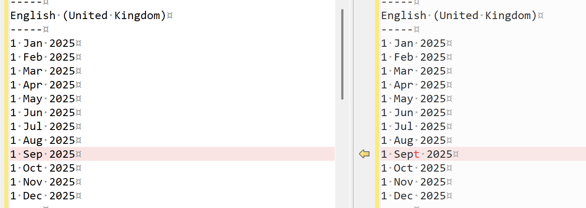
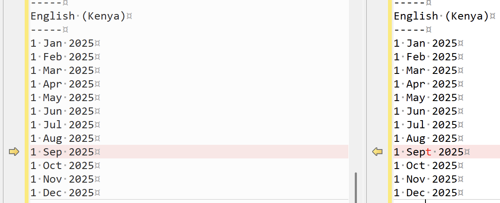
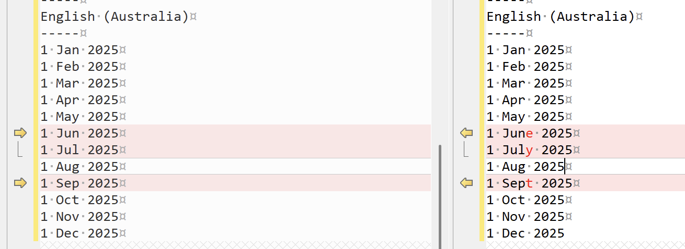

We have discussed [dates](), [localization](), and [regional]() [considerations]() in past posts.

Today, we will discuss a gotcha that my team encountered this month.

When it comes to formatting dates, we utilize [format strings](https://learn.microsoft.com/en-us/dotnet/standard/base-types/custom-date-and-time-format-strings).

The format string for **months** (short) is `MMM`.

Most people consider`MMM` to mean the month names in **three characters**.

This is not the correct interpretation. Consider `MMM` as the **short form of the month name**, which **may or may not** be three characters.

Let us take a look at some examples in various locales to illustrate.

My environment (OS & .NET version) I can retrieve as follows:

```bash 
dotnet --info
```

Which yields:

```plaintext
.NET SDK:
 Version:           10.0.100-preview.7.25380.108
 Commit:            30000d883e
 Workload version:  10.0.100-manifests.70c080cd
 MSBuild version:   17.15.0-preview-25380-108+30000d883

Runtime Environment:
 OS Name:     Mac OS X
 OS Version:  15.6
 OS Platform: Darwin
 RID:         osx-arm64
 Base Path:   /usr/local/share/dotnet/sdk/10.0.100-preview.7.25380.108/
```

The code is as follows:

```c#
using System.Globalization;

// Define list of cultures we want to test
string[] cultureCodes = ["en-GB", "en-US", "fr-FR", "de-DE", "en-KE", "en-AU"];

// From each code, build the CultureInfo object (culture)
foreach (string code in cultureCodes)
{
    var culture = new CultureInfo(code);
    Console.WriteLine(new string('-', culture.Name.Length));
    Console.WriteLine(culture.EnglishName);
    Console.WriteLine(new string('-', culture.Name.Length));
  	// Print formatted dates
    for (var i = 1; i <= 12; i++)
    {
        var date = new DateTime(2025, i, 1);
        Console.WriteLine(string.Format(culture, "{0:d MMM yyyy}", date));
    }
}
```

This will print the following on [macOS](https://www.apple.com/os/macos/):

```plaintext
-----
English (United Kingdom)
-----
1 Jan 2025
1 Feb 2025
1 Mar 2025
1 Apr 2025
1 May 2025
1 Jun 2025
1 Jul 2025
1 Aug 2025
1 Sep 2025
1 Oct 2025
1 Nov 2025
1 Dec 2025
-----
English (United States)
-----
1 Jan 2025
1 Feb 2025
1 Mar 2025
1 Apr 2025
1 May 2025
1 Jun 2025
1 Jul 2025
1 Aug 2025
1 Sep 2025
1 Oct 2025
1 Nov 2025
1 Dec 2025
-----
French (France)
-----
1 janv. 2025
1 févr. 2025
1 mars 2025
1 avr. 2025
1 mai 2025
1 juin 2025
1 juil. 2025
1 août 2025
1 sept. 2025
1 oct. 2025
1 nov. 2025
1 déc. 2025
-----
German (Germany)
-----
1 Jan. 2025
1 Feb. 2025
1 März 2025
1 Apr. 2025
1 Mai 2025
1 Juni 2025
1 Juli 2025
1 Aug. 2025
1 Sept. 2025
1 Okt. 2025
1 Nov. 2025
1 Dez. 2025
-----
English (Kenya)
-----
1 Jan 2025
1 Feb 2025
1 Mar 2025
1 Apr 2025
1 May 2025
1 Jun 2025
1 Jul 2025
1 Aug 2025
1 Sep 2025
1 Oct 2025
1 Nov 2025
1 Dec 2025
-----
English (Australia)
-----
1 Jan 2025
1 Feb 2025
1 Mar 2025
1 Apr 2025
1 May 2025
1 Jun 2025
1 Jul 2025
1 Aug 2025
1 Sep 2025
1 Oct 2025
1 Nov 2025
1 Dec 2025
```

The same code will print the following on [Windows 11](https://www.microsoft.com/en-us/windows/windows-11?r=1):

```plaintext
-----
English (United Kingdom)
-----
1 Jan 2025
1 Feb 2025
1 Mar 2025
1 Apr 2025
1 May 2025
1 Jun 2025
1 Jul 2025
1 Aug 2025
1 Sept 2025
1 Oct 2025
1 Nov 2025
1 Dec 2025
-----
English (United States)
-----
1 Jan 2025
1 Feb 2025
1 Mar 2025
1 Apr 2025
1 May 2025
1 Jun 2025
1 Jul 2025
1 Aug 2025
1 Sep 2025
1 Oct 2025
1 Nov 2025
1 Dec 2025
-----
French (France)
-----
1 janv. 2025
1 févr. 2025
1 mars 2025
1 avr. 2025
1 mai 2025
1 juin 2025
1 juil. 2025
1 août 2025
1 sept. 2025
1 oct. 2025
1 nov. 2025
1 déc. 2025
-----
German (Germany)
-----
1 Jan. 2025
1 Feb. 2025
1 März 2025
1 Apr. 2025
1 Mai 2025
1 Juni 2025
1 Juli 2025
1 Aug. 2025
1 Sept. 2025
1 Okt. 2025
1 Nov. 2025
1 Dez. 2025
-----
English (Kenya)
-----
1 Jan 2025
1 Feb 2025
1 Mar 2025
1 Apr 2025
1 May 2025
1 Jun 2025
1 Jul 2025
1 Aug 2025
1 Sept 2025
1 Oct 2025
1 Nov 2025
1 Dec 2025
-----
English (Australia)
-----
1 Jan 2025
1 Feb 2025
1 Mar 2025
1 Apr 2025
1 May 2025
1 June 2025
1 July 2025
1 Aug 2025
1 Sept 2025
1 Oct 2025
1 Nov 2025
1 Dec 2025
```

My environment on Windows is as follow:

```plaintext
.NET SDK:
 Version:           10.0.100-rc.1.25451.107
 Commit:            2db1f5ee2b
 Workload version:  10.0.100-manifests.0e2d47c4
 MSBuild version:   17.15.0-preview-25451-107+2db1f5ee2

Runtime Environment:
 OS Name:     Windows
 OS Version:  10.0.26100
 OS Platform: Windows
 RID:         win-arm64
 Base Path:   C:\Program Files\dotnet\sdk\10.0.100-rc.1.25451.107\
```


What is the difference?

**English (UK)**



**English (Kenya)**



**English (Australia)**



Interesting.

Let us rewrite the code for [Java](https://www.java.com/en/).

```java
void main() {
    String[] cultureCodes = {"en-GB", "en-US", "fr-FR", "de-DE", "en-KE", "en-AU"};

    for (String code : cultureCodes) {
        // Create locale from language + country
        Locale locale = Locale.forLanguageTag(code);

        // Print separators
        String line = "-".repeat(code.length());
        System.out.println(line);
        System.out.println(locale.getDisplayName(Locale.ENGLISH));
        System.out.println(line);

        // Format months for the given locale
        DateTimeFormatter formatter = DateTimeFormatter.ofPattern("d MMM yyyy", locale);
        for (int i = 1; i <= 12; i++) {
            LocalDate date = LocalDate.of(2025, i, 1);
            System.out.println(date.format(formatter));
        }
    }

}
```

This returns the following:

```plaintext
-----
English (United Kingdom)
-----
1 Jan 2025
1 Feb 2025
1 Mar 2025
1 Apr 2025
1 May 2025
1 Jun 2025
1 Jul 2025
1 Aug 2025
1 Sept 2025
1 Oct 2025
1 Nov 2025
1 Dec 2025
-----
English (United States)
-----
1 Jan 2025
1 Feb 2025
1 Mar 2025
1 Apr 2025
1 May 2025
1 Jun 2025
1 Jul 2025
1 Aug 2025
1 Sep 2025
1 Oct 2025
1 Nov 2025
1 Dec 2025
-----
French (France)
-----
1 janv. 2025
1 févr. 2025
1 mars 2025
1 avr. 2025
1 mai 2025
1 juin 2025
1 juil. 2025
1 août 2025
1 sept. 2025
1 oct. 2025
1 nov. 2025
1 déc. 2025
-----
German (Germany)
-----
1 Jan. 2025
1 Feb. 2025
1 März 2025
1 Apr. 2025
1 Mai 2025
1 Juni 2025
1 Juli 2025
1 Aug. 2025
1 Sept. 2025
1 Okt. 2025
1 Nov. 2025
1 Dez. 2025
-----
English (Kenya)
-----
1 Jan 2025
1 Feb 2025
1 Mar 2025
1 Apr 2025
1 May 2025
1 Jun 2025
1 Jul 2025
1 Aug 2025
1 Sept 2025
1 Oct 2025
1 Nov 2025
1 Dec 2025
-----
English (Australia)
-----
1 Jan 2025
1 Feb 2025
1 Mar 2025
1 Apr 2025
1 May 2025
1 June 2025
1 July 2025
1 Aug 2025
1 Sept 2025
1 Oct 2025
1 Nov 2025
1 Dec 2025
```

This matches exactly with the output for Windows.

What about [Linux](https://www.linux.org/)?

For this we run the [.NET SDK image](https://hub.docker.com/r/microsoft/dotnet-nightly-sdk/) that it is based on [Debian](https://www.debian.org/).

```bash
dotnet run -it mcr.microsoft.com/dotnet/nightly/sdk:10.0-preview
```

The environment info I retrieved as follows:

```bash
dotnet --info
```

Which returns the following:

```plaintext
.NET SDK:
 Version:           10.0.100-rc.1.25425.114
 Commit:            bcd89f47fb
 Workload version:  10.0.100-manifests.342a7967
 MSBuild version:   17.15.0-preview-25425-114+bcd89f47f

Runtime Environment:
 OS Name:     ubuntu
 OS Version:  24.04
 OS Platform: Linux
 RID:         linux-arm64
 Base Path:   /usr/share/dotnet/sdk/10.0.100-rc.1.25425.114/
```

From within this container we run the C# code above.

This prints the following:

```plaintext
-----
English (United Kingdom)
-----
1 Jan 2025
1 Feb 2025
1 Mar 2025
1 Apr 2025
1 May 2025
1 Jun 2025
1 Jul 2025
1 Aug 2025
1 Sept 2025
1 Oct 2025
1 Nov 2025
1 Dec 2025
-----
English (United States)
-----
1 Jan 2025
1 Feb 2025
1 Mar 2025
1 Apr 2025
1 May 2025
1 Jun 2025
1 Jul 2025
1 Aug 2025
1 Sep 2025
1 Oct 2025
1 Nov 2025
1 Dec 2025
-----
French (France)
-----
1 janv. 2025
1 févr. 2025
1 mars 2025
1 avr. 2025
1 mai 2025
1 juin 2025
1 juil. 2025
1 août 2025
1 sept. 2025
1 oct. 2025
1 nov. 2025
1 déc. 2025
-----
German (Germany)
-----
1 Jan. 2025
1 Feb. 2025
1 März 2025
1 Apr. 2025
1 Mai 2025
1 Juni 2025
1 Juli 2025
1 Aug. 2025
1 Sept. 2025
1 Okt. 2025
1 Nov. 2025
1 Dez. 2025
-----
English (Kenya)
-----
1 Jan 2025
1 Feb 2025
1 Mar 2025
1 Apr 2025
1 May 2025
1 Jun 2025
1 Jul 2025
1 Aug 2025
1 Sept 2025
1 Oct 2025
1 Nov 2025
1 Dec 2025
-----
English (Australia)
-----
1 Jan 2025
1 Feb 2025
1 Mar 2025
1 Apr 2025
1 May 2025
1 June 2025
1 July 2025
1 Aug 2025
1 Sept 2025
1 Oct 2025
1 Nov 2025
1 Dec 2025
```

Which is the same as Windows.

In conclusion, it would appear that the **localization for the short month name in .NET is the same in Linux and Windows**, but **different on macOS**.

I thought it was a **macOS** issue, but the fact that **Java** correctly returns the expected output indicates otherwise.

In the next post we will examine why is **September** shortened as **Sept**.

### TLDR

**The short form of the month September is not consistent between macOS, Linux and Windows.**

The code is in my [GitHub](https://github.com/conradakunga/BlogCode/tree/master/2025-09-08%20-%20MonthNames).

Happy hacking!
