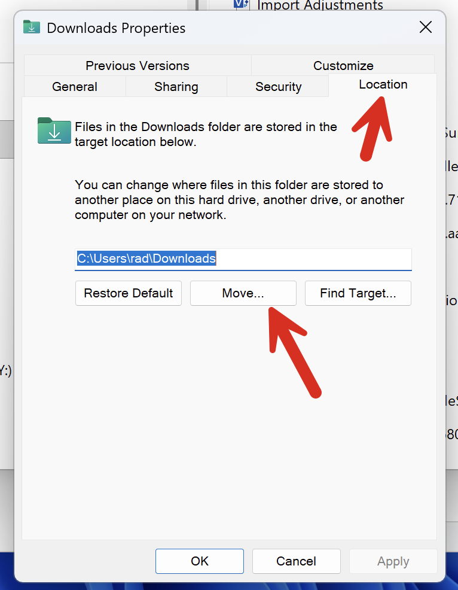

Recently, I needed to get the location of the `Downloads` folder in [Windows](https://www.microsoft.com/en-us/windows).

Usually, the goto is the [Environment.GetFolderPath](https://learn.microsoft.com/en-us/dotnet/api/system.environment.getfolderpath?view=net-9.0) method, which looks something like this:

```c#
var path = Environment.GetFolderPath(Environment.SpecialFolder.Desktop);
Console.WriteLine(path);
```

However, the immediate hurdle is that `Downloads` is not one of the [SpecialFolder](https://learn.microsoft.com/en-us/dotnet/api/system.environment.specialfolder?view=net-9.0) `enum` members!

| Name                   | Value |
| ---------------------- | ----- |
| Desktop                | 0     |
| Programs               | 2     |
| MyDocuments            | 5     |
| Favorites              | 6     |
| Startup                | 7     |
| Recent                 | 8     |
| SendTo                 | 9     |
| StartMenu              | 11    |
| MyMusic                | 13    |
| MyVideos               | 14    |
| DesktopDirectory       | 16    |
| MyComputer             | 17    |
| NetworkShortcuts       | 19    |
| Fonts                  | 20    |
| Templates              | 21    |
| CommonStartMenu        | 22    |
| CommonPrograms         | 23    |
| CommonStartup          | 24    |
| CommonDesktopDirectory | 25    |
| ApplicationData        | 26    |
| PrinterShortcuts       | 27    |
| LocalApplicationData   | 28    |
| InternetCache          | 32    |
| Cookies                | 33    |
| History                | 34    |
| CommonApplicationData  | 35    |
| Windows                | 36    |
| System                 | 37    |
| ProgramFiles           | 38    |
| MyPictures             | 39    |
| UserProfile            | 40    |
| SystemX86              | 41    |
| ProgramFilesX86        | 42    |
| CommonProgramFiles     | 43    |
| CommonProgramFilesX86  | 44    |
| CommonTemplates        | 45    |
| CommonDocuments        | 46    |
| CommonAdminTools       | 47    |
| AdminTools             | 48    |
| CommonMusic            | 53    |
| CommonPictures         | 54    |
| CommonVideos           | 55    |
| Resources              | 56    |
| LocalizedResources     | 57    |
| CommonOemLinks         | 58    |
| CDBurning              | 59    |

Therefore, we must resort to a different technique: [interop](https://learn.microsoft.com/en-us/dotnet/csharp/advanced-topics/interop/) with the [Windows API](https://learn.microsoft.com/en-us/windows/win32/apiindex/windows-api-list).

The method we need is [SHGetKnownFolderPath](https://learn.microsoft.com/en-us/windows/win32/api/shlobj_core/nf-shlobj_core-shgetknownfolderpath), to which we need to pass a number of parameters:

- A reference to the known folder, represented by a `GUID`. The known folder IDs can be found [here](https://learn.microsoft.com/en-us/windows/win32/shell/knownfolderid)
- Flags for the folder retrieval. The known flags can be found [here](https://learn.microsoft.com/en-us/windows/win32/api/shlobj_core/ne-shlobj_core-known_folder_flag)
- An access token for the user.

The setup to call the API is as follows:

```c#
using System.Runtime.InteropServices;

[DllImport("shell32.dll")]
    private static extern int SHGetKnownFolderPath(
        [MarshalAs(UnmanagedType.LPStruct)] Guid rfid,
        uint dwFlags,
		IntPtr hToken,
		out IntPtr ppszPath);
```

The method to call it is as follows:

```c#
static string? GetDownloadsPath()
{
    // Define the ID
    var downloadFolderID = new Guid("374DE290-123F-4565-9164-39C4925E467B");
    // Invoke the method 
    SHGetKnownFolderPath(downloadFolderID, 0, IntPtr.Zero, out IntPtr outPath);
    // Retrieve the path
    string? path = Marshal.PtrToStringUni(outPath);
    Marshal.FreeCoTaskMem(outPath);
    return path;
}
```

Finally, we invoke it like this:

```c#
var downloadsPath = GetDownloadsPath();
if (downloadsPath is null)
    Console.WriteLine("Could not find downloads path");
else
    Console.WriteLine(downloadsPath);
```

This prints something like the following:

```plaintext
C:\Users\rad\Desktop
```

Now, you might ask yourself whether this is worth the **bother**, given we can just get the folder path for a known folder like `Desktop`, and assume the `Downloads` folder will be on the same drive

```c#
// Get desktop
var path = Environment.GetFolderPath(Environment.SpecialFolder.Desktop);
// Get parenth path
var parent = new DirectoryInfo(path).Parent;
// Build downloads path
var dowloadsPath = Path.Combine(parent.FullName,"Downloads");
Console.WriteLine(dowloadsPath);
```

There are two problems with this approach:

1. A user can **move** their `Downloads` path to another drive, for example, if they run out of disk space on their system drive.
2. A user can **rename** it from `Downloads` to something else.

You can see these options when you right-click the `Downloads` folder.



### TLDR

**The most robust way to get the folder for known folders like `Downloads` on Windows is to use the Windows API.**

The code is in my GitHub.

Happy hacking!
