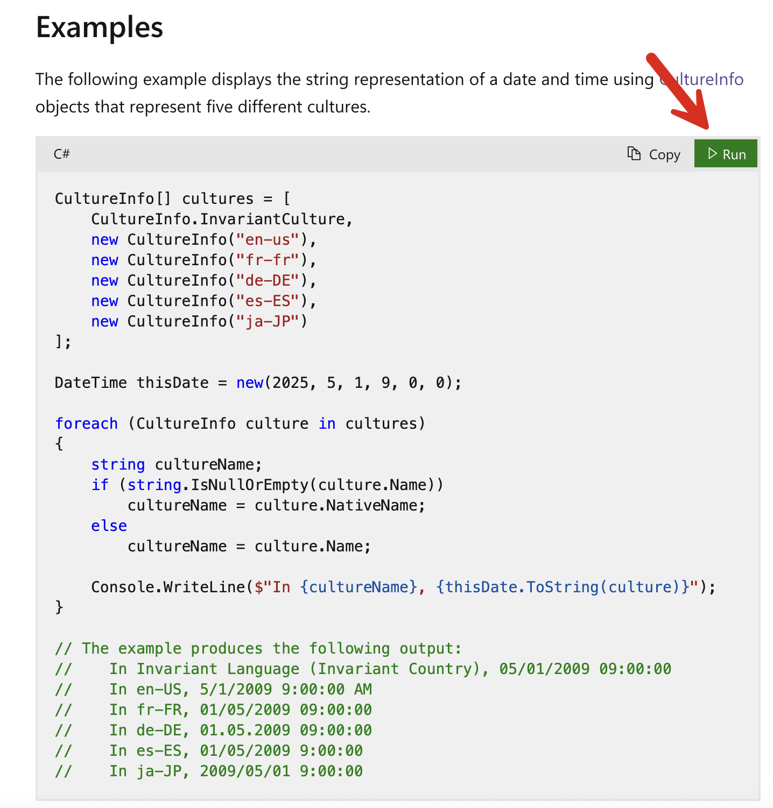
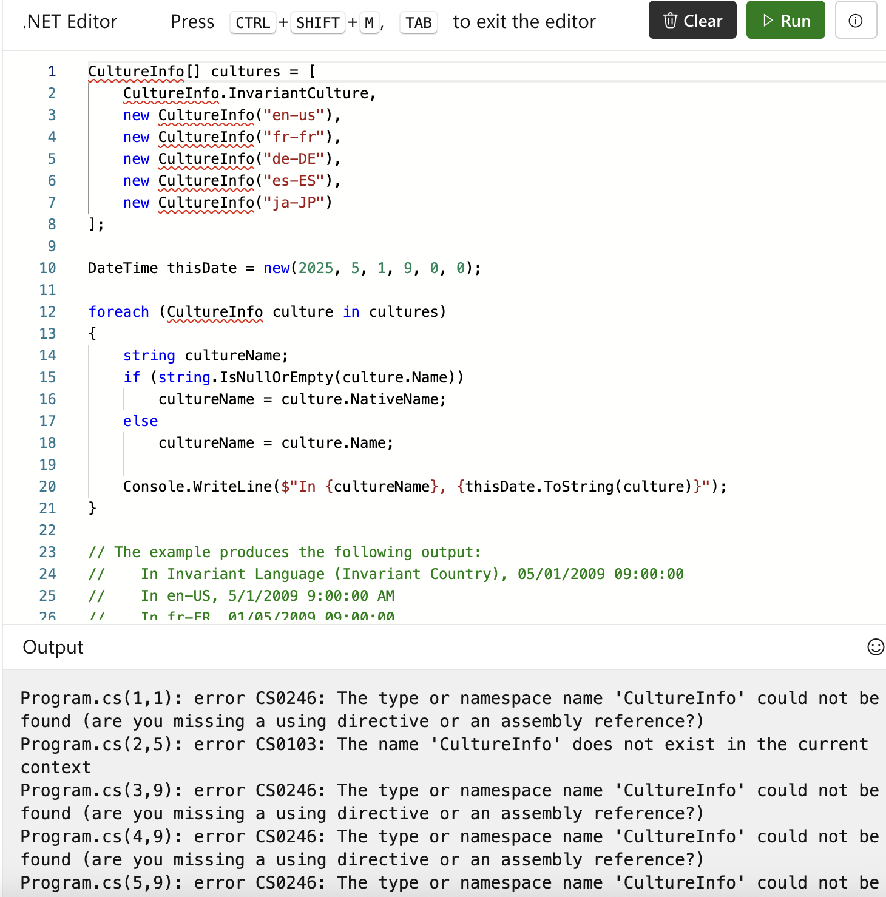
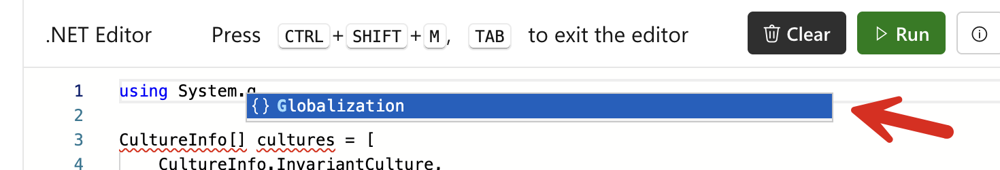
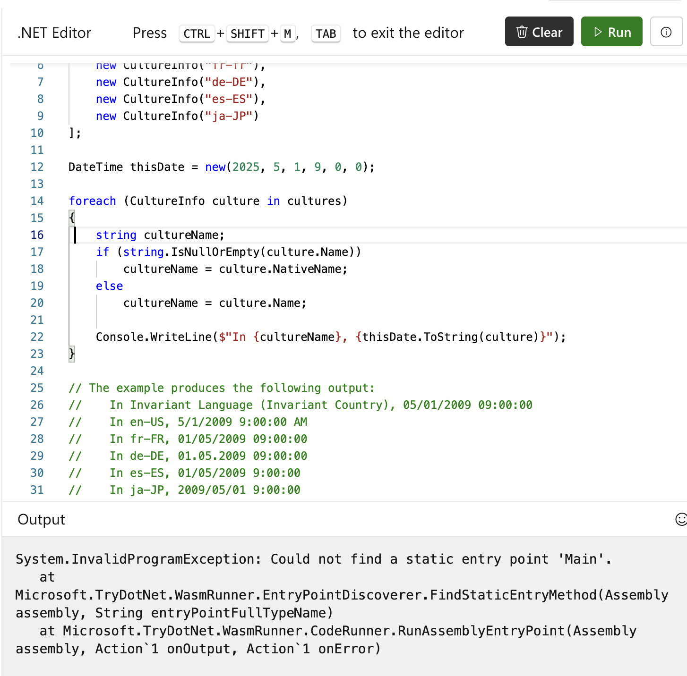

One of the brilliant innovations when it comes to the .NET documentation is the **ability to run (some) samples in your browser**.

So, take the following case for the documentation of the [DateTime.ToString()](https://learn.microsoft.com/en-us/dotnet/api/system.datetime.tostring?view=net-9.0) method.

If you scroll down, you will find not only some code samples, but there is a **button to actually run them**.



Unfortunately, this does not actually work!



I discovered by chance that **you can modify the code**, a nice touch.

The problem here is importing the appropriate **namespace**, [System.Globalization](https://learn.microsoft.com/en-us/dotnet/api/system.globalization?view=net-9.0).

So I f**ixed them directly** in the sample.

A nice touch is that you get **IntelliSense**:



Unfortunately, this **does not work either**!



It is throwing an error about an **inability to find an entry point**.

I will spare you the grief of trial and error to get it to run.

You will need to **add the following to the sample** for it to run:

```c#
public class Program
{
  public static async Task Main(string[] args){
    //
    // Sample code is here
    //
  }
}


```

After which, success.

```plaintext
In Invariant Language (Invariant Country), 05/01/2025 09:00:00
In en-US, 5/1/2025 9:00:00 AM
In fr-FR, 01/05/2025 09:00:00
In de-DE, 01.05.2025 09:00:00
In es-ES, 1/5/2025 9:00:00
In ja-JP, 5/1/2025 09:00:00
```

Let us assume this problem manifested only in [.NET 9](https://dotnet.microsoft.com/en-us/download/dotnet/9.0), which was released on [12 November 2024](https://learn.microsoft.com/en-us/dotnet/core/whats-new/dotnet-9/overview).

One (or more of these is possible)

1. It has never worked, and **nobody has noticed**
2. It never worked; **someone noticed**, but **nobody logged a report**.
3. It never worked; **someone noticed**, **logged a bug report**, and **nobody read the report**
4. It worked; **someone noticed**, **filed** a bug report, **somebody read** the report, and **did nothing**
5. It worked, and then at some point broke, at which point GOTO #1 and follow the logic

**There is no reason to believe this problem is isolated to the `DateTime` samples.**

[I have logged it myself](https://github.com/dotnet/dotnet-api-docs/issues/11820). Hopefully, it will be resolved soon.

### TLDR

**The runnable sample for [DateTime.ToString](https://learn.microsoft.com/en-us/dotnet/api/system.datetime.tostring?view=net-9.0#code-try-2) does not run.**

Happy hacking!
