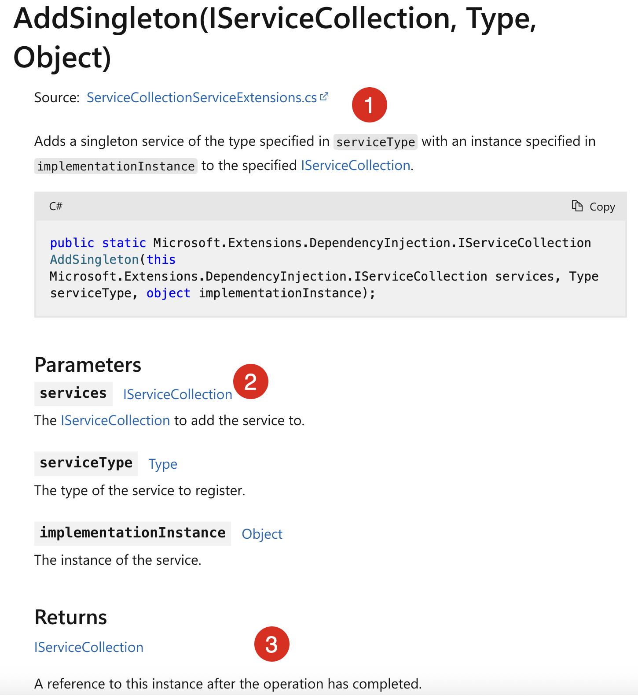
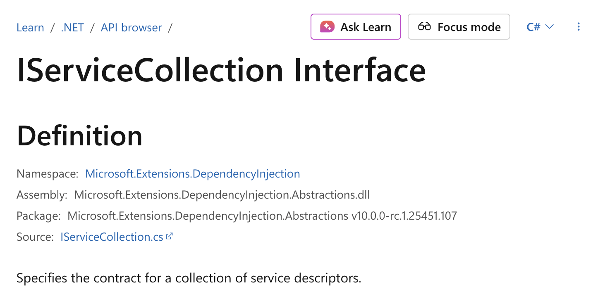
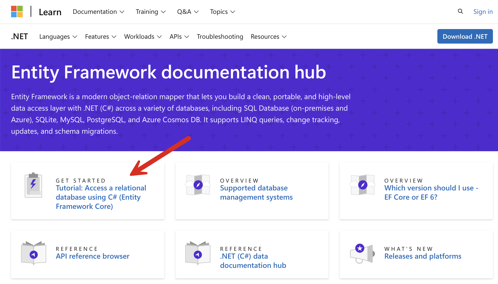
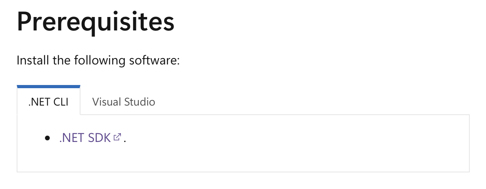
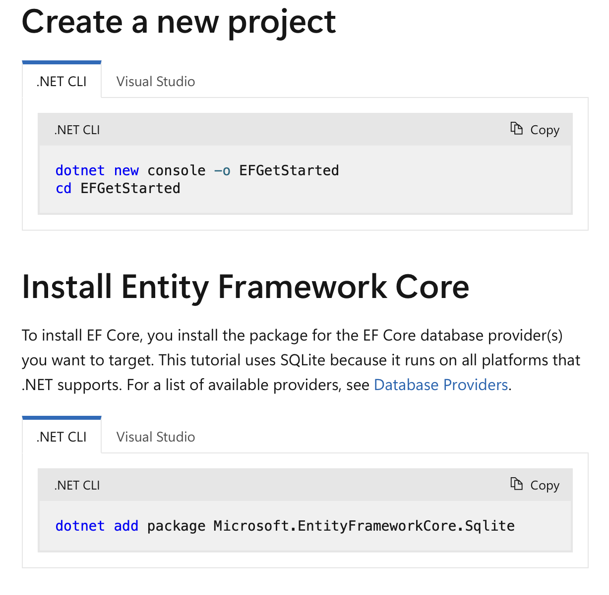
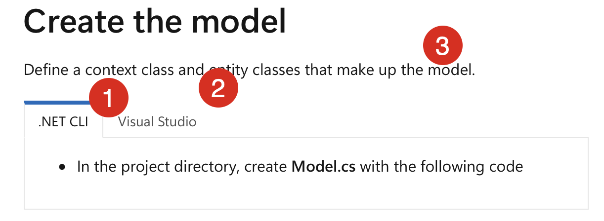
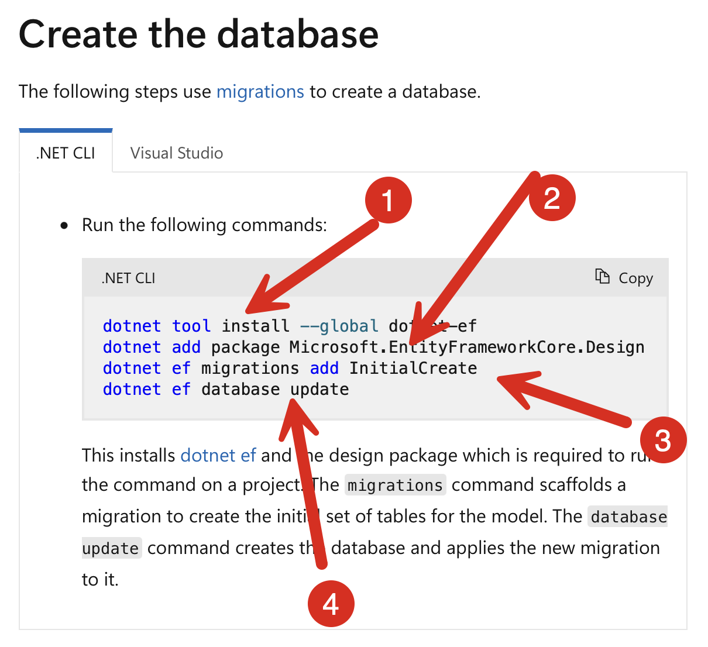
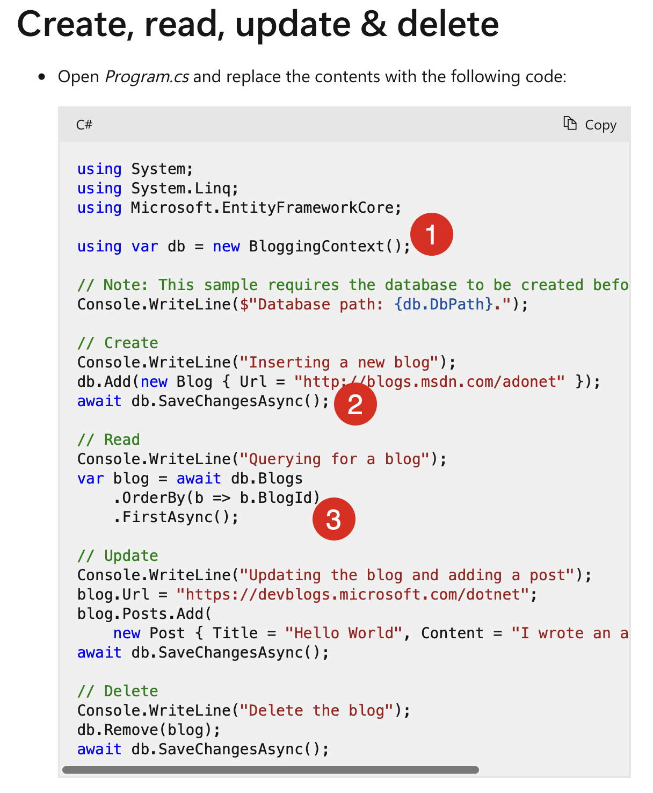

When learning a new technology or library, the first port of call is usually the **documentation**.

The assumption here is that the documentation will provide **enough context to a user to utilize the technology, regardless of the level of experience**. There does, however, need to be a **baseline** - **knowledge or experience of the fundamentals**.

In other words, documentation for an API should assume the user is knowledgeable enough to know what an API is, how to invoke it, and how to process the results.

Documentation should either:

1. Be useful **as is**
2. Provide you with **additional resources if the scope/context is not practical to include within**

Let us take an example of a method you will almost certainly use if you are building an [ASP.NET](https://dotnet.microsoft.com/en-us/apps/aspnet) web application or API - [AddSingleton](https://learn.microsoft.com/en-us/dotnet/api/microsoft.extensions.dependencyinjection.servicecollectionserviceextensions.addsingleton?view=net-9.0-pp#microsoft-extensions-dependencyinjection-servicecollectionserviceextensions-addsingleton(microsoft-extensions-dependencyinjection-iservicecollection-system-type-system-object)).



Everything in this documentation is completely true.

However, someone learning to write a web application or migrating from another platform will encounter a hurdle.

1. What is a [singleton,](https://en.wikipedia.org/wiki/Singleton_pattern) and what is a **service**? What does this line even mean?

    > Adds a singleton service of the type specified in `serviceType` with an instance specified in `implementationInstance` to the specified [IServiceCollection](https://learn.microsoft.com/en-us/dotnet/api/microsoft.extensions.dependencyinjection.iservicecollection?view=net-9.0-pp).

2. What is an `IServiceCollection` in the first place? Clicking the (helpfully) [linked documentation](https://learn.microsoft.com/en-us/dotnet/api/microsoft.extensions.dependencyinjection.iservicecollection?view=net-9.0-pp) takes you to something even more cryptic.

    

	> Specifies the contract for a collection of service descriptors.

	**What does that mean**?
	
3. Then there is "**A reference to this instance after the operation has completed**". Presumably, the operation being referred to here is the **addition of the service**?

Again, all these definitions are 100% accurate, but do they cater to someone exploring ASP.NET for the very first time?

Let us take another example - [Entity Framework](https://learn.microsoft.com/en-us/ef/).

Assume you have never used Entity Framework before and want to try it out.

You go to the home page.



The [tutorial](https://learn.microsoft.com/en-us/ef/core/get-started/overview/first-app?tabs=netcore-cli) looks promising.

The prerequisites look straightforward enough.



Next is creating a project and installing EF.



This looks straightforward enough.

Next, we have the section to create a model.



You are on your own here. A `Model` perhaps a seasoned developer might now, but what is an `Entity` and a `Context` with respect to Entity Framework?

There is some code provided:

```c#
using Microsoft.EntityFrameworkCore;
using System;
using System.Collections.Generic;

public class BloggingContext : DbContext
{
    public DbSet<Blog> Blogs { get; set; }
    public DbSet<Post> Posts { get; set; }

    public string DbPath { get; }

    public BloggingContext()
    {
        var folder = Environment.SpecialFolder.LocalApplicationData;
        var path = Environment.GetFolderPath(folder);
        DbPath = System.IO.Path.Join(path, "blogging.db");
    }

    // The following configures EF to create a Sqlite database file in the
    // special "local" folder for your platform.
    protected override void OnConfiguring(DbContextOptionsBuilder options)
        => options.UseSqlite($"Data Source={DbPath}");
}

public class Blog
{
    public int BlogId { get; set; }
    public string Url { get; set; }

    public List<Post> Posts { get; } = new();
}

public class Post
{
    public int PostId { get; set; }
    public string Title { get; set; }
    public string Content { get; set; }

    public int BlogId { get; set; }
    public Blog Blog { get; set; }
}
```

Quick, which is the `Entity` and which is the `Model` referred to above? What is the `Context`?

What is a `DbSet`? I just happen to know C# so I know that it is used in a context here for generic types. I wonder if such an assumption can be made for someone who wants to try out EF for the first time.

Next we have the section to create the database.



Even someone experience would trip up here.

1. This is installing something, globally. It is actually a [.NET tool](https://learn.microsoft.com/en-us/dotnet/core/tools/global-tools)
2. This adding **another package**. But remember, **earlier we had already installed a package referred to as Entity Framework**. So what is this? It says it is a ***design package***. **What is a design package**?
3. What is a [migration](https://learn.microsoft.com/en-us/ef/core/managing-schemas/migrations/?tabs=dotnet-core-cli)? What is `InitialCreate`? What does "scaffolding a migration" mean?

Finally, there are CRUD examples.



This is where you use everything setup earlier.

A couple of things to scratch your head:

1. The `BloggingContext` was declared earlier. But what does it do? What is it's purpose? How does it work?
2. `SaveChangesAsync` presumably saves changes to the database in an `asynchronous` fashion?
3. Why is querying for a `Blog` necessitating use of [FirstAsync](https://learn.microsoft.com/en-us/dotnet/api/system.data.entity.queryableextensions.firstasync?view=entity-framework-6.2.0)? This is in fact a [LINQ](https://learn.microsoft.com/en-us/dotnet/csharp/linq/) thing, but there is nothing in this tutorial explaining the **connection between LINQ and Entity Framework**. Is it a a valid assumption to make that **somone who wants to use Entity Framework already knows LINQ**?

Again, this tutorial is **100% correct and 100% accurate**, but **does it cater for an experience developer who has never used Entity Framework before**?

### TLDR

**Documentation should make a strong effort to to be welcoming to potential users, regardless of their experience levels.**

Happy hacking!
