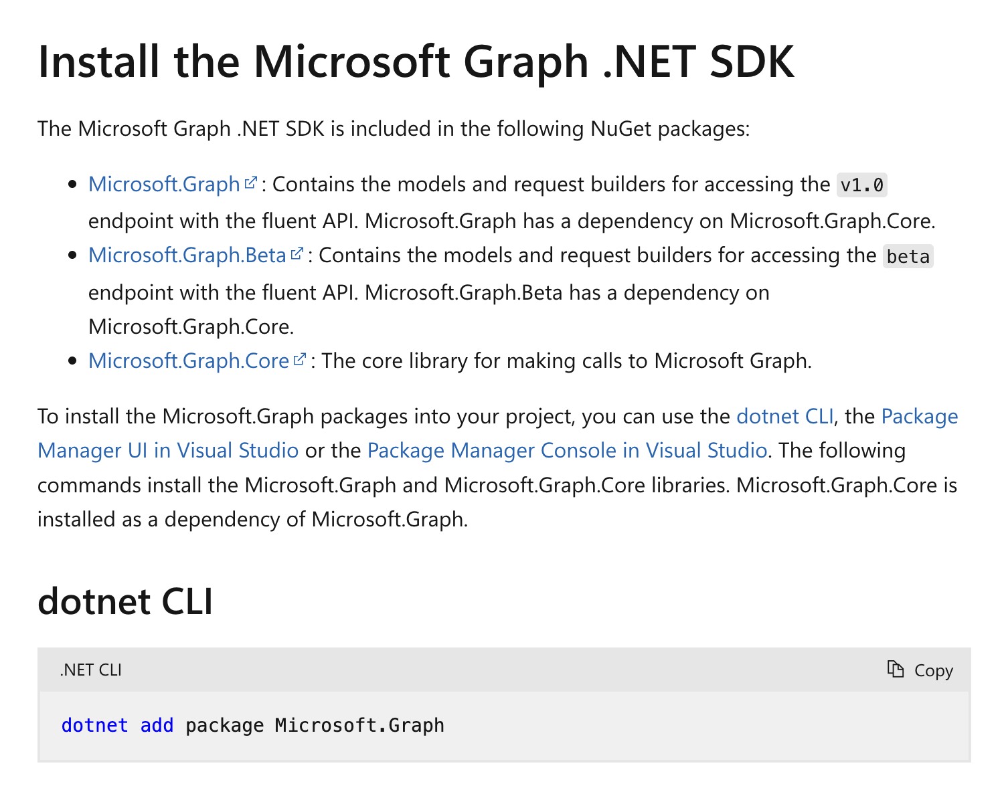

I recently wrote a post on how to [send email using C# & the Graph API](), and was surprised how difficult it was.

Let me try again, now that it is **two months later**, only using the instructions in the documentation.

The sample code is on the documentation page, [here](https://learn.microsoft.com/en-us/graph/api/user-sendmail?view=graph-rest-1.0&tabs=csharp).

```c#
// Code snippets are only available for the latest version. Current version is 5.x

// Dependencies
using Microsoft.Graph.Me.SendMail;
using Microsoft.Graph.Models;

var requestBody = new SendMailPostRequestBody
{
	Message = new Message
	{
		Subject = "9/9/2018: concert",
		Body = new ItemBody
		{
			ContentType = BodyType.Html,
			Content = "The group represents Nevada.",
		},
		ToRecipients = new List<Recipient>
		{
			new Recipient
			{
				EmailAddress = new EmailAddress
				{
					Address = "AlexW@contoso.com",
				},
			},
		},
		InternetMessageHeaders = new List<InternetMessageHeader>
		{
			new InternetMessageHeader
			{
				Name = "x-custom-header-group-name",
				Value = "Nevada",
			},
			new InternetMessageHeader
			{
				Name = "x-custom-header-group-id",
				Value = "NV001",
			},
		},
	},
};

// To initialize your graphClient, see https://learn.microsoft.com/en-us/graph/sdks/create-client?from=snippets&tabs=csharp
await graphClient.Me.SendMail.PostAsync(requestBody);
```

At the very bottom is a cryptic comment about creating a `graphClient` and a [link](// To initialize your graphClient, see https://learn.microsoft.com/en-us/graph/sdks/create-client?from=snippets&tabs=csharp). What is a `graphClient`?

The link takes us here:


It talks about installing the SDK [here](https://learn.microsoft.com/en-us/graph/sdks/sdk-installation).



It then gives us the code to create a client.

```c#
var scopes = new[] { "User.Read" };

// Multi-tenant apps can use "common",
// single-tenant apps must use the tenant ID from the Azure portal
var tenantId = "common";

// Value from app registration
var clientId = "YOUR_CLIENT_ID";

// using Azure.Identity;
var options = new DeviceCodeCredentialOptions
{
    AuthorityHost = AzureAuthorityHosts.AzurePublicCloud,
    ClientId = clientId,
    TenantId = tenantId,
    // Callback function that receives the user prompt
    // Prompt contains the generated device code that user must
    // enter during the auth process in the browser
    DeviceCodeCallback = (code, cancellation) =>
    {
        Console.WriteLine(code.Message);
        return Task.FromResult(0);
    },
};

// https://learn.microsoft.com/dotnet/api/azure.identity.devicecodecredential
var deviceCodeCredential = new DeviceCodeCredential(options);

var graphClient = new GraphServiceClient(deviceCodeCredential, scopes);
```

So, if we update our code, it will look like this:

```c#
using Microsoft.Graph;
using Microsoft.Graph.Me.SendMail;
using Microsoft.Graph.Models;

var scopes = new[] { "User.Read" };

// Multi-tenant apps can use "common",
// single-tenant apps must use the tenant ID from the Azure portal
var tenantId = "common";

// Value from app registration
var clientId = "YOUR_CLIENT_ID";

// using Azure.Identity;
var options = new DeviceCodeCredentialOptions
{
    AuthorityHost = AzureAuthorityHosts.AzurePublicCloud,
    ClientId = clientId,
    TenantId = tenantId,
    // Callback function that receives the user prompt
    // Prompt contains the generated device code that user must
    // enter during the auth process in the browser
    DeviceCodeCallback = (code, cancellation) =>
    {
        Console.WriteLine(code.Message);
        return Task.FromResult(0);
    },
};

// https://learn.microsoft.com/dotnet/api/azure.identity.devicecodecredential
var deviceCodeCredential = new DeviceCodeCredential(options);

var graphClient = new GraphServiceClient(deviceCodeCredential, scopes);

var requestBody = new SendMailPostRequestBody
{
    Message = new Message
    {
        Subject = "9/9/2018: concert",
        Body = new ItemBody
        {
            ContentType = BodyType.Html,
            Content = "The group represents Nevada.",
        },
        ToRecipients = new List<Recipient>
        {
            new Recipient
            {
                EmailAddress = new EmailAddress
                {
                    Address = "AlexW@contoso.com",
                },
            },
        },
        InternetMessageHeaders = new List<InternetMessageHeader>
        {
            new InternetMessageHeader
            {
                Name = "x-custom-header-group-name",
                Value = "Nevada",
            },
            new InternetMessageHeader
            {
                Name = "x-custom-header-group-id",
                Value = "NV001",
            },
        },
    },
};

// To initialize your graphClient, see https://learn.microsoft.com/en-us/graph/sdks/create-client?from=snippets&tabs=csharp
await graphClient.Me.SendMail.PostAsync(requestBody);
```

Remember, up to this point, the only packages we have been told to add are `Microsoft.Graph`

The code **does not compile**, as there are some `types` that it could not find.


Furthermore, the last error indicates a change in signature in one of the methods.

In the initial sample, there was this comment:

```c#
// Code snippets are only available for the latest version. Current version is 5.x
```

Which I do, in fact, have installed in the project.

```xml
<ItemGroup>
  <PackageReference Include="Microsoft.Graph" Version="5.93.0" />
</ItemGroup>
```

The problem seems to be the `DeviceCodeCredential` class.

Above which there is is this comment:

```c#
// https://learn.microsoft.com/dotnet/api/azure.identity.devicecodecredential
```

This link takes you [here](https://learn.microsoft.com/en-us/dotnet/api/azure.identity.devicecodecredential?view=azure-dotnet):


You can see here that it references a package, [Azure.Identity](https://www.nuget.org/packages/azure.identity), which, remember,  has **not been mentioned anywhere in the documentation**.

Let's try adding it directly:

```c#
dotnet add package Azure.Identity
```

The code now **builds**.

Which got me thinking.

1. At some point, this code **must have worked**.
2. This comment, presumably, **at some point was correct**:
    > // Code snippets are only available for the latest version. Current version is 5.x

When did it break?

I also wonder why the **Azure.Identity** package isn't a transient dependency.

And most importantly, what does it mean for something to be broken for this long? As hypothesized [recently]().

One (or more of these is possible)

1. It has never worked, and **nobody has noticed**
2. It never worked; **someone noticed**, but **nobody logged a report**.
3. It never worked; **someone noticed**, **logged a bug report**, and **nobody read the report**
4. It worked; **someone noticed**, **filed** a bug report, **somebody read** the report, and **did nothing**
5. It worked, and then at some point broke, at which point GOTO #1 and follow the logic

There isn't a way to **directly** report issues on that page.

The best that can be done is this button on the **sidebar**:


Which takes you to this dialog:


### TLDR

**The Microsoft Graph samples don't work out of the box (as of 17 September 2025)**

The (**working**) code is in my [GitHub](https://github.com/conradakunga/BlogCode/tree/master/2025-09-17%20-%20MSGraphCompilingSample).

Happy hacking!
