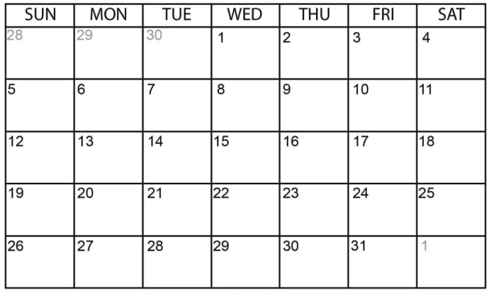
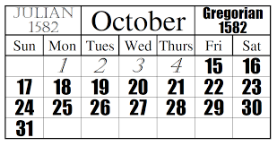

Quick, how many **days** does [October](https://en.wikipedia.org/wiki/October) have?

This year's (**2025**) has `31` days.



Can we therefore say **all Octobers have 31 days**?

**Nay**!

Because October [1582](https://en.wikipedia.org/wiki/1582) looked like this:



`11` days are **missing**!

This was due to the switch from a [Julian Calendar](https://en.wikipedia.org/wiki/Julian_calendar) to a [Gregorian Calendar](https://en.wikipedia.org/wiki/Gregorian_calendar).

This presents an interesting problem in code - **how do you represent dates when converting between calendars**?

Suppose we were writing code that needed to be aware of the fact that **5 October 1582** does not exist, as it was replaced by **15 October 1582**.

For this, we turn to the [NodaTime](https://nodatime.org/) library, specifically the `LocalDate` class.

```c#
//Create the date in the Julian Calendar	
var julianDate = new LocalDate(1582, 10, 5, CalendarSystem.Julian);
Console.WriteLine($"Julian: {julianDate}");

//Convert the date to the Gregorian calendar
var gregorianDate = julianDate.WithCalendar(CalendarSystem.Gregorian);
Console.WriteLine($"Gregorian: {gregorianDate}");
```

This will print the following:

```plaintext
Julian: Friday, 5 October 1582
Gregorian: Friday, 15 October 1582
```

The following are some other dates where days were **adjusted**:

| Julian Date      | Gregorian Date |
| ---------------- | -------------- |
| 4 Oct 1582       | 14 Oct 1582    |
| 2 Sep 1752 (UK)  | 13 Sep 1752    |
| 14 Feb 1918 (RU) | 14 Feb 1918    |

There is also a problematic year, **1900**, that was a leap year in the **Julian** calendar but wasn't in the **Gregorian** calendar. This has famously led to a [debatable bug](https://learn.microsoft.com/en-us/troubleshoot/microsoft-365-apps/excel/wrongly-assumes-1900-is-leap-year) in [Microsoft Excel](https://www.microsoft.com/en-us/microsoft-365/excel).

### TLDR

**Calendar conversions are crucial for accurately performing date arithmetic. This can be done using the `NodaTime` package.**

The code is in my [GitHub](https://github.com/conradakunga/BlogCode/tree/master/2025-09-30%20-%20CalendarConversions).

Happy hacking!
