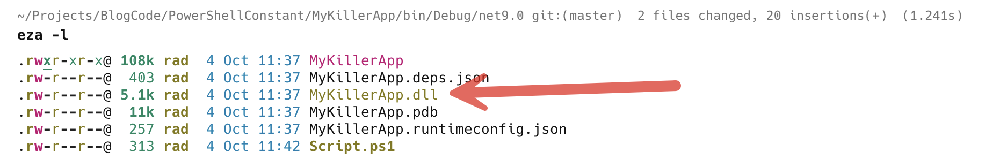

[PowerShell](https://learn.microsoft.com/en-us/powershell/scripting/overview?view=powershell-7.5) is an excellent, [cross-platform](https://en.wikipedia.org/wiki/Cross-platform_software) scripting solution that you can use to automate various tasks in Windows, Linux, and Unix environments. The fact that it has full access to the entire .[NET ecosystem](https://dotnet.microsoft.com/en-us/) is the icing on the cake.

I use it for a bunch of quick scripts and utilities across the various devices I work on.

Recently, I needed to load the value of a **constant** that was in a .NET application, so that I could use it for registration of the application.

The steps are as follows:

1. Obtain the **path** to the actual application
2. Load the **assembly**
3. Extract the **constant** value

Given that the application was in the **same path as the application executable**, I made use of the knowledge from the last post, ["Getting The Current Path Of An Executing PowerShell Script"](), and then used the [Join-Path](https://learn.microsoft.com/en-us/powershell/module/microsoft.powershell.management/join-path?view=powershell-7.5) [cmdlet](https://learn.microsoft.com/en-us/powershell/scripting/powershell-commands?view=powershell-7.5) to build the path.

```powershell
$path = (Join-Path  (Split-Path -Parent $MyInvocation.MyCommand.Path) 'MyKillerApp.exe')

Write-Host $path
```

Next, we load the assembly.

In .NET (not .[NET Framework](https://dotnet.microsoft.com/en-us/download/dotnet-framework)), when you [compile](https://dev.to/kcrnac/net-execution-process-explained-c-1b7a) an executable, among the artifacts that are generated is what we think of as the application executable, in this case `MyKillerApp`.

This, however, is just a **bootstrapper**. Your code actually gets compiled into a `DLL` with the same name.



It is in this DLL that we can find our constant.

We then use native PowerShell `cmdLet`, [Add-Type](https://learn.microsoft.com/en-us/powershell/module/microsoft.powershell.utility/add-type?view=powershell-7.5), to load the type, passing it the path.

```powershell
# Load the type
Add-Type -Path $path
```

Finally, we extract the constant.

```powershell
# Fetch the constant value
$ApplicationName = ([MyKillerApp.AppInfo]::ApplicationName)
```

The complete script is as follows:

```powershell
# Get the path to the exe
$path = (Join-Path  (Split-Path -Parent $MyInvocation.MyCommand.Path) 'MyKillerApp.dll')

# Print path
Write-Host $path

# Load the type
Add-Type -Path $path

# Fetch the constant value
$ApplicationName = ([MyKillerApp.AppInfo]::ApplicationName)

# Print the value
Write-Host $ApplicationName
```

If we run the script, we should see the following:

```bash
./Script.ps1
/Users/rad/Projects/BlogCode/PowerShellConstant/MyKillerApp/bin/Debug/net9.0/MyKillerApp.dll
My Killer Application
```

Remember that you must run the script from a PowerShell shell.

You can launch that as follows:

```bash
pwsh
```

If you don't have PowerShell installed, here are the [installation instructions](https://learn.microsoft.com/en-us/powershell/scripting/install/installing-powershell?view=powershell-7.5).

### TLDR

**PowerShell can extract constants and other values from .NET assemblies.**

The code is in my [GitHub](https://github.com/conradakunga/BlogCode/tree/master/2025-10-03%20-%20MyKillerApp).

Happy hacking!
