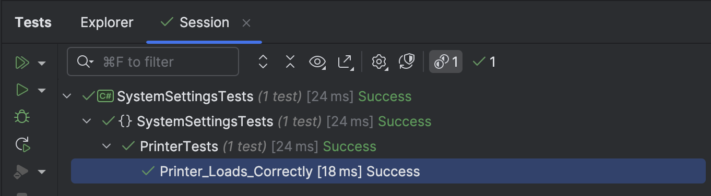

One of the abilities offered by the .NET platform is a flexible and robust **configuration and settings management engine**.

I have discussed this at some length in this post, "[Loading & Using Application Settings In .NET]()" and the subsequent post, "[Flexible Leveraging of appsettings.json in .NET Applications]()".

Suppose we have a `Settings` class that looks like this:

```c#
public class SystemSettings
{
    public string ForegroundColour { get; set; }
    public string BackgroundColour { get; set; }
}
```

And we are using it in a `Printer` class like this:

```c#
public class Printer
{
    private readonly SystemSettings _systemSettings;
    public string ForegroundColour => _systemSettings.ForegroundColour;
    public string BackgroundColour => _systemSettings.BackgroundColour;

    public Printer(IOptions<SystemSettings> settings, SystemSettings systemSettings)
    {
        _systemSettings = systemSettings;
    }
}
```

Suppose we need to **unit test** this?

Note that this is a **unit** test, not an **integration test.**

This means we don't have access to the **underlying platform**, such as ASP.NET, to do the heavy lifting for us, which is covered in this post, "[Dependency Injection In C# & .NET Part 7 - Integration Testing]()".

There is a way around this - using the [Create](https://learn.microsoft.com/en-us/dotnet/api/microsoft.extensions.options.options.create?view=net-9.0-pp) method of the [Options](https://learn.microsoft.com/en-us/dotnet/api/microsoft.extensions.options.options?view=net-9.0-pp) class.

The code would look like this:

```c#
using AwesomeAssertions;
using Microsoft.Extensions.Options;
using SystemSettings;

namespace SystemSettingsTests;

public class PrinterTests
{
    [Fact]
    public void Printer_Loads_Correctly()
    {
      	// Create the settings
        var settings = new SystemSettings
        {
            ForegroundColour = "Red",
            BackgroundColour = "White"
        };

      	// Create the options
        var options = Options.Create(settings);

      	// Pass the option where neeed
        var printer = new Printer(options);

        printer.ForegroundColour.Should().Be("Red");
        printer.BackgroundColour.Should().Be("White");
    }
}
```

If we run this code, it should run successfully.



### TLDR

**The `Options` class has a `Create` method that allows you to unit test types that have settings passed to them through the .NET settings & configuration infrastructure.**

The code is in my [GitHub](https://github.com/conradakunga/BlogCode/tree/master/2025-10-05%20-%20SettingsTest).

Happy hacking!
