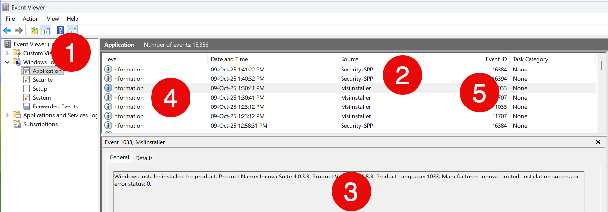

On the [Windows](https://www.microsoft.com/en-us/windows?r=1) platform, the canonical place to write logs is the [Windows Event Log](https://learn.microsoft.com/en-us/windows/win32/eventlog/event-logging).

You view this using the [Event Viewer](https://learn.microsoft.com/en-us/shows/inside/event-viewer), which looks like this:



This is composed of the following:

1. The **log**, which is a grouping of log messages
2. The **source**, which is usually the application logging the message
3. The **message**, which is the data
4. The log **level**, which categorizes the log - information, warning, error 
5. The event **ID**, a numeric ID

Writing to the event log requires the following steps

1. **Registration** of a **source**
2. Optional **creation** of a **log**
3. **Writing** to the event log

`EventLog` access and manipulation is found in the [EventLog](https://learn.microsoft.com/en-us/dotnet/api/system.diagnostics.eventlog?view=windowsdesktop-9.0) class.

## Registration Of A Source

The first order of business is to **register** an event source.

You can do this in a number of ways:

### PowerShell

You can run the following script to create an event source:

```powershell
$source = "My Awesome App"
$log = "Application"
if (-not [System.Diagnostics.EventLog]::SourceExists($source)) {
    [System.Diagnostics.EventLog]::CreateEventSource($source, $log)
    Write-Host "Created event source $source in $log"
}
```

### Code

You can also write code to accomplish  the same.

```c#
using System.Diagnostics;

const string applicationName = "My Awesome App";
const string logName = "Application";

// Check if source exists
if (!EventLog.Exists(applicationName))
{
    // Create source
    EventLog.CreateEventSource(applicationName, logName);
}
```

Whichever of these routes taken, the code must be run with administrative access.

Otherwise you will get the following error:

```plaintext
The source was not found, but some or all event logs could not be searched.  To create the source, you need permission to read all event logs to make sure that the new source name is unique.  Inaccessible logs: Security.

	
at System.Diagnostics.EventLog.FindSourceRegistration(String source, String machineName, Boolean readOnly, Boolean wantToCreate)
at System.Diagnostics.EventLog.SourceExists(String source, String machineName, Boolean wantToCreate)
at System.Diagnostics.EventLog.CreateEventSource(EventSourceCreationData sourceData)
```

Of interest is that **checking if a source exists without admin access also throws this exception**.

In other words, this code throws an exception:

```c#
Console.WriteLine($"Source exists? {EventLog.SourceExists(applicationName)}");
```


## Creation Of A Log

Next is the optional creation of a log.

Typically, most applications write to one of the existing logs, and typically, the **Application** log.


However, it is possible to create your own.

```c#
const string applicationName = "My Awesome App";
// Define our custom log
const string logName = "Awesome Logs";

// Check if source exists
if (!EventLog.SourceExists(applicationName))
{
  // Create source
  EventLog.CreateEventSource(applicationName, logName);
}
```

It is probably better to use the conventional **Application** log.

## Writing To The Event Log

Finally, there is the writing to the Event Log itself.

This is done as follows:

```c#
// Create a logger
using (var logger = new EventLog(logName))
{
    // Set the source
    logger.Source = applicationName;
    // Write the entry
    logger.WriteEntry("This is a test", EventLogEntryType.Information);
}
```

```c#
// Create a logger
using (var logger = new EventLog(logName))
{
    // Set the source
    logger.Source = applicationName;
    // Write the entry
    logger.WriteEntry("This is a test", EventLogEntryType.Information);
}
```

This looks as follows in the event log viewer.


If you omit the [EventLogEntryType](https://learn.microsoft.com/en-us/dotnet/api/system.diagnostics.eventlogentrytype?view=windowsdesktop-9.0), `Information` will be assumed.

### TLDR

You can access and manipulate the Windows Event Log using the `EventLog` class.

The code is in my GitHub.

Happy hacking!
