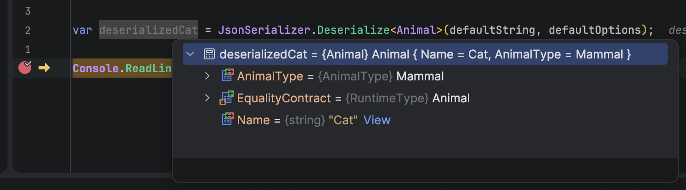

One of the data structures that you will almost certainly use as a developer is the [enumeration](https://learn.microsoft.com/en-us/dotnet/csharp/language-reference/builtin-types/enum), or `enum`.

This is basically a collection of **known values grouped together** that offer more **clarity** and **usability** than a [magic number](https://en.wikipedia.org/wiki/Magic_number_(programming)).

Take, for example, this `enum`, which we can use to describe an `AnimalType`:

```c#
public enum AnimalType
{
  Mammal,
  Reptile,
  Bird,
  Fish,
  VeryLargeMammal
}
```

We can make use of this in a [record](https://learn.microsoft.com/en-us/dotnet/csharp/language-reference/builtin-types/record), like this:

```c#
public sealed record Animal
{
  public required string Name { get; init; }
  public required AnimalType AnimalType { get; init; }
}
```

So far, so good.

Now, suppose we needed to [serialize](https://learn.microsoft.com/en-us/dotnet/standard/serialization/) an `Animal` to `JSON`.

We would do something like this, using [System.Text.Json](https://learn.microsoft.com/en-us/dotnet/api/system.text.json?view=net-9.0).

```c#
using System.Text.Json;

var cat = new Animal
{
  Name = "Cat",
  AnimalType = AnimalType.Mammal
};

// Setup the serialization to indent the properties
var defaultOptions = new JsonSerializerOptions { WriteIndented = true };

// Get the serialized string
var defaultString = JsonSerializer.Serialize(cat, defaultOptions);

// Print to console
Console.WriteLine(defaultString);
```

This would print the following:

```json
{
  "Name": "Cat",
  "AnimalType": 0
}
```

Note here that the `AnimalType` enum has been serialized as a 0, because at the end of the day, an enum represents an `int`.

This can safely be **deserialized** as follows:

```c#
var deserializedCat = JsonSerializer.Deserialize<Animal>(defaultString, defaultOptions);
```

If we inspect the `Animal` in the debugger, we can see it has been **deserialized** correctly.



When it comes to **serializing** `enums`, we have other **options**.

We can also **serialize** it as a **string**.

To do so, we need to configure the **options** that our serializer will use.

For this, we will use the [JsonSerializerOptions](https://learn.microsoft.com/en-us/dotnet/api/system.text.json.jsonserializeroptions?view=net-9.0) class, and to this, add a built-in [converter](https://learn.microsoft.com/en-us/dotnet/api/system.text.json.serialization.jsonconverter-1?view=net-9.0) to address this, the [JsonStringEnumConverter](https://learn.microsoft.com/en-us/dotnet/api/system.text.json.serialization.jsonstringenumconverter?view=net-9.0).

```c#
// Create our serialization options
var enumStringOptions = new JsonSerializerOptions { WriteIndented = true };
// Add a string enum converter
enumStringOptions.Converters.Add(new JsonStringEnumConverter());
// Serialize
var enumString = JsonSerializer.Serialize(cat, enumStringOptions);
// Print to console
Console.WriteLine(enumString);
```

This will print the following:

```json
{
  "Name": "Cat",
  "AnimalType": "Mammal"
}
```

Here we can see that the `AnimalType` is now serialized as "`Mammal`" and not `0`.

**Why** would you want to do this?

 A couple of reasons:

1. Easier to **read** and **debug**
2. You can later **change the order and values** of the enum without breaking code
3. Specifications like [Swagger](https://swagger.io/) and [OpenAPI](https://www.openapis.org/) tend to prefer this approach

As with all things, there are always drawbacks, the main one being that the JSON is **larger**. But unless you are writing high-performance systems at scale, **this doesn't matter**.

Where you need to be careful is when **deserializing** a `string` `enum`.

You would probably start off like this:

```c#
var otherCat = JsonSerializer.Deserialize<Animal>(enumString);
```

This will throw the following [exception](https://learn.microsoft.com/en-us/dotnet/api/system.exception?view=net-9.0):

```plaintext
Unhandled exception. System.Text.Json.JsonException: The JSON value could not be converted to AnimalType. Path: $.AnimalType | LineNumber: 2 | BytePositionInLine: 24.
   at System.Text.Json.ThrowHelper.ThrowJsonException(String message)
   at System.Text.Json.Serialization.Converters.EnumConverter`1.Read(Utf8JsonReader& reader, Type typeToConvert, JsonSerializerOptions options)
   at System.Text.Json.Serialization.Metadata.JsonPropertyInfo`1.ReadJsonAndSetMember(Object obj, ReadStack& state, Utf8JsonReader& reader)
   at System.Text.Json.Serialization.Converters.ObjectDefaultConverter`1.OnTryRead(Utf8JsonReader& reader, Type typeToConvert, JsonSerializerOptions options, ReadStack& state, T& value)
   at System.Text.Json.Serialization.JsonConverter`1.TryRead(Utf8JsonReader& reader, Type typeToConvert, JsonSerializerOptions options, ReadStack& state, T& value, Boolean& isPopulatedValue)
   at System.Text.Json.Serialization.JsonConverter`1.ReadCore(Utf8JsonReader& reader, T& value, JsonSerializerOptions options, ReadStack& state)
   at System.Text.Json.Serialization.Metadata.JsonTypeInfo`1.Deserialize(Utf8JsonReader& reader, ReadStack& state)
   at System.Text.Json.JsonSerializer.ReadFromSpan[TValue](ReadOnlySpan`1 utf8Json, JsonTypeInfo`1 jsonTypeInfo, Nullable`1 actualByteCount)
   at System.Text.Json.JsonSerializer.ReadFromSpan[TValue](ReadOnlySpan`1 json, JsonTypeInfo`1 jsonTypeInfo)
   at Program.<Main>$(String[] args) in /Users/rad/Projects/BlogCode/EnumSerialize/Program.cs:line 33

```

To correctly deserialize this, you need to provide a [JsonSerializerOptions](https://learn.microsoft.com/en-us/dotnet/api/system.text.json.jsonserializeroptions?view=net-9.0) with the appropriate [converter](https://learn.microsoft.com/en-us/dotnet/api/system.text.json.serialization.jsonconverter-1?view=net-9.0) added.

```c#
var otherCat = JsonSerializer.Deserialize<Animal>(enumString, enumStringOptions);
```

You can further customize the **serialization** and **deserialization**, such as changing the naming policy.

For this we use the overloaded [constructor](https://learn.microsoft.com/en-us/dotnet/api/system.text.json.serialization.jsonstringenumconverter.-ctor?view=net-9.0#system-text-json-serialization-jsonstringenumconverter-ctor(system-text-json-jsonnamingpolicy-system-boolean)).

The code would look like this:

```c#
var whale = new Animal
{
  Name = "Whale",
  AnimalType = AnimalType.VeryLargeMammal
};

// Create our serialization options
var customEnumStringOptions = new JsonSerializerOptions { WriteIndented = true };
// Add a string enum converter in kebab upper case
customEnumStringOptions.Converters.Add(new JsonStringEnumConverter(JsonNamingPolicy.KebabCaseUpper));

var customEnumString = JsonSerializer.Serialize(whale, customEnumStringOptions);

Console.WriteLine(customEnumString);
```

This will print the following:

```json
{
  "Name": "Whale",
  "AnimalType": "VERY-LARGE-MAMMAL"
}
```

The other available naming policies are outlined [here](https://learn.microsoft.com/en-us/dotnet/api/system.text.json.jsonnamingpolicy?view=net-9.0).

This is important in the case where you are **interfacing with a REST API that you do not control** as a consumer.

### TLDR

**You can control how to serialize `enums` either as `numbers` or as `strings` using `JsonSerializerOptions`.**

The code is in my GitHub.

Happy hacking!
