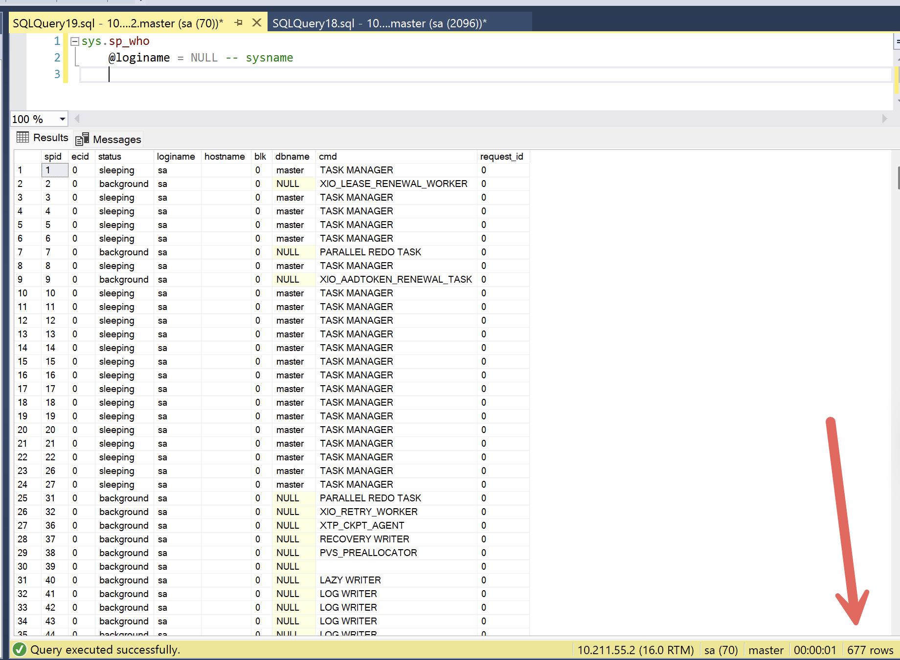

Occasionally, you might run into a situation where there are **very many open connections** to a [SQL Server database](https://www.microsoft.com/en-us/sql-server), and for whatever reason, you want to **kick them all out**.

You can see the active connections using the [sp_who](https://learn.microsoft.com/en-us/sql/relational-databases/system-stored-procedures/sp-who-transact-sql?view=sql-server-ver17) or the [sp_who2](https://sqlserverplanet.com/dba/using-sp_who2) system stored procedure.

```sql
sp_who
```

This will return something like this:



You might then want to **kick out all the connected users**.

Why? A number of reasons:

1. **Maintenance** of schemas and objects
2. There is **poorly written code** that is holding open connections, compromising performance
3. **Backup**

The brute force, take-no-prisoners method is to simply restart the SQL Server service. This will unceremoniously kick everyone out of the database, leaving you free to proceed.

This, naturally, is a **terrible** solution. **Don't do it!**

A much better way is as follows:

1. Set the database to [single-user mode](https://learn.microsoft.com/en-us/sql/relational-databases/databases/set-a-database-to-single-user-mode?view=sql-server-ver17), with the ROLLBACK IMMEDIATE option. This will **kick everyone out** and leave only one allowable connection - yours.
2. Perform your **maintenance** (if any).
3. Return the database to [multi-user mode](https://www.geeksforgeeks.org/sql/set-database-from-single-user-mode-to-multi-user-in-sql/).

The script would look like this:

```sql
-- Switch to the master database
USE master;
GO
-- Set the mode of your database
ALTER DATABASE [YourDB] SET SINGLE_USER WITH ROLLBACK IMMEDIATE;
GO

-- 
-- Do whatever work you want here
--

-- Set back to multi-user
ALTER DATABASE [YourDB] SET MULTI_USER;
GO
```

You can read more about the available options [here](https://learn.microsoft.com/en-us/sql/t-sql/statements/alter-database-transact-sql-set-options?view=sql-server-ver17).

### TLDR

**You can disconnect all users from a database by setting it to single-user mode.**

Happy hacking!
