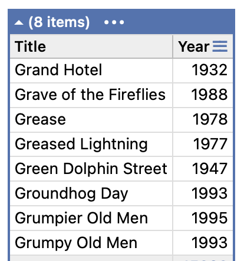
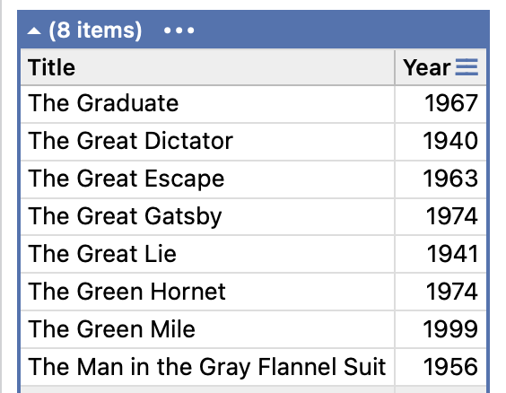

I have a small collection of **old movies**, an excerpt of which is shown below:



**What exactly constitutes an "old" movie is a matter of personal preference!** 

Further down the list is the following:



Now, here lies the challenge - for sorting purposes, I want to **ignore the "The" prefix**.

In other words, I still want **"The"** to appear in the title, but **I don't want these movies to appear under `T`** - I want them to appear **under `G`.**

The raw data is as follows:

```json
[
  {
    "Title": "Grand Hotel",
    "Year": 1932
  },
  {
    "Title": "Grave of the Fireflies",
    "Year": 1988
  },
  {
    "Title": "Grease",
    "Year": 1978
  },
  {
    "Title": "Greased Lightning",
    "Year": 1977
  },
  {
    "Title": "Green Dolphin Street",
    "Year": 1947
  },
  {
    "Title": "Groundhog Day",
    "Year": 1993
  },
  {
    "Title": "Grumpier Old Men",
    "Year": 1995
  },
  {
    "Title": "Grumpy Old Men",
    "Year": 1993
  },
  {
    "Title": "The Graduate",
    "Year": 1967
  },
  {
    "Title": "The Great Dictator",
    "Year": 1940
  },
  {
    "Title": "The Great Escape",
    "Year": 1963
  },
  {
    "Title": "The Great Gatsby",
    "Year": 1974
  },
  {
    "Title": "The Great Lie",
    "Year": 1941
  },
  {
    "Title": "The Green Hornet",
    "Year": 1974
  },
  {
    "Title": "The Green Mile",
    "Year": 1999
  }
]
```

The type, `Movie`, will look like this:

```c#
public sealed record Movie
{
	public string Title { get; set; }
	public short Year { get; set; }
}
```

We can write some simple code that will load our `JSON`, **sort** the movies by `Title`, and **print to the console**.

```c#
var movies = JsonSerializer.Deserialize<List<Movie>>(json);
var sortedMovies = movies!.OrderBy(x => x.Title).ToList();
sortedMovies.ForEach(x => Console.WriteLine(x.Title));
```

This will print the following:

```plaintext
Grand Hotel
Grave of the Fireflies
Grease
Greased Lightning
Green Dolphin Street
Groundhog Day
Grumpier Old Men
Grumpy Old Men
The Graduate
The Great Dictator
The Great Escape
The Great Gatsby
The Great Lie
The Green Hornet
The Green Mile

```

You can see here that all titles starting with `The` are **clustered together**.

The first, and simpler solution is to **introduce a computed property** that **removes the prefix I don't want**, and then **sort using this new property**.

```c#
public sealed record Movie
{
    public required string Title { get; set; }

    // Remove the prefix "The" if it exists
    public string SortTitle => Title.StartsWith("The") ? Title.Remove(0, 4) : Title;
    public required short Year { get; set; }
}
```

The code would look like this:

```c#
var moviesV2 = JsonSerializer.Deserialize<List<V2.Movie>>(json);
var sortedMoviesV2 = moviesV2!.OrderBy(x => x.SortTitle).ToList();
sortedMoviesV2.ForEach(x => Console.WriteLine(x.Title));
```

And the result is as follows:

```plaintext
The Graduate
Grand Hotel
Grave of the Fireflies
Grease
Greased Lightning
The Great Dictator
The Great Escape
The Great Gatsby
The Great Lie
Green Dolphin Street
The Green Hornet
The Green Mile
Groundhog Day
Grumpier Old Men
Grumpy Old Men

```

Which is what I expect. It works.

The problem is:

1. I have **complicated** the `Movie` class
2. The code is **brittle** - I have to assume there are no extra spaces after the `The`
3. I might want to add **more articles**, like `A`
4. In my application, I have to **remember to sort by the correct property**

Another solution to this problem is to use a custom [comparer](https://learn.microsoft.com/en-us/dotnet/api/system.collections.generic.comparer-1?view=net-9.0), something we have looked at before.

The `comparer` will look like this:

```c#
public sealed class MovieComparer : IComparer<Movie>, IEqualityComparer<Movie>
{
    // Define the articles to ignore in the sort
    private static readonly string[] Articles = ["a ", "an ", "the "];

    // Create a CompareInfo object for comparison
    private static readonly CompareInfo CompareInfo = CultureInfo.InvariantCulture.CompareInfo;
  
  
    // Static instance creator
    public static readonly MovieComparer Instance = new();

    // Sanitize our input strings
    private static string Normalize(string? input)
    {
        if (string.IsNullOrWhiteSpace(input))
            return string.Empty;

        var trimmed = input.TrimStart();

        foreach (var article in Articles)
        {
            if (trimmed.StartsWith(article, StringComparison.InvariantCultureIgnoreCase))
                return trimmed.Substring(article.Length).TrimStart();
        }

        return trimmed;
    }

    // Do the comparison
    public int Compare(Movie? x, Movie? y)
    {
        if (ReferenceEquals(x, y)) return 0;
        if (x is null) return -1;
        if (y is null) return 1;

        return CompareInfo.Compare(Normalize(x.Title), Normalize(y.Title), CompareOptions.IgnoreCase);
    }

    // Equality override
    public bool Equals(Movie? x, Movie? y)
    {
        if (ReferenceEquals(x, y)) return true;
        if (x is null || y is null) return false;

        return string.Equals(Normalize(x.Title), Normalize(y.Title), StringComparison.InvariantCultureIgnoreCase);
    }

    // Hashcode override
    public int GetHashCode(Movie? obj)
    {
        if (obj?.Title is null)
            return 0;

        return StringComparer.InvariantCultureIgnoreCase.GetHashCode(Normalize(obj.Title));
    }
}
```

We can then use our `comparer` like this:

```c#
moviesV1!.Sort(new MovieComparer());
foreach (var movie in moviesV1)
    Console.WriteLine(movie.Title);
```

The final improvement is to add [LINQ](https://learn.microsoft.com/en-us/dotnet/csharp/linq/) support by implementing the generic [IComparable<Movie>>](https://learn.microsoft.com/en-us/dotnet/api/system.icomparable-1?view=net-9.0) on the `Movie` type.

```c#
public sealed record Movie : IComparable<Movie>
{
    public required string Title { get; init; }
    public required short Year { get; init; }

    // Delegate to comparer
    public int CompareTo(Movie? other) => MovieComparer.Instance.Compare(this, other);

    // Delegate to comparer
    public override int GetHashCode() => MovieComparer.Instance.GetHashCode(this);
}
```

Of interest here is that rather than **duplicate the comparison** code, we **delegate to the code we already have** in the `MovieComparer`.

This allows us now to write code like this:

```c#
var sortedMovies = moviesV1.OrderBy(x => x).ToList();
foreach (var movie in sortedMovies)
  Console.WriteLine(movie.Title);
```

We can also omit the lambda altogether, and do this:

```c#
var sortedMovies = moviesV1.Order().ToList();
foreach (var movie in sortedMovies)
  Console.WriteLine(movie.Title);
```

You also don't need to directly invoke the comparer when sorting, so you can do this:

```c#
moviesV1!.Sort();
foreach (var movie in moviesV1)
  Console.WriteLine(movie.Title);
```

### TLDR

**A custom `Comparer` can be a very powerful technique to control how to do custom sorting.**

The code is in my GitHub.

Happy hacking!
