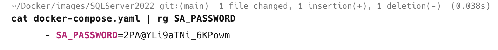
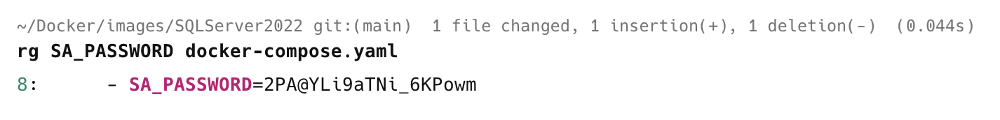

I have mentioned a number of times that I make heavy use of [Docker](https://www.docker.com/) to spin up instances of **infrastructure I use in development**, like databases. 

For example, here is the `docker-compose.yaml` for my [Microsoft SQL Server](https://www.microsoft.com/en-us/sql-server) that persists data to disk:

```yaml
services:
  sql_server:
    image: mcr.microsoft.com/mssql/server:2022-latest
    container_name: sql_server_2022
    restart: always
    environment:
      - ACCEPT_EULA=Y
      - SA_PASSWORD=2PA@YLi9aTNi_6KPowm
      - TZ=Africa/Nairobi
    ports:
      - '1433:1433'
    volumes:
      - /Users/rad/Data/SQLServer2022:/var/opt/mssql/data
```

I routinely forget the SA password, so when I need to retrieve it, I have been doing this using the [ripgrep](https://github.com/BurntSushi/ripgrep) utility :

```bash
cat docker-compose.yaml | rg SA_PASSWORD
```

Which prints what I expect:



Much as it is working, I am in fact doing the wrong thing.

What this does is:

1. **Load the entire file** from disk
2. **Pipe the content** to `ripgrep`
3. `Ripgrep` then **filters** what I want
4. The result is **printed** to the terminal

This is **unnecessary** because `ripgrep` directly **supports searching in files**.

I can achieve the same thing with a **single command** like this:

```bash
rg SA_PASSWORD docker-compose.yaml
```

This returns the following:



In addition to being **simpler** and **faster**, this approach also has the added benefit of returning the **line number**.

The same will work with whichever flavour of grep you use, plain vanilla grep, [ripgrep,](https://github.com/BurntSushi/ripgrep) or [ugrep](https://github.com/Genivia/ugrep).

### TLDR

**`Grep` (and its flavours) directly support searching in files, so piping `cat` to `grep` is unnecessary.**

Happy hacking!
