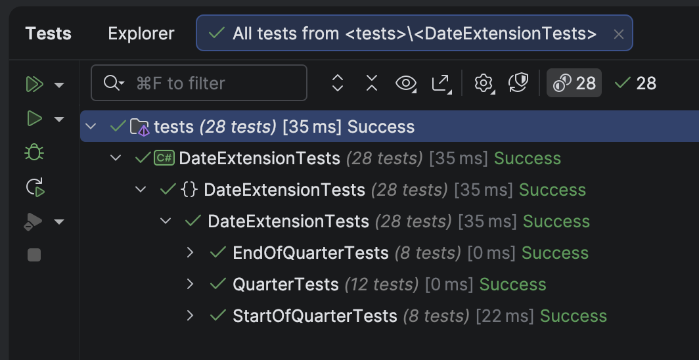

When doing [DateOnly](https://learn.microsoft.com/en-us/dotnet/api/system.dateonly?view=net-9.0) or [DateTime](https://learn.microsoft.com/en-us/dotnet/api/system.datetime?view=net-9.0) arithmetic and manipulations, it is common to come across a situation where you need to operate in **quarters**.

A calendar year has `4` quarters, each of 3 months.

- Quarter 1 - January, February, March
- Quarter 2 - April, May, June
- Quarter 3 - July, August, September
- Quarter 4 - October, November, December

We can implement the following to make life easier

1. Get the **current** quarter
2. Get the **start** of the current quarter
3. Get the **end** of the current quarter

## Get the current quarter

For this, we can make use of the fact that the distance between the quarters is `3` **months**.

A simple algorithm is to **subtract** `1` from the month, **divide** the result by `3`, **round the result down**, and **add** `1`.

We get the month from the [Month](https://learn.microsoft.com/en-us/dotnet/api/system.dateonly.month?view=net-9.0) property of the `DateOnly`.

| Month | Computation         | Result |
| ----- | ------------------- | ------ |
| Jan   | `((1 - 1) / 3) + 1` | `1`    |
| Feb   | `((2 - 1) / 3) + 1` | `1`    |
| Mar   | `((3 - 1) / 3) + 1` | `1`    |
| April   | `((4 - 1) / 3) + 1` | `2`    |
| May   | `((5 - 1) / 3) + 1` | `2`    |
| June   | `((6 - 1) / 3) + 1` | `2`    |
| July   | `((7 - 1) / 3) + 1` | `3`    |
| August   | `((8 - 1) / 3) + 1` | `3`    |
| September | `((9 - 1) / 3) + 1` | `3`    |
| October | `((10 - 1) / 3) + 1` | `4`    |
| November | `((11 - 1) / 3) + 1` | `4`    |
| December | `((12 - 1) / 3) + 1` | `4`    |

The code, implemented as an [extension method](https://en.wikipedia.org/wiki/Extension_method), will look like this:

```c#
public static class DateOnlyExtensions
{
    /// <summary>
    /// Get the current quarter of the date
    /// </summary>
    /// <param name="date"></param>
    /// <returns></returns>
    public static int Quarter(this DateOnly date)
    {
        return (date.Month - 1) / 3 + 1;
    }
}
```

## Get the start of the current quarter

The next challenge is: given a `DateOnly`, to determine the **start of the quarter**.

For this, we will need two things:

1. The **current** quarter
2. The **year**

To get the **start** of the **quarter**, we first get the **current** quarter.

We then **subtract** `1` from the quarter, **multiply** by `3`, then **add** `1`. This will give us the **month** that is the **start** of the **quarter**.

The code looks like this:

```c#
public static class DateOnlyExtensions
{
    /// <summary>
    /// Get the current quarter of the date
    /// </summary>
    /// <param name="date"></param>
    /// <returns></returns>
    public static int Quarter(this DateOnly date)
    {
        return (date.Month - 1) / 3 + 1;
    }

    /// <summary>
    /// Returns the start date of the quarter for the given date.
    /// </summary>
    public static DateOnly GetStartOfQuarter(this DateOnly date)
    {
        int startMonth = (date.Quarter() - 1) * 3 + 1;
        return new DateOnly(date.Year, startMonth, 1);
    }
}
```

## Get the end of the current quarter

The next challenge is: given a `DateOnly`, to determine the **end of the quarter**.

For this, we will need two things:

1. The **current** quarter
2. The **year**

To get the **end** of the **quarter**, we first get the **current** quarter.

The month that is at the end of the quarter will be the **current quarter** multiplied by `3`.

The final code looks like this:

```c#
public static class DateOnlyExtensions
{
    /// <summary>
    /// Get the current quarter of the date
    /// </summary>
    /// <param name="date"></param>
    /// <returns></returns>
    public static int Quarter(this DateOnly date)
    {
        return (date.Month - 1) / 3 + 1;
    }

    /// <summary>
    /// Returns the start date of the quarter for the given date.
    /// </summary>
    public static DateOnly GetStartOfQuarter(this DateOnly date)
    {
        int startMonth = (date.Quarter() - 1) * 3 + 1;
        return new DateOnly(date.Year, startMonth, 1);
    }

    /// <summary>
    /// Returns the end date of the quarter for the given date.
    /// </summary>
    public static DateOnly GetEndOfQuarter(this DateOnly date)
    {
        int endMonth = date.Quarter() * 3;
        int endDay = DateTime.DaysInMonth(date.Year, endMonth);
        return new DateOnly(date.Year, endMonth, endDay);
    }
}
```

We can add some **tests** to verify our code.

```c#
public class DateExtensionTests
{
    [Theory]
    [InlineData(1, 1, 1)]
    [InlineData(2, 1, 1)]
    [InlineData(3, 1, 1)]
    [InlineData(4, 1, 2)]
    [InlineData(5, 1, 2)]
    [InlineData(6, 1, 2)]
    [InlineData(7, 1, 3)]
    [InlineData(8, 1, 3)]
    [InlineData(9, 1, 3)]
    [InlineData(10, 1, 4)]
    [InlineData(11, 1, 4)]
    [InlineData(12, 1, 4)]
    public void QuarterTests(int month, int day, byte quarter)
    {
        var sut = new DateOnly(2025, month, day);
        sut.Quarter().Should().Be(quarter);
    }

    [Theory]
    [InlineData(1, 1, 1, 1)]
    [InlineData(3, 1, 1, 1)]
    [InlineData(4, 1, 4, 1)]
    [InlineData(6, 1, 4, 1)]
    [InlineData(7, 1, 7, 1)]
    [InlineData(9, 1, 7, 1)]
    [InlineData(10, 1, 10, 1)]
    [InlineData(12, 1, 10, 1)]
    public void StartOfQuarterTests(int testMonth, int testDay, int actualMonth, int actualDay)
    {
        var testDate = new DateOnly(2025, testMonth, testDay);
        testDate.GetStartOfQuarter().Should().Be(new DateOnly(2025, actualMonth, actualDay));
    }

    [Theory]
    [InlineData(1, 1, 3, 31)]
    [InlineData(3, 31, 3, 31)]
    [InlineData(4, 1, 6, 30)]
    [InlineData(6, 30, 6, 30)]
    [InlineData(7, 1, 9, 30)]
    [InlineData(9, 30, 9, 30)]
    [InlineData(10, 1, 12, 31)]
    [InlineData(12, 31, 12, 31)]
    public void EndOfQuarterTests(int testMonth, int testDay, int actualMonth, int actualDay)
    {
        var testDate = new DateOnly(2025, testMonth, testDay);
        testDate.GetEndOfQuarter().Should().Be(new DateOnly(2025, actualMonth, actualDay));
    }
}
```

These, naturally, should pass.



### TLDR

**We have implemented some extension methods that help us get the current quarter, the start of the current quarter, and the end of the current quarter.**

The code is in my Github.

Happy hacking!
