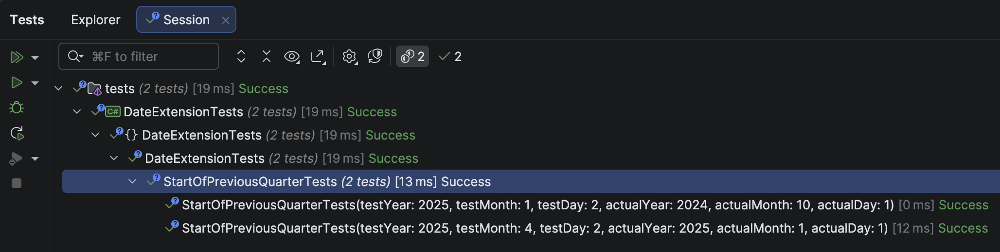

The previous post, "[Getting The Start and End Of A Quarter In C# & .NET]()", looked at how to get the **start** and **end** of a **quarter**.

In this post, we shall build on the work we did last time and write code that gets the following:

1. The **end of the previous** quarter, e.g., given **2 April 2025**, it returns **31 March 2025**
2. The **start of the previous** quarter, e.g., given **2 April 2025**, it returns **1 January 2025**

## End of the previous quarter

To get this, we can do the following:

1. Get the **start of the current** quarter
2. **Subtract a day** from that

So, for our example of **2 April 2025**, we get the **start of the current quarter**, which is **1 April 2025**.

We then **subtract one day** from this, giving us **31 March 2025**.

The code is as follows:

```c#
/// <summary>
/// Returns the last day of the previous quarter
/// </summary>
/// <param name="date"></param>
/// <returns></returns>
public static DateOnly GetEndOfPreviousQuarter(this DateOnly date)
  {
      // Get the start of the current quarter
      var startOfCurrentQuarter = date.GetStartOfQuarter();
      // Subtract one day
      return startOfCurrentQuarter.AddDays(-1);
  }
```

We then write some **tests** for this:

```c#
[Theory]
[InlineData(2025, 4, 2, 2025, 3, 31)]
[InlineData(2025, 1, 1, 2024, 12, 31)]
public void EndOfPreviousQuarterTests(int testYear, int testMonth, int testDay, int actualYear, int actualMonth,
    int actualDay)
{
    var testDate = new DateOnly(testYear, testMonth, testDay);
    testDate.GetEndOfPreviousQuarter().Should().Be(new DateOnly(actualYear, actualMonth, actualDay));
}
```

## Start of the previous quarter

To get this, we can use the following simple algorithm.

1. Get the start of the current quarter
2. Subtract 3 months from that

The rationale here is that the **start** of each quarter is exactly `3` months **away from the next**.

So, for our example of **2 April 2025**, we get the **start of the current quarter**, which is **1 April 2025**.

We then **subtract** `3` months from this to get **1 Jan 2025**.

The code is as follows:

```c#
/// <summary>
/// Returns the first day of the previous quarter
/// </summary>
/// <param name="date"></param>
/// <returns></returns>
public static DateOnly GetStartOfPreviousQuarter(this DateOnly date)
{
  // Get the start of the current quarter
  var startOfCurrentQuarter = date.GetStartOfQuarter();
  // Subtract 3 months
  return startOfCurrentQuarter.AddMonths(-3);
}
```

We then write some **tests** for this:

```c#
[Theory]
[InlineData(2025, 4, 2, 2025, 1, 1)]
[InlineData(2025, 1, 2, 2024, 10, 1)]
public void StartOfPreviousQuarterTests(int testYear, int testMonth, int testDay, int actualYear, int actualMonth,
    int actualDay)
{
    var testDate = new DateOnly(testYear, testMonth, testDay);
    testDate.GetStartOfPreviousQuarter().Should().Be(new DateOnly(actualYear, actualMonth, actualDay));
}
```

The **tests** for these two extension methods should **pass**:



### TLDR

**We have written two extension methods that compute:**

1. **The last day of the previous quarter**
2. **The first day of the previous quarter**

The code is in my GitHub.

Happy hacking!
