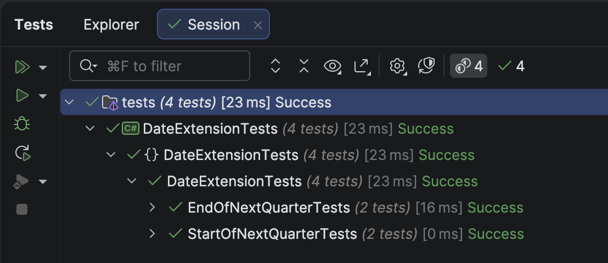

The previous post, "[Getting The Start and End Of The Previous Quarter In C# & .NET]()" looked at how to compute the **last day of the previous quarter** and the **first day of the previous quarter**.

In this post, we will look at how to compute the following:

1. **First** date of the **next quarter**
2. **Last** date of the **next quarter**

## First date of the next quarter

To fetch this, we can do the following:

1. Get the **last** date of the **current quarter**
2. **Add a day** to that

So, given an example of **2nd April 2025**, we first compute the **last date of the current quarter** using the method `GetEndOfQuarter()` we have already [written](). This will be **30 Jun 2025**.

The first date of the next quarter is **the day after** this date, **1 Jul 2025.**

The code looks like this:

```c#
/// <summary>
/// Returns the first day of the next quarter
/// </summary>
/// <param name="date"></param>
/// <returns></returns>
public static DateOnly GetStartOfNextQuarter(this DateOnly date)
{
  // Get the end of the current quarter
  var endOfCurrentQuarter = date.GetEndOfQuarter();
  // Add a day
  return endOfCurrentQuarter.AddDays(1);
}
```

We then write some **tests** for this.

```c#
[Theory]
[InlineData(2025, 4, 2, 2025, 7, 1)]
[InlineData(2025, 12, 31, 2026, 1, 1)]
public void StartOfNextQuarterTests(int testYear, int testMonth, int testDay, int actualYear, int actualMonth, int actualDay)
{
  var testDate = new DateOnly(testYear, testMonth, testDay);
  testDate.GetStartOfNextQuarter().Should().Be(new DateOnly(actualYear, actualMonth, actualDay));
}
```

## Last date of the next quarter

To get this is even simpler.

1. Get the **first date** of the **next** quarter

2. Get the **last date** of the (now) **current** quarter 


So, given an example of **2nd April 2025**, we first compute the **first date of the next quarter** using the method `GetStartOfNextQuarter()` we have just written. This will be **1 July 2025**.

We then get the end of this using the `GetEndOfQuarter()` method we wrote [here](), which is **30 September 2025**.

The code is as follows:

```c#
/// <summary>
/// Returns the last day of the next quarter
/// </summary>
/// <param name="date"></param>
/// <returns></returns>
public static DateOnly GetEndOfNextQuarter(this DateOnly date)
{
  // Get the start of the next quarter
  var startOfNextQuarter = date.GetStartOfNextQuarter();
  // Get the end of the (now) current quarter
  return startOfNextQuarter.GetEndOfQuarter();
}
```

Next, we write some tests for this:

```c#
[Theory]
[InlineData(2025, 4, 2, 2025, 9, 30)]
[InlineData(2025, 12, 31, 2026, 3, 31)]
public void EndOfNextQuarterTests(int testYear, int testMonth, int testDay, int actualYear, int actualMonth, int actualDay)
{
  var testDate = new DateOnly(testYear, testMonth, testDay);
  testDate.GetEndOfNextQuarter().Should().Be(new DateOnly(actualYear, actualMonth, actualDay));
}
```

These tests should **pass**.



### TLDR

**In this post, we have written methods to compute:**

1. **First day of the next quarter**
2. **Last day of the next quarter**

The code is in my [GitHub](https://github.com/conradakunga/BlogCode/tree/master/2025-10-23%20-%20DateExtensions).

Happy hacking!
