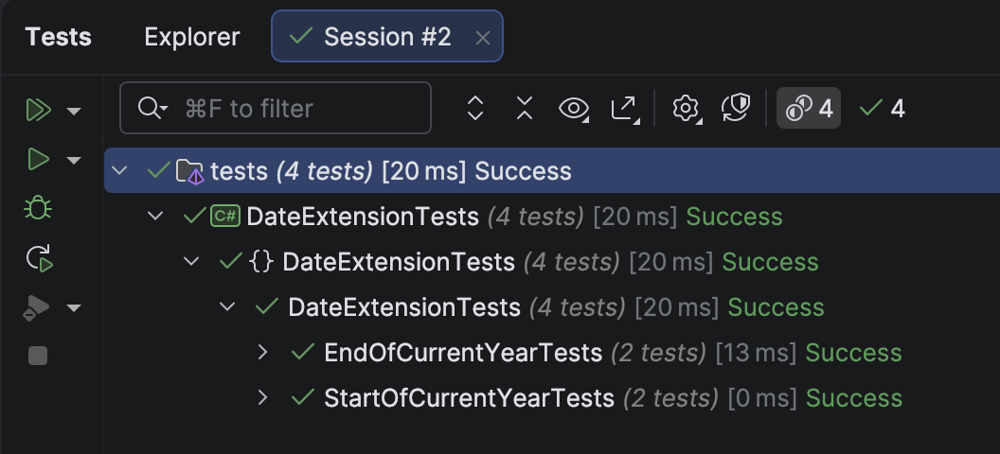

The previous post, "[Getting The Start and End Of The Next Quarter In C# & .NET]()" looked at how to get the start and end of the next quarter, given a [DateOnly](https://learn.microsoft.com/en-us/dotnet/api/system.dateonly?view=net-9.0).

In this post, we will look at how to compute the following:

1. **Start** of the current year
2. **End** of the current year

## Start of the current year

The **start** of the **current** year is simply the first day of the year. 

A simple algorithm is the following:

1. Get the **current year**
2. Assume the first **date** is the 1<sup>st</sup>
3. Assume the first **month** is January
4. Create a new `DateOnly` with these parameters

So, given a date such as **5 July 2025**, the start of the current year is **1 January 2025**.

The code is as follows:

```c#
public static DateOnly StartOfCurrentYear(this DateOnly date)
{
  //Create a new dateonly using the current year, first day, and first month (Jan)
  return new DateOnly(date.Year, 1, 1);
}
```

We then write some **tests** to verify our functionality.

```c#
[Trait("Year", "Start")]
[Theory]
[InlineData(2025, 4, 2, 2025, 1, 1)]
[InlineData(2025, 12, 31, 2025, 1, 1)]
public void StartOfCurrentYearTests(int testYear, int testMonth, int testDay, int actualYear, int actualMonth,
    int actualDay)
{
    var testDate = new DateOnly(testYear, testMonth, testDay);
    testDate.GetStartOfCurrentYear().Should().Be(new DateOnly(actualYear, actualMonth, actualDay));
}
```

## End of the current year

The end of the current year, by definition, is the last day of the last month of the current year.

A simple algorithm is as follows:

1. Get the **start of the year** of the given `DateOnly`, using the `GetStartOfCurrentYear()` method above.
2. Get the **current year**
3. **Increment** the current year
4. Create a new `DateOnly` with these parameters
5. Subtract a **day**

So, given a date, 6 July 2025:

- **Start** of the year will be **1 Jan 2025**
- The **current** year is `2025`
- **Increment** this to `2026`
- Create a new `DateOnly`, **1 Jan 2026**
- **Subtract** a **day**, **31 Dec 2025**

The code is as follows:

```c#
/// <summary>
/// Returns the end of the current year
/// </summary>
/// <param name="date"></param>
/// <returns></returns>
public static DateOnly GetEndOfCurrentYear(this DateOnly date)
{
  // Get the start of the current year
  var startOfCurrentYear = date.GetStartOfCurrentYear();
  // Push to the next year
  var startOfNextYear = new DateOnly(startOfCurrentYear.Year + 1, 1, 1);
  // Advance to end of current year
  return startOfNextYear.AddDays(-1);
}
```

We then write some **tests** to verify the functionality.

```c#
[Trait("Year", "End")]
[Theory]
[InlineData(2025, 4, 2, 2025, 12, 31)]
[InlineData(2025, 12, 31, 2025, 12, 31)]
public void EndOfCurrentYearTests(int testYear, int testMonth, int testDay, int actualYear, int actualMonth,
    int actualDay)
{
  var testDate = new DateOnly(testYear, testMonth, testDay);
  testDate.GetEndOfCurrentYear().Should().Be(new DateOnly(actualYear, actualMonth, actualDay));
}
```

The tests should pass successfully.



### TLDR

**In this post, we have written methods to compute:**

1. **First day of the current year**
2. **Last day of the current year**

The code is in my [GitHub](https://github.com/conradakunga/BlogCode/tree/master/2025-10-24%20-%20DateExtensions).

Happy hacking!
