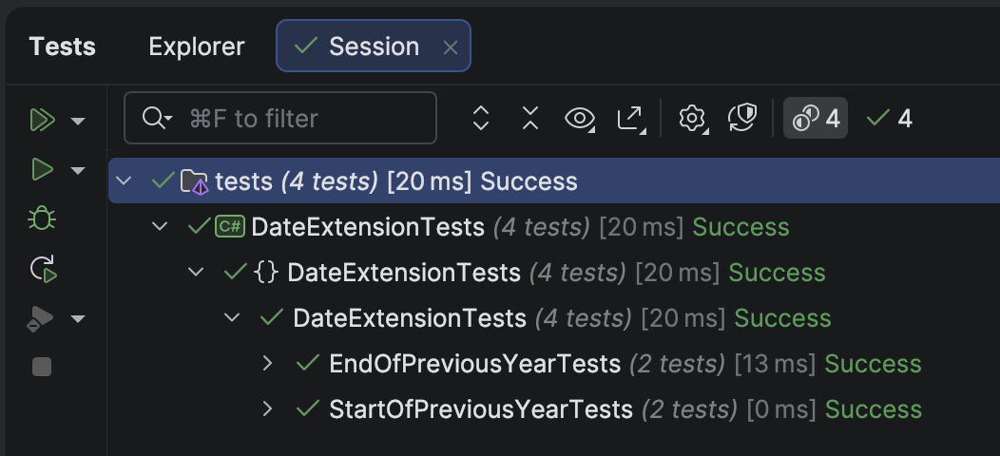

The previous post, "Getting The Start and End Of The Current Year In C# & .NET", discussed how to get the start and end dates of the current year given a [DateOnly](https://learn.microsoft.com/en-us/dotnet/api/system.dateonly?view=net-9.0).

In this post, we will look at how to compute the following:

1. **Start** of the previous year
2. **End** of the previous year

## Start of the previous year

To get the start of the previous year, we do the following:

- Get the **start** of the **current** year
- Get the **current** **year**
- **Decrement** the current year by one
- Return a new `DateOnly` with these parameters

Thus, given a date, **2 July 2025**

- Start of the year is **1 January 2025**
- Current year is **2025**
- The previous year is **2024**
- The start of the previous year is **1 January 2024**

The code is as follows:

```c#
/// <summary>
/// Returns the start of the previous year
/// </summary>
/// <param name="date"></param>
/// <returns></returns>
public static DateOnly GetStartOfPreviousYear(this DateOnly date)
{
  // Create a new dateonly using the current year minus one, first day, and first month (Jan)
  return new DateOnly(date.Year - 1, 1, 1);
}
```

We then write some **tests** to verify it works:

```c#
[Trait("Year", "Start")]
[Theory]
[InlineData(2025, 4, 2, 2024, 1, 1)]
[InlineData(2025, 12, 31, 2024, 1, 1)]
public void StartOfPreviousYearTests(int testYear, int testMonth, int testDay, int actualYear, int actualMonth,
int actualDay)
{
  var testDate = new DateOnly(testYear, testMonth, testDay);
  testDate.GetStartOfPreviousYear().Should().Be(new DateOnly(actualYear, actualMonth, actualDay));
}
```

## End of the previous year

To get the **end** of the **previous year**, we do the following, leveraging some of our earlier work:

1. Get the **start** of the **previous** year, using the `GetStartOfPreviousYear()` method we just wrote.
2. Using the `GetEndOfCurrentYear()` method we wrote [earlier](), get the **last day of the year** 

The code is as follows:

```c#
/// <summary>
/// Returns the end of the previous year
/// </summary>
/// <param name="date"></param>
/// <returns></returns>
public static DateOnly GetEndOfPreviousYear(this DateOnly date)
{
  // Get the start of the previous year
  var startOfPreviousYear = date.GetStartOfPreviousYear();
  // Return the end of that year
  return startOfPreviousYear.GetEndOfCurrentYear();
}
```

We then write some **tests** for this:

```c#
[Trait("Year", "End")]
[Theory]
[InlineData(2025, 4, 2, 2024, 12, 31)]
[InlineData(2025, 12, 31, 2024, 12, 31)]
public void EndOfPreviousYearTests(int testYear, int testMonth, int testDay, int actualYear, int actualMonth,
int actualDay)
{
  var testDate = new DateOnly(testYear, testMonth, testDay);
  testDate.GetEndOfPreviousYear().Should().Be(new DateOnly(actualYear, actualMonth, actualDay));
}
```



### TLDR

**In this post, we have written methods to compute:**

1. **First day of the previous year**
2. **Last day of the previous year**

The code is in my GitHub.

Happy hacking!
