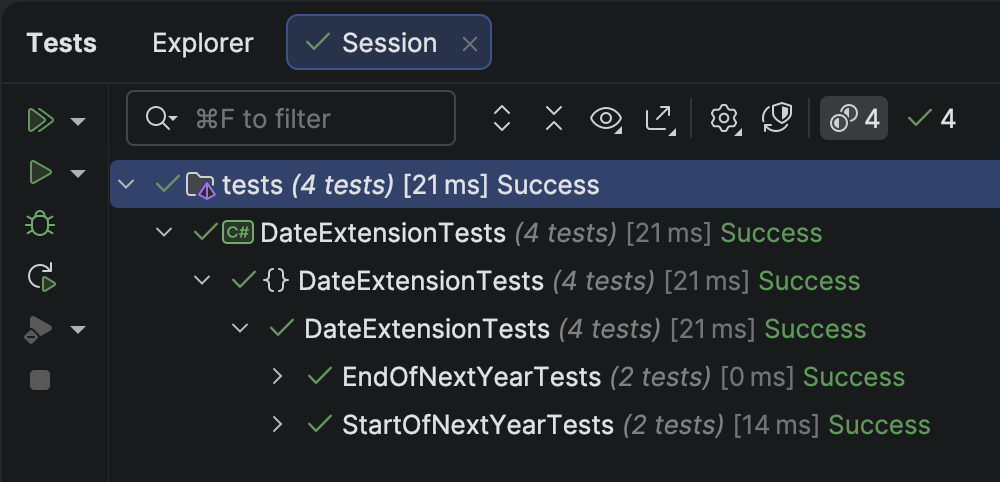

The previous post, "[Getting The Start and End Of The Previous Year In C# & .NET]()", discussed how to get the **start** and **end** dates of the **previous year** given a [DateOnly](https://learn.microsoft.com/en-us/dotnet/api/system.dateonly?view=net-9.0).

In this post, we will look at how to compute the following:

1. **Start** of the next year
2. **End** of the next year

## Start of the next year

To get the **start** of the **next** year, we can do the following:

1. Get the **start** of the **current** year
2. Get the **year**
3. **Increment** the year by `1`
4. Create a new `DateOnly` with these parameters

Thus, given a date, **1 July 2025**

1. Start of the **current** year is **1 Jan 2025**
2. The year is `2025`
3. Increment to `2026`
4. Create a new `DateOnly`

The code is as follows:

```c#
/// <summary>
/// Returns the start of the next year
/// </summary>
/// <param name="date"></param>
/// <returns></returns>
public static DateOnly GetStartOfNextYear(this DateOnly date)
{
  // Create a new dateonly using the current year plus one, first day, and first month (Jan)
  return new DateOnly(date.Year + 1, 1, 1);
}
```

We next create some **tests** to make sure it works:

```c#
[Trait("Year", "Start")]
[Theory]
[InlineData(2025, 4, 2, 2026, 1, 1)]
[InlineData(2025, 12, 31, 2026, 1, 1)]
public void StartOfNextYearTests(int testYear, int testMonth, int testDay, int actualYear, int actualMonth,
  int actualDay)
{
  var testDate = new DateOnly(testYear, testMonth, testDay);
  testDate.GetStartOfNextYear().Should().Be(new DateOnly(actualYear, actualMonth, actualDay));
}
```

## End of the next year

To get the **end** of the **next** year, we leverage some of the work that we have done earlier.

1. Get the **start** of the **current** year, using the method we have just written, `GetStartOfNextYear()`
2. With that `DateOnly`, get the **end** of **that** (current) year, using the `GetEndOfCurrentYear()` method we wrote [here]().

The code looks like this:

```c#
/// <summary>
/// Return the end of the next year
/// </summary>
/// <param name="date"></param>
/// <returns></returns>
public static DateOnly GetEndOfNextYear(this DateOnly date)
{
  // Get the start of the next year
  var startOfNextYear = date.GetStartOfNextYear();
  // Return the end of that year
  return startOfNextYear.GetEndOfCurrentYear();
}
```

We then create some **tests** for the same:

```c#
[Trait("Year", "End")]
[Theory]
[InlineData(2025, 4, 2, 2026, 12, 31)]
[InlineData(2025, 12, 31, 2026, 12, 31)]
public void EndOfNextYearTests(int testYear, int testMonth, int testDay, int actualYear, int actualMonth,
  int actualDay)
{
  var testDate = new DateOnly(testYear, testMonth, testDay);
  testDate.GetEndOfNextYear().Should().Be(new DateOnly(actualYear, actualMonth, actualDay));
}
```

If we run our tests, they should pass.



### TLDR

**In this post, we have written methods to compute:**

1. ***First* day of the *next* year**
2. ***Last* day of the *next* year**

The code is in my [GitHub](https://github.com/conradakunga/BlogCode/tree/master/2025-10-26%20-%20DateExtensions).

Happy hacking!
