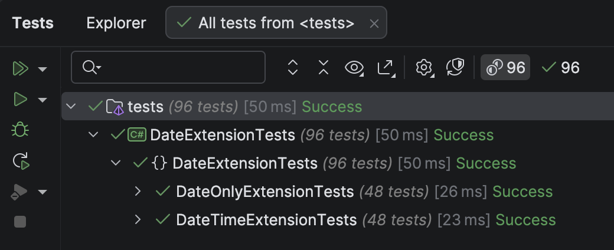

Over the last 6 days, we have written a bunch of **extension methods** for the [DateOnly](https://learn.microsoft.com/en-us/dotnet/api/system.dateonly?view=net-9.0) type to make a number of date **computations** easier.

- [Getting The Start and End Of The Next Year](https://www.conradakunga.com/blog/getting-the-start-and-end-of-the-next-year-in-c-net/) 
-  [Getting The Start and End Of The Previous Year](https://www.conradakunga.com/blog/getting-the-start-and-end-of-the-previous-year-in-c-net/) 
-  [Getting The Start and End Of The Current Year](https://www.conradakunga.com/blog/getting-the-start-and-end-of-the-current-year-in-c-net/) 
-  [Getting The Start and End Of The Next Quarter](https://www.conradakunga.com/blog/getting-the-start-and-end-of-the-next-quarter-in-c-net/) 
- [Getting The Start and End Of The Previous Quarter](https://www.conradakunga.com/blog/getting-the-start-and-end-of-the-previous-quarter-in-c-net/) 
- [Getting The Start and End Of A Quarter](https://www.conradakunga.com/blog/getting-the-start-and-end-of-a-quarter-in-c-net/) 

Given that they are written to extend the `DateOnly` type, they do not factor in **hours**, **minutes**, **seconds**, or the other **smaller units** of time.

In this case, we would need to write the extension methods for the [DateTime](https://learn.microsoft.com/en-us/dotnet/api/system.datetime?view=net-9.0) type.

Here will will leverage the following:

1. We have **already written all the code for the conversions** already with the `DateOnly`
2. The smallest unit of time is a [Tick](https://learn.microsoft.com/en-us/dotnet/api/system.datetime.ticks?view=net-9.0)

All the `Start` methods will remain as is - the start of any period is the smallest unit. For example, the time for the first quarter is going to be `00:00.0000`

All the `End` methods, however, need to factor in the **time** component, which is going to be the l**argest time value just shy of crossing the date**.

We can get this as follows:

```c#
TimeSpan.FromDays(1).Add(TimeSpan.FromTicks(-10))
```

We are **subtracting** `10` because `Ticks` advance in units of `10`.

We can then add this value to the start DateTime to get the end DateTime just short of crossing to the next day.

```c#
private static readonly TimeSpan LargestTime = TimeSpan.FromDays(1).Add(TimeSpan.FromTicks(-10));
```


The code for the DateTime extensions will look like this:

```c#
public static class DateTimeExtensions
{
  private static readonly TimeSpan LargestTime = TimeSpan.FromDays(1).Add(TimeSpan.FromTicks(-10));

  /// <summary>
  /// Get the current quarter of the date
  /// </summary>
  /// <param name="date"></param>
  /// <returns></returns>
  public static int Quarter(this DateTime date)
  {
    return DateOnly.FromDateTime(date).Quarter();
  }

  /// <summary>
  /// Returns the start date of the quarter for the given date.
  /// </summary>
  public static DateTime GetStartOfQuarter(this DateTime date)
  {
    return DateOnly.FromDateTime(date).GetStartOfQuarter().ToDateTime(TimeOnly.MinValue);
  }

  /// <summary>
  /// Returns the end date of the quarter for the given date.
  /// </summary>
  public static DateTime GetEndOfQuarter(this DateTime date)
  {
    return DateOnly.FromDateTime(date).GetEndOfQuarter().ToDateTime(TimeOnly.MinValue).Add(LargestTime);
  }

  /// <summary>
  /// Returns the last day of the previous quarter
  /// </summary>
  /// <param name="date"></param>
  /// <returns></returns>
  public static DateTime GetEndOfPreviousQuarter(this DateTime date)
  {
    return DateOnly.FromDateTime(date).GetEndOfPreviousQuarter().ToDateTime(TimeOnly.MinValue).Add(LargestTime);
  }

  /// <summary>
  /// Returns the first day of the previous quarter
  /// </summary>
  /// <param name="date"></param>
  /// <returns></returns>
  public static DateTime GetStartOfPreviousQuarter(this DateTime date)
  {
    return DateOnly.FromDateTime(date).GetStartOfPreviousQuarter().ToDateTime(TimeOnly.MinValue);
  }

  /// <summary>
  /// Returns the first day of the next quarter
  /// </summary>
  /// <param name="date"></param>
  /// <returns></returns>
  public static DateTime GetStartOfNextQuarter(this DateTime date)
  {
    return DateOnly.FromDateTime(date).GetStartOfNextQuarter().ToDateTime(TimeOnly.MinValue);
  }

  /// <summary>
  /// Returns the last day of the next quarter
  /// </summary>
  /// <param name="date"></param>
  /// <returns></returns>
  public static DateTime GetEndOfNextQuarter(this DateTime date)
  {
    return DateOnly.FromDateTime(date).GetEndOfNextQuarter().ToDateTime(TimeOnly.MinValue).Add(LargestTime);
  }

  /// <summary>
  /// Returns the start of the current year
  /// </summary>
  /// <param name="date"></param>
  /// <returns></returns>
  public static DateTime GetStartOfCurrentYear(this DateTime date)
  {
    return DateOnly.FromDateTime(date).GetStartOfCurrentYear().ToDateTime(TimeOnly.MinValue);
  }

  /// <summary>
  /// Returns the end of the current year
  /// </summary>
  /// <param name="date"></param>
  /// <returns></returns>
  public static DateTime GetEndOfCurrentYear(this DateTime date)
  {
    return DateOnly.FromDateTime(date).GetEndOfCurrentYear().ToDateTime(TimeOnly.MinValue).Add(LargestTime);
  }

  /// <summary>
  /// Returns the start of the previous year
  /// </summary>
  /// <param name="date"></param>
  /// <returns></returns>
  public static DateTime GetStartOfPreviousYear(this DateTime date)
  {
    return DateOnly.FromDateTime(date).GetStartOfPreviousYear().ToDateTime(TimeOnly.MinValue);
  }

  /// <summary>
  /// Returns the end of the previous year
  /// </summary>
  /// <param name="date"></param>
  /// <returns></returns>
  public static DateTime GetEndOfPreviousYear(this DateTime date)
  {
    return DateOnly.FromDateTime(date).GetEndOfPreviousYear().ToDateTime(TimeOnly.MinValue).Add(LargestTime);
  }

  /// <summary>
  /// Returns the start of the next year
  /// </summary>
  /// <param name="date"></param>
  /// <returns></returns>
  public static DateTime GetStartOfNextYear(this DateTime date)
  {
    return DateOnly.FromDateTime(date).GetStartOfNextYear().ToDateTime(TimeOnly.MinValue);
  }

  /// <summary>
  /// Return the end of the next year
  /// </summary>
  /// <param name="date"></param>
  /// <returns></returns>
  public static DateTime GetEndOfNextYear(this DateTime date)
  {
    return DateOnly.FromDateTime(date).GetEndOfNextYear().ToDateTime(TimeOnly.MinValue).Add(LargestTime);
  }
}
```

The tests will look like this:

```c#
public class DateTimeExtensionTests
{
  [Trait("Quarter", "General")]
  [Theory]
  [InlineData(1, 1, 1)]
  [InlineData(2, 1, 1)]
  [InlineData(3, 1, 1)]
  [InlineData(4, 1, 2)]
  [InlineData(5, 1, 2)]
  [InlineData(6, 1, 2)]
  [InlineData(7, 1, 3)]
  [InlineData(8, 1, 3)]
  [InlineData(9, 1, 3)]
  [InlineData(10, 1, 4)]
  [InlineData(11, 1, 4)]
  [InlineData(12, 1, 4)]
  public void QuarterTests(int month, int day, byte quarter)
  {
      var sut = new DateTime(2025, month, day);
      sut.Quarter().Should().Be(quarter);
  }

  [Trait("Quarter", "Start")]
  [Theory]
  [InlineData(1, 1, 1, 1)]
  [InlineData(3, 1, 1, 1)]
  [InlineData(4, 1, 4, 1)]
  [InlineData(6, 1, 4, 1)]
  [InlineData(7, 1, 7, 1)]
  [InlineData(9, 1, 7, 1)]
  [InlineData(10, 1, 10, 1)]
  [InlineData(12, 1, 10, 1)]
  public void StartOfQuarterTests(int testMonth, int testDay, int actualMonth, int actualDay)
  {
      var testDate = new DateTime(2025, testMonth, testDay);
      testDate.GetStartOfQuarter().Should().Be(new DateTime(2025, actualMonth, actualDay));
  }

  [Trait("Quarter", "End")]
  [Theory]
  [InlineData(1, 1, 3, 31)]
  [InlineData(3, 31, 3, 31)]
  [InlineData(4, 1, 6, 30)]
  [InlineData(6, 30, 6, 30)]
  [InlineData(7, 1, 9, 30)]
  [InlineData(9, 30, 9, 30)]
  [InlineData(10, 1, 12, 31)]
  [InlineData(12, 31, 12, 31)]
  public void EndOfQuarterTests(int testMonth, int testDay, int actualMonth, int actualDay)
  {
      var testDate = new DateTime(2025, testMonth, testDay, 23, 59, 59, 999, 999);
      testDate.GetEndOfQuarter().Should().Be(new DateTime(2025, actualMonth, actualDay, 23, 59, 59, 999, 999));
  }

  [Trait("Quarter", "End")]
  [Theory]
  [InlineData(2025, 4, 2, 2025, 3, 31)]
  [InlineData(2025, 1, 1, 2024, 12, 31)]
  public void EndOfPreviousQuarterTests(int testYear, int testMonth, int testDay, int actualYear, int actualMonth,
      int actualDay)
  {
      var testDate = new DateTime(testYear, testMonth, testDay, 23, 59, 59, 999, 999);
      testDate.GetEndOfPreviousQuarter().Should()
          .Be(new DateTime(actualYear, actualMonth, actualDay, 23, 59, 59, 999, 999));
  }

  [Trait("Quarter", "Start")]
  [Theory]
  [InlineData(2025, 4, 2, 2025, 1, 1)]
  [InlineData(2025, 1, 2, 2024, 10, 1)]
  public void StartOfPreviousQuarterTests(int testYear, int testMonth, int testDay, int actualYear, int actualMonth,
      int actualDay)
  {
      var testDate = new DateTime(testYear, testMonth, testDay);
      testDate.GetStartOfPreviousQuarter().Should().Be(new DateTime(actualYear, actualMonth, actualDay));
  }

  [Trait("Quarter", "Start")]
  [Theory]
  [InlineData(2025, 4, 2, 2025, 7, 1)]
  [InlineData(2025, 12, 31, 2026, 1, 1)]
  public void StartOfNextQuarterTests(int testYear, int testMonth, int testDay, int actualYear, int actualMonth,
      int actualDay)
  {
      var testDate = new DateTime(testYear, testMonth, testDay);
      testDate.GetStartOfNextQuarter().Should().Be(new DateTime(actualYear, actualMonth, actualDay));
  }

  [Trait("Quarter", "End")]
  [Theory]
  [InlineData(2025, 4, 2, 2025, 9, 30)]
  [InlineData(2025, 12, 31, 2026, 3, 31)]
  public void EndOfNextQuarterTests(int testYear, int testMonth, int testDay, int actualYear, int actualMonth,
      int actualDay)
  {
      var testDate = new DateTime(testYear, testMonth, testDay, 23, 59, 59, 999, 999);
      testDate.GetEndOfNextQuarter().Should()
          .Be(new DateTime(actualYear, actualMonth, actualDay, 23, 59, 59, 999, 999));
  }

  [Trait("Year", "Start")]
  [Theory]
  [InlineData(2025, 4, 2, 2025, 1, 1)]
  [InlineData(2025, 12, 31, 2025, 1, 1)]
  public void StartOfCurrentYearTests(int testYear, int testMonth, int testDay, int actualYear, int actualMonth,
      int actualDay)
  {
      var testDate = new DateTime(testYear, testMonth, testDay);
      testDate.GetStartOfCurrentYear().Should().Be(new DateTime(actualYear, actualMonth, actualDay));
  }

  [Trait("Year", "End")]
  [Theory]
  [InlineData(2025, 4, 2, 2025, 12, 31)]
  [InlineData(2025, 12, 31, 2025, 12, 31)]
  public void EndOfCurrentYearTests(int testYear, int testMonth, int testDay, int actualYear, int actualMonth,
      int actualDay)
  {
      var testDate = new DateTime(testYear, testMonth, testDay, 23, 59, 59, 999, 999);
      testDate.GetEndOfCurrentYear().Should()
          .Be(new DateTime(actualYear, actualMonth, actualDay, 23, 59, 59, 999, 999));
  }

  [Trait("Year", "Start")]
  [Theory]
  [InlineData(2025, 4, 2, 2024, 1, 1)]
  [InlineData(2025, 12, 31, 2024, 1, 1)]
  public void StartOfPreviousYearTests(int testYear, int testMonth, int testDay, int actualYear, int actualMonth,
      int actualDay)
  {
      var testDate = new DateTime(testYear, testMonth, testDay);
      testDate.GetStartOfPreviousYear().Should().Be(new DateTime(actualYear, actualMonth, actualDay));
  }

  [Trait("Year", "End")]
  [Theory]
  [InlineData(2025, 4, 2, 2024, 12, 31)]
  [InlineData(2025, 12, 31, 2024, 12, 31)]
  public void EndOfPreviousYearTests(int testYear, int testMonth, int testDay, int actualYear, int actualMonth,
      int actualDay)
  {
      var testDate = new DateTime(testYear, testMonth, testDay, 23, 59, 59, 999, 999);
      testDate.GetEndOfPreviousYear().Should()
          .Be(new DateTime(actualYear, actualMonth, actualDay, 23, 59, 59, 999, 999));
  }

  [Trait("Year", "Start")]
  [Theory]
  [InlineData(2025, 4, 2, 2026, 1, 1)]
  [InlineData(2025, 12, 31, 2026, 1, 1)]
  public void StartOfNextYearTests(int testYear, int testMonth, int testDay, int actualYear, int actualMonth,
      int actualDay)
  {
      var testDate = new DateTime(testYear, testMonth, testDay);
      testDate.GetStartOfNextYear().Should().Be(new DateTime(actualYear, actualMonth, actualDay));
  }

  [Trait("Year", "End")]
  [Theory]
  [InlineData(2025, 4, 2, 2026, 12, 31)]
  [InlineData(2025, 12, 31, 2026, 12, 31)]
  public void EndOfNextYearTests(int testYear, int testMonth, int testDay, int actualYear, int actualMonth,
      int actualDay)
  {
      var testDate = new DateTime(testYear, testMonth, testDay, 23, 59, 59, 999, 999);
      testDate.GetEndOfNextYear().Should().Be(new DateTime(actualYear, actualMonth, actualDay, 23, 59, 59, 999, 999));
  }
}
```

Our tests should all pass



### TLDR

**In this post,  we have written extension methods for the `DateTime` type to compute the *start* and *end* periods, factoring in the *time*.**

The code is in my GitHub.

Happy hacking!
