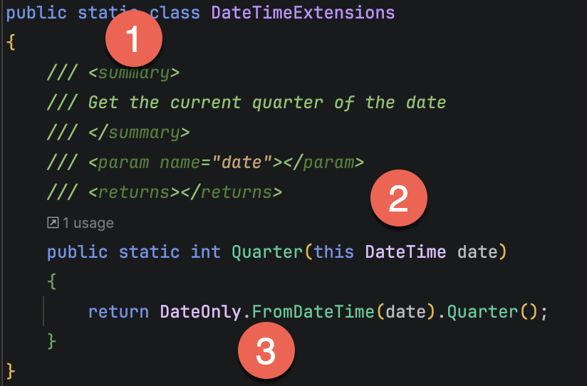

Over the last week, we have written extension methods to extend the functionality of the [DateOnly](https://learn.microsoft.com/en-us/dotnet/api/system.dateonly?view=net-9.0) and the [DateTime](https://learn.microsoft.com/en-us/dotnet/api/system.datetime?view=net-9.0) types.

We achieved this using **extension methods**, which allowed us to write a separate **static `class`** that allowed us to **add methods to an existing `class`**.

An extension method looks like this:



It has 3 main components:

1. A `static` **class** to house the implementation
2. A **method** that has the **type to be extended** passed using the `this` keyword
3. The **implementation** of the method.

This mechanism works very well with a single pedantic drawback - implementations have always had to be [methods](https://learn.microsoft.com/en-us/dotnet/csharp/programming-guide/classes-and-structs/methods), and [properties](https://learn.microsoft.com/en-us/dotnet/csharp/programming-guide/classes-and-structs/properties) were not supported.

Until C# 10, where we can now implement extensions to types that are **properties**.

To use extension methods, we require the following:

1. A **static** `class`
2. The **extension declaration**
3. The **implementation**

Our extension property above, `Quarter`, can be rewritten thus:

```c#
public static class DateTimeExtensions
{
  extension(DateTime date)
  {
    /// <summary>
    /// Get the current quarter of the date
    /// </summary>
    /// <returns></returns>
    public int Quarter => DateOnly.FromDateTime(date).Quarter;
  }
}
```

An important thing to note is that this extension property is for **instances** of `DateTime` and `DateOnly` objects.

The code for the `DateOnly` extensions is as follows:

```c#
namespace DateExtensions;

public static class DateOnlyExtensions
{
  extension(DateOnly date)
  {
    /// <summary>
    ///  the current quarter of the date
    /// </summary>
    /// <returns></returns>
    public int Quarter => (date.Month - 1) / 3 + 1;

    /// <summary>
    /// Returns the start date of the quarter for the given date.
    /// </summary>
    public DateOnly StartOfQuarter
    {
      get
      {
        int startMonth = (date.Quarter - 1) * 3 + 1;
        return new DateOnly(date.Year, startMonth, 1);
      }
    }

    /// <summary>
    /// Returns the end date of the quarter for the given date.
    /// </summary>
    public DateOnly EndOfQuarter
    {
      get
      {
          int endMonth = date.Quarter * 3;
          int endDay = DateTime.DaysInMonth(date.Year, endMonth);
          return new DateOnly(date.Year, endMonth, endDay);
      }
    }

    /// <summary>
    /// Returns the last day of the previous quarter
    /// </summary>
    /// <returns></returns>
    public DateOnly EndOfPreviousQuarter
    {
      get
      {
          //  the start of the current quarter
          var startOfCurrentQuarter = date.StartOfQuarter;
          // Subtract one day
          return startOfCurrentQuarter.AddDays(-1);
      }
    }

    /// <summary>
    /// Returns the first day of the previous quarter
    /// </summary>
    /// <returns></returns>
    public DateOnly StartOfPreviousQuarter
    {
      get
      {
          //  the start of the current quarter
          var startOfCurrentQuarter = date.StartOfQuarter;
          // Subtract 3 months
          return startOfCurrentQuarter.AddMonths(-3);
      }
    }

    /// <summary>
    /// Returns the first day of the next quarter
    /// </summary>
    /// <returns></returns>
    public DateOnly StartOfNextQuarter
    {
      get
      {
          //  the end of the current quarter
          var endOfCurrentQuarter = date.EndOfQuarter;
          // Add a day
          return endOfCurrentQuarter.AddDays(1);
      }
    }

    /// <summary>
    /// Returns the last day of the next quarter
    /// </summary>
    /// <returns></returns>
    public DateOnly EndOfNextQuarter
    {
      get
      {
          //  the start of the next quarter
          var startOfNextQuarter = date.StartOfNextQuarter;
          //  the end of the (now) current quarter
          return startOfNextQuarter.EndOfQuarter;
      }
    }

    /// <summary>
    /// Returns the start of the current year
    /// </summary>
    /// <returns></returns>
    public DateOnly StartOfCurrentYear =>
    // Create a new dateonly using the current year, first day, and first month (Jan)
    new(date.Year, 1, 1);

    /// <summary>
    /// Returns the end of the current year
    /// </summary>
    /// <returns></returns>
    public DateOnly EndOfCurrentYear
    {
      get
      {
          //  the start of the current year
          var startOfCurrentYear = date.StartOfCurrentYear;
          // Push to the next year
          var startOfNextYear = new DateOnly(startOfCurrentYear.Year + 1, 1, 1);
          // Advance to end of current year
          return startOfNextYear.AddDays(-1);
      }
    }

    /// <summary>
    /// Returns the start of the previous year
    /// </summary>
    /// <param name="date"></param>
    /// <returns></returns>
    public DateOnly StartOfPreviousYear =>
    // Create a new dateonly using the current year minus one, first day, and first month (Jan)
    new DateOnly(date.Year - 1, 1, 1);

    /// <summary>
    /// Returns the end of the previous year
    /// </summary>
    /// <param name="date"></param>
    /// <returns></returns>
    public DateOnly EndOfPreviousYear
    {
      get
      {
          //  the start of the previous year
          var startOfPreviousYear = date.StartOfPreviousYear;
          // Return the end of that year
          return startOfPreviousYear.EndOfCurrentYear;
      }
    }

    /// <summary>
    /// Returns the start of the next year
    /// </summary>
    /// <returns></returns>
    public DateOnly StartOfNextYear =>
    // Create a new dateonly using the current year plus one, first day, and first month (Jan)
    new DateOnly(date.Year + 1, 1, 1);

    /// <summary>
    /// Return the end of the next year
    /// </summary>
    /// <returns></returns>
    public DateOnly EndOfNextYear
    {
      get
      {
          //  the start of the next year
          var startOfNextYear = date.StartOfNextYear;
          // Return the end of that year
          return startOfNextYear.EndOfCurrentYear;
      }
    }
  }
}
```

The code for the `DateTime` extensions is as follows:

```c#
namespace DateExtensions;

public static class DateTimeExtensions
{
  private static readonly TimeSpan LargestTime = TimeSpan.FromDays(1).Add(TimeSpan.FromTicks(-10));

  extension(DateTime date)
  {
    /// <summary>
    /// Get the current quarter of the date
    /// </summary>
    /// <returns></returns>
    public int Quarter => DateOnly.FromDateTime(date).Quarter;

    /// <summary>
    /// Returns the start date of the quarter for the given date.
    /// </summary>
    public DateTime StartOfQuarter => DateOnly.FromDateTime(date).StartOfQuarter.ToDateTime(TimeOnly.MinValue);

    /// <summary>
    /// Returns the end date of the quarter for the given date.
    /// </summary>
    public DateTime EndOfQuarter =>
        DateOnly.FromDateTime(date).EndOfQuarter.ToDateTime(TimeOnly.MinValue).Add(LargestTime);

    /// <summary>
    /// Returns the last day of the previous quarter
    /// </summary>
    /// <returns></returns>
    public DateTime EndOfPreviousQuarter =>
        DateOnly.FromDateTime(date).EndOfPreviousQuarter.ToDateTime(TimeOnly.MinValue).Add(LargestTime);

    /// <summary>
    /// Returns the first day of the previous quarter
    /// </summary>
    /// <returns></returns>
    public DateTime StartOfPreviousQuarter =>
        DateOnly.FromDateTime(date).StartOfPreviousQuarter.ToDateTime(TimeOnly.MinValue);

    /// <summary>
    /// Returns the first day of the next quarter
    /// </summary>
    /// <returns></returns>
    public DateTime StartOfNextQuarter =>
        DateOnly.FromDateTime(date).StartOfNextQuarter.ToDateTime(TimeOnly.MinValue);

    /// <summary>
    /// Returns the last day of the next quarter
    /// </summary>
    /// <returns></returns>
    public DateTime EndOfNextQuarter =>
        DateOnly.FromDateTime(date).EndOfNextQuarter.ToDateTime(TimeOnly.MinValue).Add(LargestTime);

    /// <summary>
    /// Returns the start of the current year
    /// </summary>
    /// <returns></returns>
    public DateTime StartOfCurrentYear =>
        DateOnly.FromDateTime(date).StartOfCurrentYear.ToDateTime(TimeOnly.MinValue);

    /// <summary>
    /// Returns the end of the current year
    /// </summary>
    /// <returns></returns>
    public DateTime EndOfCurrentYear =>
        DateOnly.FromDateTime(date).EndOfCurrentYear.ToDateTime(TimeOnly.MinValue).Add(LargestTime);

    /// <summary>
    /// Returns the start of the previous year
    /// </summary>
    /// <returns></returns>
    public DateTime StartOfPreviousYear =>
        DateOnly.FromDateTime(date).StartOfPreviousYear.ToDateTime(TimeOnly.MinValue);

    /// <summary>
    /// Returns the end of the previous year
    /// </summary>
    /// <returns></returns>
    public DateTime EndOfPreviousYear =>
        DateOnly.FromDateTime(date).EndOfPreviousYear.ToDateTime(TimeOnly.MinValue).Add(LargestTime);

    /// <summary>
    /// Returns the start of the next year
    /// </summary>
    /// <returns></returns>
    public DateTime StartOfNextYear =>
        DateOnly.FromDateTime(date).StartOfNextYear.ToDateTime(TimeOnly.MinValue);

    /// <summary>
    /// Return the end of the next year
    /// </summary>
    /// <returns></returns>
    public DateTime EndOfNextYear =>
 DateOnly.FromDateTime(date).EndOfNextYear.ToDateTime(TimeOnly.MinValue).Add(LargestTime);
  }
}
```

### TLDR

**Extension properties allow the ability to write cleaner code by allowing for the definition of new properties on types.**

The code is in my [GitHub](https://github.com/conradakunga/BlogCode/tree/master/2025-10-28%20-%20DateExtensions).

Happy hacking!
