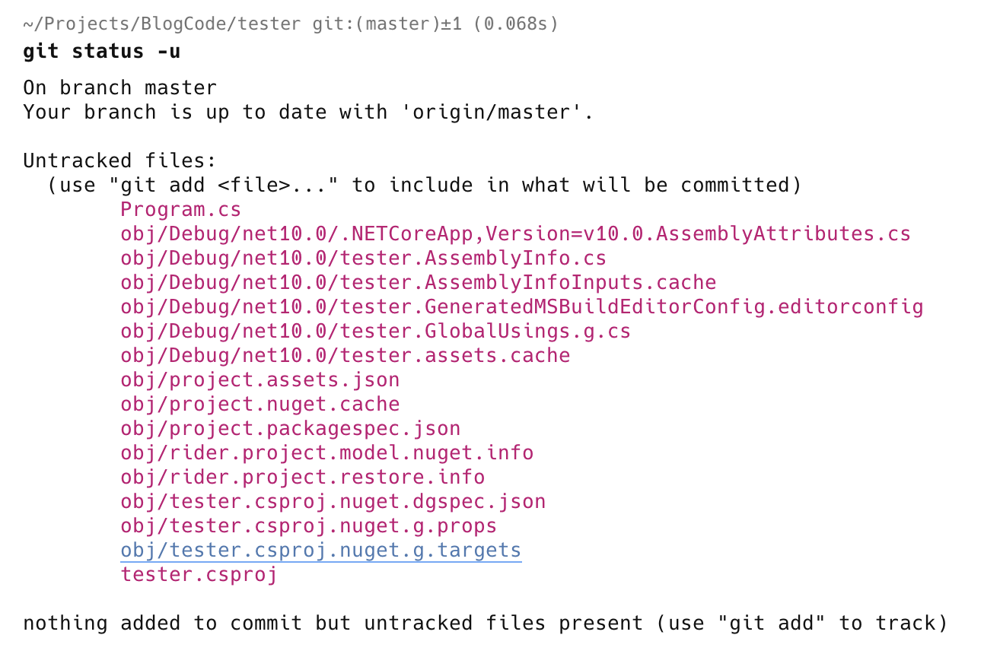
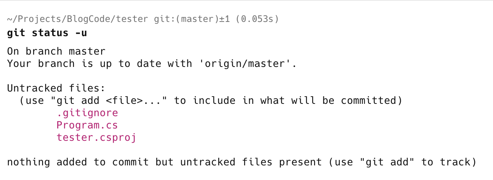

When you create a new project in .NET, in whatever language - [C#](https://learn.microsoft.com/en-us/dotnet/csharp/), [F#](https://learn.microsoft.com/en-us/dotnet/fsharp/), or [VB.NET](https://learn.microsoft.com/en-us/dotnet/visual-basic/), a number of **files** are **generated**.

At the very least, you will immediately spot these:

- A **project** file, .`csproj` (of `.fsproj` or `.vbproj)`
- At least one **source** file, usually `Program.cs` (or Program.fs or `Program.vb`)
- An `obj` folder
- A `bin` folder

Let us do this **practically**.

Let us create a **console** C# project named `tester`.

```bash
dotnet new console -o tester
```

Let us then view the **content** of the `tester` folder.

```bash
ls -l
```


Looks simple enough.

Let us now add support for [git](https://git-scm.com/) source control.

```bash
git init
```

Let us then check to see what files will be added to source control.

```bash
git status -u
```

This will show the **untracked** files.



If we were to add these files to source control using `git add -A`, it would add not just our **source code**, but a whole bunch of **intermediate files,** that we do not, in fact, want to track.

**Git** offers a solution to this - the [.gitignore](https://git-scm.com/docs/gitignore) file. This file contains instructions to `git` as to which files to **ignore**.

Creating this file yourself is a **long** and **arduous** process.

Typically, I would use an **extension** for this.

For [Visual Studio Code](https://code.visualstudio.com/), I use [this one by CodeZombie](https://marketplace.visualstudio.com/items?itemName=codezombiech.gitignore).

But did you know that the `dotnet` tool can generate one **natively**?

Simply run the following command:

```c#
dotnet new gitignore
```

This will generate a .NET-friendly `.gitignore` file in the **current directory**.

If we now list the untracked files, it prints the following:



You can see here that all the intermediate files are now **ignored** by `git`.

The file itself looks like this:

```plaintext
## Ignore Visual Studio temporary files, build results, and
## files generated by popular Visual Studio add-ons.
##
## Get latest from `dotnet new gitignore`

# dotenv files
.env

# User-specific files
*.rsuser
*.suo
*.user
*.userosscache
*.sln.docstates

# User-specific files (MonoDevelop/Xamarin Studio)
*.userprefs

# Mono auto generated files
mono_crash.*

# Build results
[Dd]ebug/
[Dd]ebugPublic/
[Rr]elease/
[Rr]eleases/
x64/
x86/
[Ww][Ii][Nn]32/
[Aa][Rr][Mm]/
[Aa][Rr][Mm]64/
bld/
[Bb]in/
[Oo]bj/
[Ll]og/
[Ll]ogs/

# Visual Studio 2015/2017 cache/options directory
.vs/
# Uncomment if you have tasks that create the project's static files in wwwroot
#wwwroot/

# Visual Studio 2017 auto generated files
Generated\ Files/

# MSTest test Results
[Tt]est[Rr]esult*/
[Bb]uild[Ll]og.*

# NUnit
*.VisualState.xml
TestResult.xml
nunit-*.xml

# Build Results of an ATL Project
[Dd]ebugPS/
[Rr]eleasePS/
dlldata.c

# Benchmark Results
BenchmarkDotNet.Artifacts/

# .NET
project.lock.json
project.fragment.lock.json
artifacts/

# Tye
.tye/

# ASP.NET Scaffolding
ScaffoldingReadMe.txt

# StyleCop
StyleCopReport.xml

# Files built by Visual Studio
*_i.c
*_p.c
*_h.h
*.ilk
*.meta
*.obj
*.iobj
*.pch
*.pdb
*.ipdb
*.pgc
*.pgd
*.rsp
*.sbr
*.tlb
*.tli
*.tlh
*.tmp
*.tmp_proj
*_wpftmp.csproj
*.log
*.tlog
*.vspscc
*.vssscc
.builds
*.pidb
*.svclog
*.scc

# Chutzpah Test files
_Chutzpah*

# Visual C++ cache files
ipch/
*.aps
*.ncb
*.opendb
*.opensdf
*.sdf
*.cachefile
*.VC.db
*.VC.VC.opendb

# Visual Studio profiler
*.psess
*.vsp
*.vspx
*.sap

# Visual Studio Trace Files
*.e2e

# TFS 2012 Local Workspace
$tf/

# Guidance Automation Toolkit
*.gpState

# ReSharper is a .NET coding add-in
_ReSharper*/
*.[Rr]e[Ss]harper
*.DotSettings.user

# TeamCity is a build add-in
_TeamCity*

# DotCover is a Code Coverage Tool
*.dotCover

# AxoCover is a Code Coverage Tool
.axoCover/*
!.axoCover/settings.json

# Coverlet is a free, cross platform Code Coverage Tool
coverage*.json
coverage*.xml
coverage*.info

# Visual Studio code coverage results
*.coverage
*.coveragexml

# NCrunch
_NCrunch_*
.*crunch*.local.xml
nCrunchTemp_*

# MightyMoose
*.mm.*
AutoTest.Net/

# Web workbench (sass)
.sass-cache/

# Installshield output folder
[Ee]xpress/

# DocProject is a documentation generator add-in
DocProject/buildhelp/
DocProject/Help/*.HxT
DocProject/Help/*.HxC
DocProject/Help/*.hhc
DocProject/Help/*.hhk
DocProject/Help/*.hhp
DocProject/Help/Html2
DocProject/Help/html

# Click-Once directory
publish/

# Publish Web Output
*.[Pp]ublish.xml
*.azurePubxml
# Note: Comment the next line if you want to checkin your web deploy settings,
# but database connection strings (with potential passwords) will be unencrypted
*.pubxml
*.publishproj

# Microsoft Azure Web App publish settings. Comment the next line if you want to
# checkin your Azure Web App publish settings, but sensitive information contained
# in these scripts will be unencrypted
PublishScripts/

# NuGet Packages
*.nupkg
# NuGet Symbol Packages
*.snupkg
# The packages folder can be ignored because of Package Restore
**/[Pp]ackages/*
# except build/, which is used as an MSBuild target.
!**/[Pp]ackages/build/
# Uncomment if necessary however generally it will be regenerated when needed
#!**/[Pp]ackages/repositories.config
# NuGet v3's project.json files produces more ignorable files
*.nuget.props
*.nuget.targets

# Microsoft Azure Build Output
csx/
*.build.csdef

# Microsoft Azure Emulator
ecf/
rcf/

# Windows Store app package directories and files
AppPackages/
BundleArtifacts/
Package.StoreAssociation.xml
_pkginfo.txt
*.appx
*.appxbundle
*.appxupload

# Visual Studio cache files
# files ending in .cache can be ignored
*.[Cc]ache
# but keep track of directories ending in .cache
!?*.[Cc]ache/

# Others
ClientBin/
~$*
*~
*.dbmdl
*.dbproj.schemaview
*.jfm
*.pfx
*.publishsettings
orleans.codegen.cs

# Including strong name files can present a security risk
# (https://github.com/github/gitignore/pull/2483#issue-259490424)
#*.snk

# Since there are multiple workflows, uncomment next line to ignore bower_components
# (https://github.com/github/gitignore/pull/1529#issuecomment-104372622)
#bower_components/

# RIA/Silverlight projects
Generated_Code/

# Backup & report files from converting an old project file
# to a newer Visual Studio version. Backup files are not needed,
# because we have git ;-)
_UpgradeReport_Files/
Backup*/
UpgradeLog*.XML
UpgradeLog*.htm
ServiceFabricBackup/
*.rptproj.bak

# SQL Server files
*.mdf
*.ldf
*.ndf

# Business Intelligence projects
*.rdl.data
*.bim.layout
*.bim_*.settings
*.rptproj.rsuser
*- [Bb]ackup.rdl
*- [Bb]ackup ([0-9]).rdl
*- [Bb]ackup ([0-9][0-9]).rdl

# Microsoft Fakes
FakesAssemblies/

# GhostDoc plugin setting file
*.GhostDoc.xml

# Node.js Tools for Visual Studio
.ntvs_analysis.dat
node_modules/

# Visual Studio 6 build log
*.plg

# Visual Studio 6 workspace options file
*.opt

# Visual Studio 6 auto-generated workspace file (contains which files were open etc.)
*.vbw

# Visual Studio 6 auto-generated project file (contains which files were open etc.)
*.vbp

# Visual Studio 6 workspace and project file (working project files containing files to include in project)
*.dsw
*.dsp

# Visual Studio 6 technical files
*.ncb
*.aps

# Visual Studio LightSwitch build output
**/*.HTMLClient/GeneratedArtifacts
**/*.DesktopClient/GeneratedArtifacts
**/*.DesktopClient/ModelManifest.xml
**/*.Server/GeneratedArtifacts
**/*.Server/ModelManifest.xml
_Pvt_Extensions

# Paket dependency manager
.paket/paket.exe
paket-files/

# FAKE - F# Make
.fake/

# CodeRush personal settings
.cr/personal

# Python Tools for Visual Studio (PTVS)
__pycache__/
*.pyc

# Cake - Uncomment if you are using it
# tools/**
# !tools/packages.config

# Tabs Studio
*.tss

# Telerik's JustMock configuration file
*.jmconfig

# BizTalk build output
*.btp.cs
*.btm.cs
*.odx.cs
*.xsd.cs

# OpenCover UI analysis results
OpenCover/

# Azure Stream Analytics local run output
ASALocalRun/

# MSBuild Binary and Structured Log
*.binlog

# NVidia Nsight GPU debugger configuration file
*.nvuser

# MFractors (Xamarin productivity tool) working folder
.mfractor/

# Local History for Visual Studio
.localhistory/

# Visual Studio History (VSHistory) files
.vshistory/

# BeatPulse healthcheck temp database
healthchecksdb

# Backup folder for Package Reference Convert tool in Visual Studio 2017
MigrationBackup/

# Ionide (cross platform F# VS Code tools) working folder
.ionide/

# Fody - auto-generated XML schema
FodyWeavers.xsd

# VS Code files for those working on multiple tools
.vscode/*
!.vscode/settings.json
!.vscode/tasks.json
!.vscode/launch.json
!.vscode/extensions.json
*.code-workspace

# Local History for Visual Studio Code
.history/

# Windows Installer files from build outputs
*.cab
*.msi
*.msix
*.msm
*.msp

# JetBrains Rider
*.sln.iml
.idea/

##
## Visual studio for Mac
##


# globs
Makefile.in
*.userprefs
*.usertasks
config.make
config.status
aclocal.m4
install-sh
autom4te.cache/
*.tar.gz
tarballs/
test-results/

# Mac bundle stuff
*.dmg
*.app

# content below from: https://github.com/github/gitignore/blob/main/Global/macOS.gitignore
# General
.DS_Store
.AppleDouble
.LSOverride

# Icon must end with two \r
Icon


# Thumbnails
._*

# Files that might appear in the root of a volume
.DocumentRevisions-V100
.fseventsd
.Spotlight-V100
.TemporaryItems
.Trashes
.VolumeIcon.icns
.com.apple.timemachine.donotpresent

# Directories potentially created on remote AFP share
.AppleDB
.AppleDesktop
Network Trash Folder
Temporary Items
.apdisk

# content below from: https://github.com/github/gitignore/blob/main/Global/Windows.gitignore
# Windows thumbnail cache files
Thumbs.db
ehthumbs.db
ehthumbs_vista.db

# Dump file
*.stackdump

# Folder config file
[Dd]esktop.ini

# Recycle Bin used on file shares
$RECYCLE.BIN/

# Windows Installer files
*.cab
*.msi
*.msix
*.msm
*.msp

# Windows shortcuts
*.lnk

# Vim temporary swap files
*.swp
```

### TLDR

**You can natively generate .NET-friendly `.gitignore` files using the `dotnet` tool plugins without requiring plugins or copying from old projects.**

Happy hacking!
