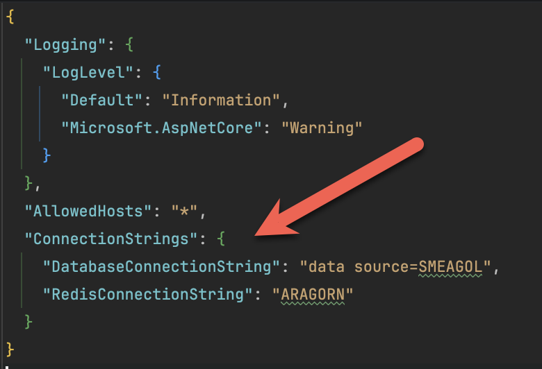
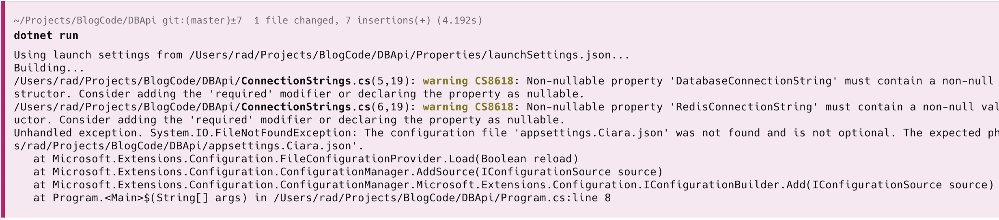

In a previous post, "[Setting the Staging & Production Environments During Development]()", we discussed how the .NET runtime can be leveraged to **load settings depending on the environment**.

I would like to touch a bit more on a common problem you will face when working on a team.

Let us suppose you have a very basic API that requires a **database** connection and a **Redis** connection.

First, we create an ASP.NET API project.

```bash
dotnet new web -o DBApi
```

We start by creating a `ConnectionStrings` class to model the same:

```c#
public class ConnectionStrings
{
  public string DatabaseConnectionString { get; set; }
  public string RedisConnectionString { get; set; }
}
```

We then update our `appsettings.json` to reflect this:

```json
{
  "Logging": {
    "LogLevel": {
      "Default": "Information",
      "Microsoft.AspNetCore": "Warning"
    }
  },
  "AllowedHosts": "*",
  "ConnectionStrings": {
    "DatabaseConnectionString": "data source=SMEAGOL",
    "RedisConnectionString": "ARAGORN"
  }
}
```

Next, we configure our **ASP.NET pipeline** to map these settings to our class for DI.

```c#
using DBApi;
using Microsoft.Extensions.Options;

var builder = WebApplication.CreateBuilder(args);

// Register settings with DI
builder.Services.AddOptions<ConnectionStrings>()
    .Bind(builder.Configuration.GetSection("ConnectionStrings"));

var app = builder.Build();


```

Finally, we write a simple API that prints the connection strings.

```c#
using DBApi;
using Microsoft.Extensions.Options;

var builder = WebApplication.CreateBuilder(args);

// Register settings with DI
builder.Services.AddOptions<ConnectionStrings>()
    .Bind(builder.Configuration.GetSection("ConnectionStrings"));

var app = builder.Build();

app.MapGet("/", (IOptions<ConnectionStrings> options) =>
{
    var settings = options.Value;
    return new
    {
        Database = settings.DatabaseConnectionString,
        Redis = settings.RedisConnectionString
    };
});

app.Run();
```

If we run this endpoint, we get the expected results.

```json
{
	"database": "data source=SMEAGOL",
	"redis": "ARAGORN"
}
```

So far, so good.

Typically, a friction point occurs when you deploy this application - you must **remember to update** the `appsettings.json` file to point to the **production** values.

Many problems have arisen from **forgetting** this step. And sooner or later, **you WILL forget**.

One elegant solution to this problem is to take advantage of the fact that the ASP.NET pipeline **already has a solution to this problem**.

All we need to do is copy the **settings that we want to override** in development into the `appsettings.Development.json`.

In our case, I can take these lines:



And add them to the `appsettings.Development.json` file, so that it looks like this:

```json
{
  "Logging": {
    "LogLevel": {
      "Default": "Information",
      "Microsoft.AspNetCore": "Warning"
    }
  },
  "ConnectionStrings": {
    "DatabaseConnectionString": "data source=FRODO",
    "RedisConnectionString": "ARWEN"
  }
}
```

Not that I have only copied the **settings I want to change**.

Now, if I re-run the application, and call the endpoint, I should see the following:

```json
{
  "database": "data source=FRODO",
  "redis": "ARWEN"
}
```

A problem arises when **multiple developers** are working on this project, and each of them is using **local or otherwise different resources**.

What happens is a cat-and-mouse game where each developer is forced to **change** their copy of `appsettings.Development.json` so that they work, and this ultimately gets **checked into source control**, so that the **next developer** now has to continue with this dance as soon as they update their code from `git`.

One solution to this problem is to add `appsettings.Development.json` to the `.gitignore` so that everyone's local copy is different.

The problem with this solution is that you **lose the benefits of source control**.

A much better solution is to **conditionally load** the settings file.

How do we do this? We have a convention where every developer will create a file named `appsettings.{MACHINENAME}.json`, and this is loaded by the runtime on start.

Given my machine (macOS host) is named **Ciara**, I create a file named `appsettings.Ciara.json`.

 I then set my custom settings in that file.

```json
{
  "Logging": {
    "LogLevel": {
      "Default": "Information",
      "Microsoft.AspNetCore": "Warning"
    }
  },
  "ConnectionStrings": {
    "DatabaseConnectionString": "data source=BOMBADIL",
    "RedisConnectionString": "MERIADOC"
  }
}
```

I then changed my startup to conditionally load this file if the environment is **Development**.

```c#
if (builder.Environment.IsDevelopment())
{
	Rbuilder.Configuration.AddJsonFile($"appsettings.{Environment.MachineName}.json", optional: false);
}
```

Note that I have passed the optional parameter to be `false` because I want to **throw an exception if this file is not found**. This forces the developers to create this file, which avoids problems downstream.

If the file cannot be found, this error will be thrown:



The complete code is as follows:

```c#
using DBApi;
using Microsoft.Extensions.Options;

var builder = WebApplication.CreateBuilder(args);

// If running in devolopment, load settings by developer machine
if (builder.Environment.IsDevelopment())
{
	builder.Configuration.AddJsonFile($"appsettings.{Environment.MachineName}.json", optional: false);
}

// Register settings with DI
builder.Services.AddOptions<ConnectionStrings>().Bind(builder.Configuration.GetSection("ConnectionStrings"));

var app = builder.Build();

app.MapGet("/", (IOptions<ConnectionStrings> options) =>
{
  var settings = options.Value;
  return new
  {
    Database = settings.DatabaseConnectionString,
    Redis = settings.RedisConnectionString
  };
});

app.Run();
```

If I now run the API, I get the following expected response:

```json
{
  "database": "data source=BOMBADIL",
  "redis": "MERIADOC"
}
```

This strategy offers several benefits.

1. **Multiple developers** can work on a project without stepping on each other's toes
2. Everyone' settings are **version-controlled** and tracked for posterity
3. You have access to everyone else's settings to **verify your own configuration** 
4. Very **simple** to implement

### TLDR

**You can conditionally load developer-specific appsettings.json files, which are controlled by the developer's machine name.**

The code is in my [GitHub](https://github.com/conradakunga/BlogCode/tree/master/2025-10-30%20-%20DBApi).

Happy hacking!
