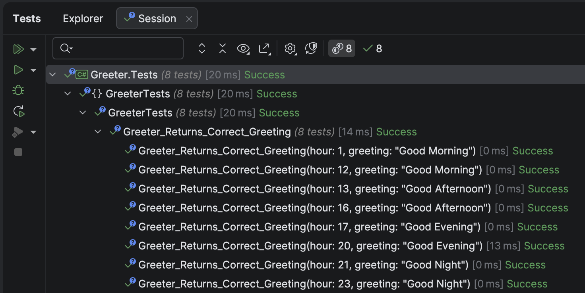

A very common challenge to which you will be writing code for is problems revolving around the **current date and time**.

We had addressed this in a prior post, "[Writing Maintainable, Testable Code That Depends On The Current Time]()".

The example was as follows:

```c#
public string Greet()
{
  return DateTime.Now.Hour switch
  {
    >= 0 and < 13 => "Good Morning",
    >= 13 and <= 16 => "Good Afternoon",
    > 16 and <= 20 => "Good Evening",
    _ => "Good Night"
  };
}
```

Testing this as it is is very **problematic**, as the method would return **different results depending on the time you run it**.

To address this,  we had created a custom interface, `IClock`, to which we had provided two implementations - the actual time `SystemClock` and a customizable time, `FakeClock`.

There is a solution to this problem in .NET - the [FakeTimeProvider](https://learn.microsoft.com/en-us/dotnet/api/microsoft.extensions.time.testing.faketimeprovider?view=net-9.0-pp) in the [Microsoft.Extensions.Time.Testing](https://learn.microsoft.com/en-us/dotnet/api/microsoft.extensions.time.testing?view=net-9.0-pp) namespace coupled with the [TimeProvider](https://learn.microsoft.com/en-us/dotnet/api/system.timeprovider?view=net-9.0&viewFallbackFrom=net-9.0-pp) class.

Any code that depends on the current date will now get the date from an injected `TimeProvider`.

We can thus rewrite our `Greeter` class as follows:

```c#
public sealed class Greeter
{
  private readonly TimeProvider _timeProvider;

  public Greeter(TimeProvider timeProvider)
  {
    _timeProvider = timeProvider;
  }

  public string Greet()
  {
  	return _timeProvider.GetLocalNow().Hour switch
          {
              >= 0 and < 13 => "Good Morning",
              >= 13 and <= 16 => "Good Afternoon",
              > 16 and <= 20 => "Good Evening",
              _ => "Good Night"
          };
  }
}
```

The `Greeter` now expects a `TimeProvider` to be injected.

In **production** use, you would inject [TimeProvider.System](https://learn.microsoft.com/en-us/dotnet/api/system.timeprovider.system?view=net-9.0), to indicate the **current (system) time**. This would typically be set up in your DI container, or manually, depending on your use case.

In tests, you would create a FakeTimeProvider, which allows you to set the date and time that you want.

Thus, you would specify your test cases as follows:

```c#
public class GreeterTests
{
  [Theory]
  [InlineData(1, "Good Morning")]
  [InlineData(12, "Good Morning")]
  [InlineData(13, "Good Afternoon")]
  [InlineData(16, "Good Afternoon")]
  [InlineData(17, "Good Evening")]
  [InlineData(20, "Good Evening")]
  [InlineData(21, "Good Night")]
  [InlineData(23, "Good Night")]
  public void Greeter_Returns_Correct_Greeting(int hour, string greeting)
  {
    // Create a fake time provider
    var provider = new FakeTimeProvider();
    // Set the time based on passed values (hour)
    provider.SetUtcNow(new DateTime(2024, 1, 1, hour, 1, 0));
    // Create instance of system under test
    var sut = new Greeter(provider);
    // Assert result
    sut.Greet().Should().Be(greeting);
  }
}
```

Here we are passing the **hour** we want to test against, as well as the expected returned **greeting**.

The tests should pass successfully:



### TLDR

**The `TimeProvider` class allows you to architect and abstract your types to avoid dependencies on `DateTime.Now` or DateTime.UtcNow offers a flexible setup for testing purposes using the `FakeDateTimeProvider`.**

The code is in my GitHub.

Happy hacking!
