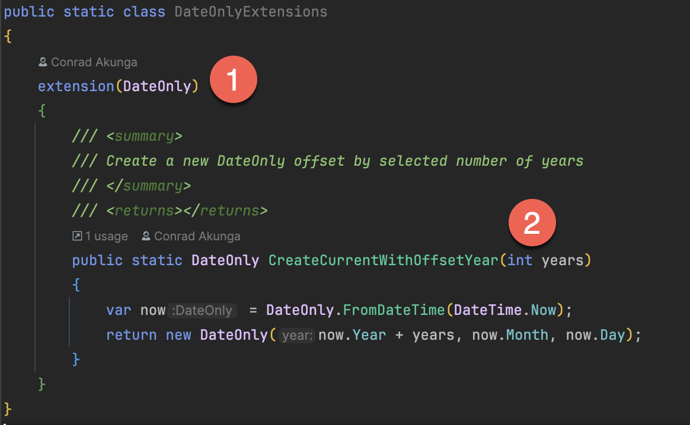

Last week, there was a series of posts that implemented extension methods to add some functionality to the [DateOnly](https://learn.microsoft.com/en-us/dotnet/api/system.dateonly?view=net-9.0) and [DateTime](https://learn.microsoft.com/en-us/dotnet/api/system.datetime?view=net-9.0) types.

Over the last 6 days, we have written a bunch of **extension methods** for the [DateOnly](https://learn.microsoft.com/en-us/dotnet/api/system.dateonly?view=net-9.0) type to make a number of date **computations** easier.

- [Getting The Start and End Of The Next Year](https://www.conradakunga.com/blog/getting-the-start-and-end-of-the-next-year-in-c-net/) 
-  [Getting The Start and End Of The Previous Year](https://www.conradakunga.com/blog/getting-the-start-and-end-of-the-previous-year-in-c-net/) 
-  [Getting The Start and End Of The Current Year](https://www.conradakunga.com/blog/getting-the-start-and-end-of-the-current-year-in-c-net/) 
-  [Getting The Start and End Of The Next Quarter](https://www.conradakunga.com/blog/getting-the-start-and-end-of-the-next-quarter-in-c-net/) 
- [Getting The Start and End Of The Previous Quarter](https://www.conradakunga.com/blog/getting-the-start-and-end-of-the-previous-quarter-in-c-net/) 
- [Getting The Start and End Of A Quarter](https://www.conradakunga.com/blog/getting-the-start-and-end-of-a-quarter-in-c-net/) 
- [Adding Date Computations Support To DateTime In C# & .NET]()

Let us take a look at one of them:

```c#
/// <summary>
/// Returns the start date of the quarter for the given date.
/// </summary>
public static DateTime GetStartOfQuarter(this DateTime date)
{
  return DateOnly.FromDateTime(date).GetStartOfQuarter().ToDateTime(TimeOnly.MinValue);
}
```

A couple of things to note here:

1. A `DateTime` is being passed as a parameter
2. The parameter has the `this` keyword

This is an example of an **instance** extension method, where we are extending an **existing instance of a type**.

However, there are times when we want to extend the **class** with a **static** method.

For example, a method that, given an **offset** in **years**, creates a new `DateOnly` object factoring that in.

We can now do that in .NET 10 & C# 14.

The code will look like this:

```c#
public static class DateOnlyExtensions
{
    extension(DateOnly)
    {
        /// <summary>
        /// Create a new DateOnly offset by selected number of years
        /// </summary>
        /// <returns></returns>
        public static DateOnly CreateCurrentWithOffsetYear(int years)
        {
            var now = DateOnly.FromDateTime(DateTime.Now);
            return new DateOnly(now.Year + years, now.Month, now.Day);
        }
    }
}
```

Of interest here are the following:



1. The `extension` block only specifies the `type` **name**
2. The only parameters to the extension method are those needed to execute the logic - there is no `DateOnly` passed here with a `this` keyword

We can write some tests to verify that this works.

```c#
public class DateExtensionTests
{
  [Theory]
  [InlineData(1)]
  [InlineData(-1)]
  public void YearTests(int offsetYears)
  {
    var current = DateTime.Now;
    var expected = new DateOnly(current.Year + offsetYears, current.Month, current.Day);
    DateOnly.CreateCurrentWithOffsetYear(offsetYears).Should().Be(expected);
  }
}
```

### TLDR

**You can now write static extension methods that allow the addition of static methods to existing types.**

The code is in my GitHub.

Happy hacking!