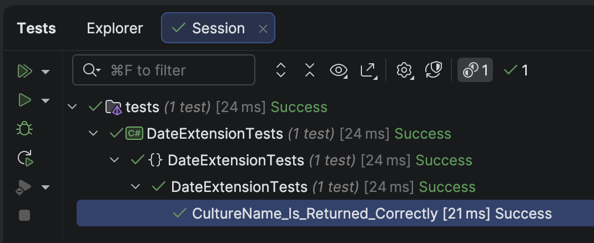

Yesterday's post, "[Creating Static Extension Methods In C# & .NET]()", discussed how you can write **static extension methods** for an **existing type**.

In this post, we will look at how to do the same thing, but for **properties**.

Let us suppose, for example, we want to quickly get the **name of the calendar in the current culture**.

The code itself is as follows:

```c#
var calendar = CultureInfo.CurrentCulture.Calendar;
var name = calendar.GetType().Name;
```

For my culture, **en-KE**, this returns the string `GegorianCalendar`.

We can then use the [Humanizer](https://github.com/Humanizr/Humanizer) library to remove the [PascalCasing](https://builtin.com/articles/pascal-case-vs-camel-case).

```c#
calendar.GetType().Name.Humanize()
```

Finally, we create the **static** extension **property** in a **static** `class`.

```c#
public static class DateOnlyExtensions
{
  extension(DateOnly)
  {
    /// <summary>
    /// Return the calendar name for the current culture
    /// </summary>
    /// <returns></returns>
    public static string CalendarName
    {
      get
      {
        var calendar = CultureInfo.CurrentCulture.Calendar;
        return calendar.GetType().Name.Humanize();
      }
    }
  }
}
```

We then write a test to verify that this works:

```c#
[Fact]
public void CultureName_Is_Returned_Correctly()
{
  CultureInfo.CurrentCulture = new CultureInfo("en-KE");
  DateOnly.CalendarName.Should().Be("Gregorian calendar");
}
```

The test should work:



In this manner, we have added a static extension property to a type.

### TLDR

**You can also write *static extension properties* to complement the static properties available in an underlying type.**

The code is in my GitHub.

Happy hacking!
