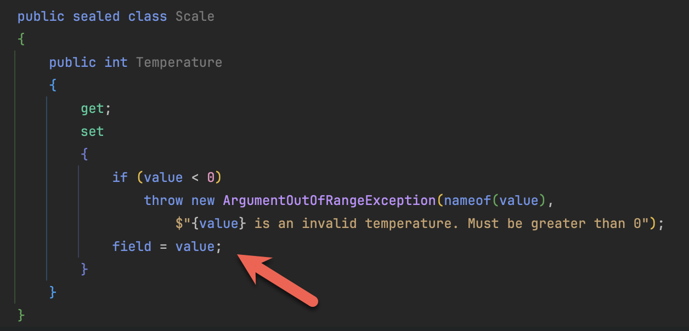
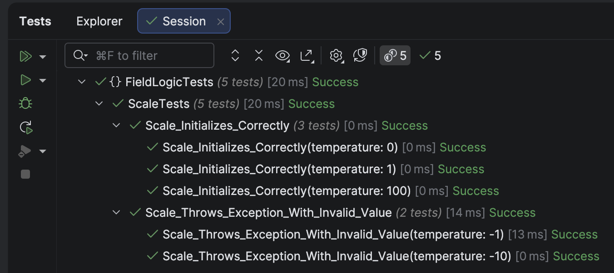

One of the most powerful features of .NET is [properties](https://learn.microsoft.com/en-us/dotnet/csharp/programming-guide/classes-and-structs/properties).

A **property** is a construct that allows you to control the **exposure of the inner state of objects**, including setting whether or not the **state can be changed**.

Suppose we have a weighing scale that is modeled by the `Scale` type.

It would look something like this:

```c#
public sealed class Scale
{
    public required int Temperature { get; init; }
}
```

`Temperature` here exposes the state, which is, in this case, the **temperature**.

`Init` here means that you must provide a value when **instantiating** this object, and it **cannot be changed** later.

If you want to be able to mutate it, change the code as follows:

```c#
public sealed class Scale
{
    public required int Temperature { get; set; }
}
```

So far, so good.

Now, suppose we wanted to **validate the temperature** and specify that the lowest valid temperature is `0` degrees.

Typically, we would need to introduce a **backing field** for this purpose.

```c#
public sealed class Scale
{
  private int _temperature;

  public int Temperature
  {
    get => _temperature;
    set
    {
      if (value < 0)
      	  throw new ArgumentOutOfRangeException(nameof(value),
                        $"{value} is an invalid temperature. Must be greater than 0");
      _temperature = value;
    }
  }
}
```

Here, `_temperature` is our backing field.

We only set it if our validation passes, and we have access to what was passed via the `value` `keyword`.

If the validation fails, we throw a [ArgumentOutOfRangeException](https://learn.microsoft.com/en-us/dotnet/api/system.argumentoutofrangeexception?view=net-9.0) exception.

The problem here is that a lot of **boilerplate** has been introduced to solve what is fundamentally a very **simple** problem.

An improvement has been made to this, starting from C# 13 - the `field` keyword.

Using this, we can rewrite the code as follows:

```c#
public sealed class Scale
{
  public int Temperature
  {
    get;
    set
    {
      if (value < 0)
        throw new ArgumentOutOfRangeException(nameof(value),
        $"{value} is an invalid temperature. Must be greater than 0");
      field = value;
    }
  }
}
```

The magic is happening here:



`field` is used to allow the setting of the value of the property **directly**, without requiring a backing field for intermediate work.

We can verify that it works with some tests:

```c#
[Theory]
[InlineData(1)]
[InlineData(0)]
[InlineData(100)]
public void Scale_Initializes_Correctly(int temperature)
{
    var scale = new Scale()
    {
        Temperature = temperature
    };
    scale.Temperature.Should().Be(temperature);
}

[Theory]
[InlineData(-1)]
[InlineData(-10)]
public void Scale_Throws_Exception_With_Invalid_Value(int temperature)
{
    var ex = Record.Exception(() =>
    {
        var scale = new Scale()
        {
            Temperature = temperature
        };
    });
    ex.Should().BeOfType<ArgumentOutOfRangeException>();
}
```

Our tests should pass.



Thus, our code is much terser and easier to maintain.

### TLDR

The `field` keyword allows flexible usage and validation of automatic properties.

The code is in my [GitHub](https://github.com/conradakunga/BlogCode/tree/master/2025-11-03%20-%20FieldKeyword).

Happy hacking!
