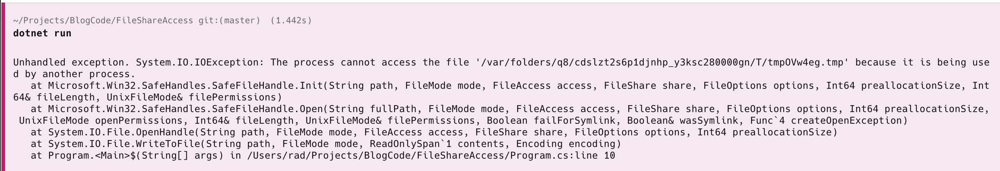

Writing to files is one of the common operations that you will be doing in the course of your work as a software developer.

There are many ways to do it, but typically you would do it like this:

```c#
// Get a temp file name
var tempFile = Path.GetTempFileName();
try
{
  // Write some data to the file
  File.AppendAllText(tempFile, "this is some test data");
  // Read the contents
  var contents = File.ReadAllText(tempFile);
  // Print to console
  Console.WriteLine(contents);
}
finally
{
  // Cleanup
  File.Delete(tempFile);
}
```

So far, so good.

Complications arise when there are multiple applications manipulating the file at the same time.

Take the following code, where I open the file twice - the first time **exclusively**, and the next for **writing**.

```c#
// Get a temp file name
var tempFile = Path.GetTempFileName();
// Open the file exclusively for rea
using (var stream = File.Open(tempFile, FileMode.Open, FileAccess.Read, FileShare.None))
{
  try
  {
    // Write some data to the file
    File.AppendAllText(tempFile, "this is some test data");
    // Read the contents
    var contents = File.ReadAllText(tempFile);
    // Print to console
    Console.WriteLine(contents);
  }
  finally
  {
    // Cleanup
    File.Delete(tempFile);
  }
}
```

If we run this code, we get the following:



The error message explains:

```plaintext
Unhandled exception. System.IO.IOException: The process cannot access the file '/var/folders/q8/cdslzt2s6p1djnhp_y3ksc280000gn/T/tmpOVw4eg.tmp' because it is being used by another process.
```

Is having **multiple applications** accessing the same file at the same time a **good** thing?

It depends on the scenario.

When **logging to a file**, you can have the **main application writing** to the log file and a **different application,** such as a **log viewer**, reading the logs.

However, when it comes to writing, things can get very complicated as **having multiple writers to a file can lead to complications** such as file **corruption** if the writes are not coordinated.

[Microsoft Excel](https://www.microsoft.com/en-us/microsoft-365/excel) also opens workbooks in this mode.

We can write a static helper method that checks if we can get write access to a file.

It would look like this:

```c#
public static class FileHelper
{
  public static bool IsFileLocked(string path)
  {
      FileStream? stream = null;
      try
      {
          // Try to open the file with exclusive read/write access
          stream = File.Open(path, FileMode.OpenOrCreate, FileAccess.ReadWrite, FileShare.None);
          return false;
      }
      catch (IOException)
      {
          // IOException occurs if the file is in use
          return true;
      }
      finally
      {
          stream?.Close();
      }
  }
}
```

We can then use it like this:

```c#
// Get a temp file name

using FileShareAccess;

var tempFile = Path.GetTempFileName();

// Open the file exclusively for read
using (_ = File.Open(tempFile, FileMode.Open, FileAccess.Read, FileShare.None))
{
    try
    {
      	// Check if we can get write access
        if (FileHelper.IsFileLocked(tempFile))
        {
            Console.WriteLine($"Cannot get write access to file {tempFile}");
            return;
        }

        // Write some data to the file
        File.AppendAllText(tempFile, "this is some test data");
        // Read the contents
        var contents = File.ReadAllText(tempFile);
        // Print to console
        Console.WriteLine(contents);
    }
    finally
    {
        // Cleanup
        File.Delete(tempFile);
    }
}
```

If we now run the program, it will print the following:

```plaintext
Cannot get write access to file /var/folders/q8/cdslzt2s6p1djnhp_y3ksc280000gn/T/tmpjrO2DT.tmp
```

### TLDR

**It is good to be aware that you may not have the ability to write to a file if it has been locked elsewhere. Write your code to factor this in.**

The code is in my GitHub.

Happy hacking!
