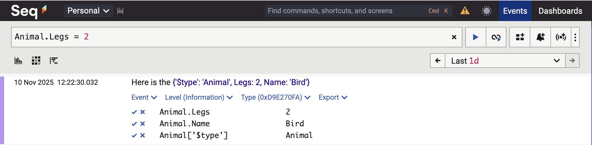
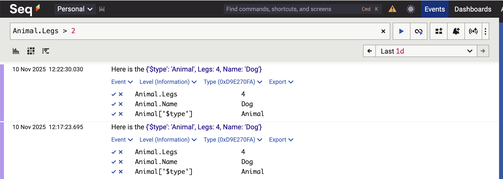

When it comes to logging, the de facto standard is the [Serilog](https://serilog.net/) library.

This works using the concepts of [sinks](https://github.com/serilog/serilog/wiki/provided-sinks), which are **targets** to which you send your log data.

The most common sinks are 

- [ElasticSearch](https://www.elastic.co/docs/reference/ecs/logging/dotnet/serilog-data-shipper)
- [Console](https://github.com/serilog/serilog-sinks-console)
- [Seq](https://datalust.co/)

Prior to writing your logs, you typically set it up like this:

```c#
Log.Logger = new LoggerConfiguration()
	.WriteTo.Seq("http://localhost:5341")
	.CreateLogger();
```

Here I am using the `Seq` sink.

We can then write our logs like this:

```c#
string fruit = "Apple";

Log.Information("The fruit is a {Fruit}", fruit);
```

There are two important elements here - the string **template** and the actual **value**.

If we view the logs in `Seq`, they look like this:


If we expand the entry, it looks like this:


Here, we can see that the **property** is `Fruit`, and the value is `Apple`.

Suppose we need to log a **complex property**, like this:

```c#
public class Animal
{
    public string Name { get; set; }
    public int Legs { get; set; }
}
```

We can try and log it in the usual way:

```c#
var animal = new Animal { Name = "Dog", Legs = 4 };
Log.Information("Here is the {Animal}", animal);
```

This will not do what you think it does. 

The line entry will look like this:


And the expanded entry will look like this:


The **details** of the `Animal` object are lost.

The correct way to log a complex object is to prefix the template placeholder with the `@` symbol.

This is called **destructuring**.

```c#
var animal = new Animal { Name = "Dog", Legs = 4 };
Log.Information("Here is the {@Animal}", animal);
```

This will log the following:


Here you can see that the `Animal` type has been decomposed into its constituent properties.

Of importance to note is that the object's **properties** are **separately logged and can be used for searching and filtering**.

For example, if we have code like this:

```c#
var animal = new Animal { Name = "Dog", Legs = 4 };
Log.Information("Here is the {@Animal}", animal);
animal = new Animal { Name = "Bird", Legs = 2 };
Log.Information("Here is the {@Animal}", animal);
```

We can filter on `Seq` like this:

```plaintext
Animal.Legs = 2
```

And this will be returned:



We can even do this:

```c#
Animal.Legs > 2
```



### TLDR

**The proper way to log complex objects with `Serilog` is to use *destructuring*.**

The code is in my [GitHub](https://github.com/conradakunga/BlogCode/tree/master/2025-11-05%20-%20ComplexLogging).

Happy hacking!
