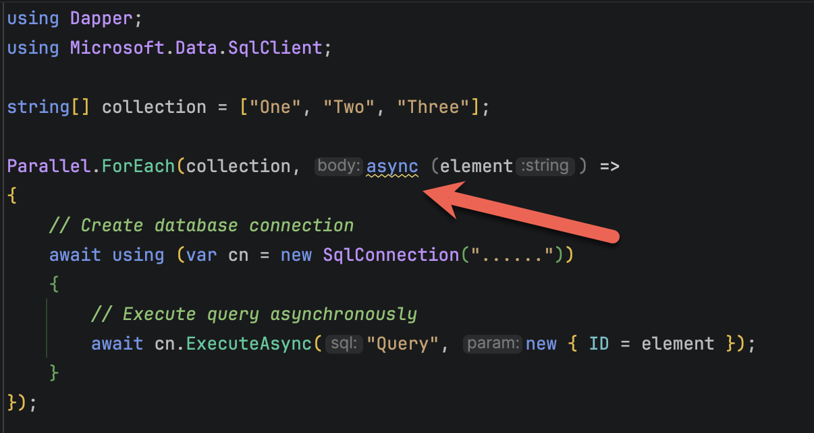

I was recently **troubleshooting** some code that would persistently throw an error to the effect that I had run out of [SQL Server](https://www.microsoft.com/en-gb/sql-server/) Connections.

The exact error was as follows:

```plaintext
'Timeout expired.  The timeout period elapsed prior to obtaining a connection from the pool.  This may have occurred because all pooled connections were in use and max pool size was reached.'
```

The code in question was as follows:

```c#
using Dapper;
using Microsoft.Data.SqlClient;

string[] collection = ["One", "Two", "Three"];

Parallel.ForEach(collection, async (element) =>
{
  // Create database connection
  await using (var cn = new SqlConnection("......"))
  {
    // Execute query asynchronously
    await cn.ExecuteAsync("Query", new { ID = element });
  }
});
```

Which looks innocent enough.

The problem is this - [Parallel.ForEach](https://learn.microsoft.com/en-us/dotnet/standard/parallel-programming/how-to-write-a-simple-parallel-foreach-loop) is a **synchronous** construct, and introducing `async` into the construct **does not do what you think it does**.



The culprit is above.

Introducing `async` **does not change the fact** that the delegate from the `Parallel.ForEach` returns `void`.

This means that the query execution is **not awaited at all**.

What will happen is **lots and lots of database connections will be created** as fast as the **thread pool** can create them, and **depending on the size of the collection**, you will **run out of connections from the database pool** because the query execution is not awaited before the next connection is created.

### TLDR

`**Parallel.ForEach` does not play well with `async`.**

The code is in my GitHub.

Happy hacking!
