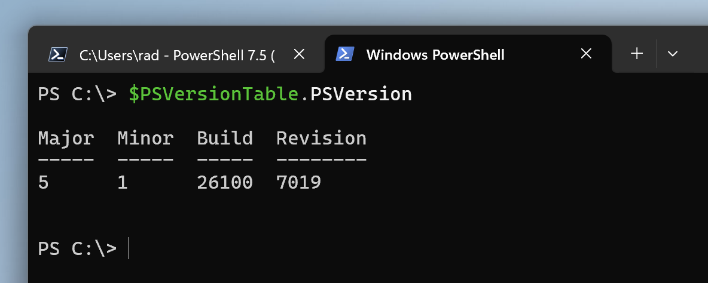
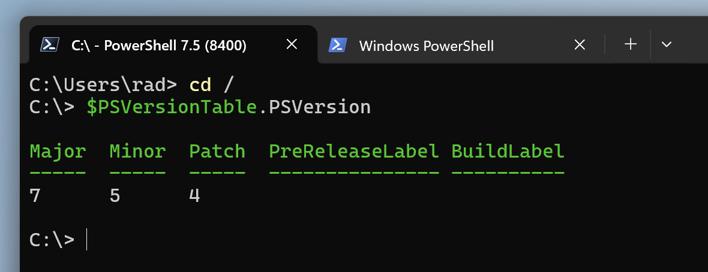
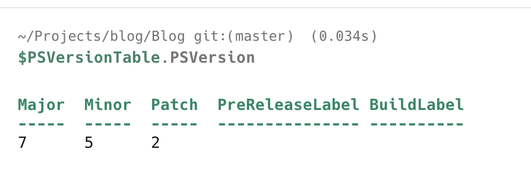

A scenario you might run into is when you want to check the PowerShell version under which you are running.

This is complicated by the fact that there are two **flavours** of PowerShell

1. [PowerShell For Windows](https://learn.microsoft.com/en-us/powershell/scripting/what-is-windows-powershell?view=powershell-7.5) (version `5` and below)
2. [PowerShell Core](https://learn.microsoft.com/en-us/powershell/scripting/overview?view=powershell-7.5) (Version `6` and above, `7` being the current)

For either, you can examine the `$PSVersionTable` variable, particularly the `PSVersion` property.

Like so:

```powershell
$PSVersionTable.PSVersion
```

In **PowerShell For Windows**, you will see something like this:



In **PowerShell Core**, running in [Windows](https://www.microsoft.com/en-us/windows?r=1), you will see something like this:



In [macOS](https://www.apple.com/os/macos/), you will see something like this (if you have installed **PowerShell**):



### TLDR

**You can get the `PowerShell` version by querying the `$PSVersionTable.PSVersion` variable.**

Happy hacking!
