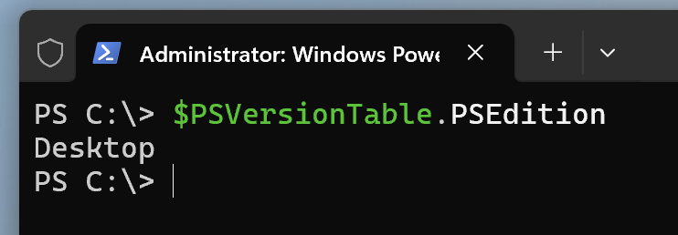
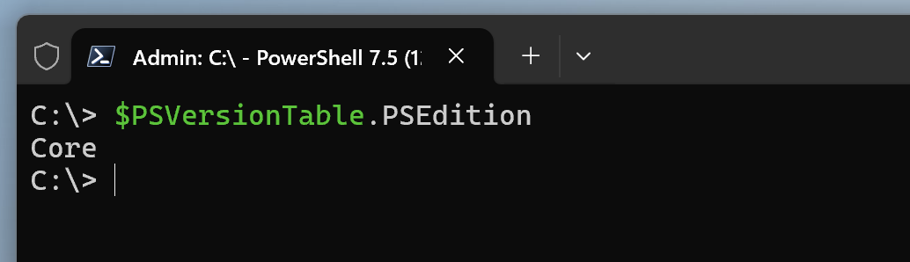
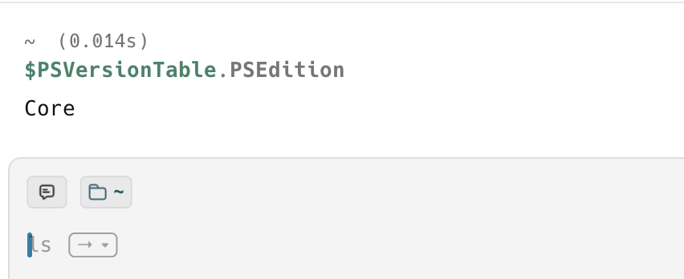

Yesterday's post, "[How To Get The PowerShell Version]()", discussed how to get the [PowerShell](https://learn.microsoft.com/en-us/powershell/scripting/overview?view=powershell-7.5) **version** that you are running under.

In this post, we will look at a **simpler** challenge - how to get the **edition**.

As a reminder, there are two editions of PowerShell:

1. [PowerShell For Windows](https://learn.microsoft.com/en-us/powershell/scripting/what-is-windows-powershell?view=powershell-7.5) (version `5` and below)
2. [PowerShell Core](https://learn.microsoft.com/en-us/powershell/scripting/overview?view=powershell-7.5) (Version `6` and above, `7` being the current)

One way would be to ride on what we learned yesterday.

We can use this invocation:

```powershell
$PSVersionTable.PSVersion
```

From this, we can extract the property `MajorVersion`.

If it is `5`, then that is **PowerShell for Windows**.

If it is larger than `5`, then that is cross-platform **PowerShell Core**.

There is another, **simpler** way to obtain this information..

We can use the following invocation:

```powershell
$PSVersionTable.PSEdition
```

If we run it under **PowerShell for Windows**, we get the following result:



It returns a `string` value, `Desktop`

We can also run it under **PowerShell Core** on Windows.



It returns a string `value`, `Core`

On **macOS**, which can run **PowerShell Core**,  it returns the same:



### TLDR

**You can obtain the PowerShell edition from the `$PSVersionTable.PSEdition` invocation.**

Happy hacking!
