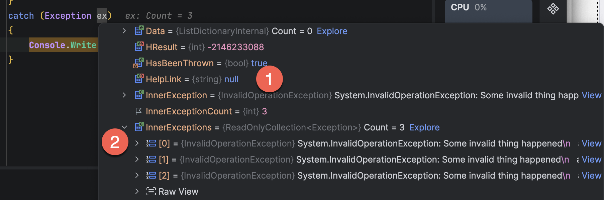

When dealing with [exceptions](https://learn.microsoft.com/en-us/dotnet/api/system.exception?view=net-10.0), which are generally a state that are **unexpected** or **legitimate**, we typically handle them in a [try-catch](https://learn.microsoft.com/en-us/dotnet/csharp/language-reference/statements/exception-handling-statements) block as follows:

```c#
var denominator = 0;
try
{
	var result = 1 / denominator;
}
catch (Exception ex)
{
	Console.Write(ex.Message);
}
```

Here, we are catching an [Exception](https://learn.microsoft.com/en-us/dotnet/api/system.exception?view=net-10.0) and printing its message.

In fact, given that we often know the `Exception` we are **expecting**, we can write the code like this:

```c#
var denominator = 0;
try
{
	var result = 1 / denominator;
}
catch (DivideByZeroException)
{
	Console.Write("Attempted to divide by zero");
}
catch (Exception ex)
{
	Console.Write($"Some other exception: {ex.Message}");
}
```

Here you can see that rather than just catching an `Exception`, we can have **multiple blocks** capturing the **specific** `Exception` we are expecting, in this case a [DivideByZeroException](https://learn.microsoft.com/en-us/dotnet/api/system.dividebyzeroexception?view=net-10.0).

Things get a bit more complicated when dealing with code like this.

```c#
try
{
  Parallel.For(0, 3, i =>
  {
  	throw new InvalidOperationException("Some invalid thing happened");
  });
}
catch (Exception ex)
{
	Console.WriteLine(ex.GetType().Name);
}
```

Here, we have some code that simulates a **parallel for loop** that throws an `Exception` natively within its logic.

Not that the `catch` block catches a **single** `Exception`.

In the code, I am printing the **name** of the `Exception` type.

If we run the code, it prints the following:

```plaintext
This exception is of type AggregateException
```

Let us take a look at it in the debugger:



We can see here some properties of interest:

1. [InnerException](https://learn.microsoft.com/en-us/dotnet/api/system.exception.innerexception?view=net-10.0#system-exception-innerexception)
2. [InnerExceptions](https://learn.microsoft.com/en-us/dotnet/api/system.aggregateexception.innerexceptions?view=net-10.0)

An `AggregateException` thus allows us to interrogate **what happened** within the parallel block.

So we can rewrite our handler like this:

```c#
try
{
  Parallel.For(0, 3, i =>
  {
    // Throw a known exception
    throw new InvalidOperationException("Some invalid thing happened");
  });
}
catch (AggregateException ex)
{
  Console.WriteLine("There were {0} exceptions ", ex.InnerExceptions.Count);

  var counter = 0;
  foreach (var e in ex.InnerExceptions)
  {
  	Console.WriteLine($"Error {++counter}: {e.Message}");
  }
}
```

This will print the following:

```plaintext
There were 3 exceptions 
Error 1: Some invalid thing happened
Error 2: Some invalid thing happened
Error 3: Some invalid thing happened
```

In this manner, we can handle the complex `Exception` situation when dealing with **parallelism**.

### TLDR

**The `AggregageException` allows us to handle exceptions in situations where the problem was thrown from a situation involving parallelism.**

The code is in my GitHub.

Happy hacking!
