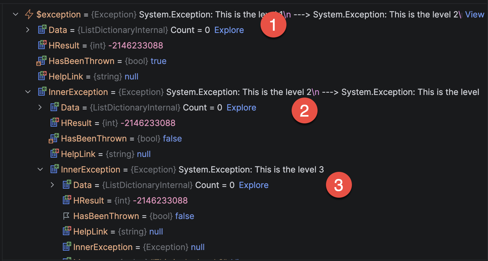

In yesterday's post, "[How To Deal With Aggregate Exceptions In C# & .NET]()", we looked at how to deal with [AggregateExceptions](https://learn.microsoft.com/en-us/dotnet/api/system.aggregateexception?view=net-10.0) that may be thrown by the runtime.

In this post, we will look at how to handle nested [Exceptions](https://learn.microsoft.com/en-us/dotnet/api/system.exception?view=net-10.0).

What is a **nested** `Exception`?

An `Exception` object has a property, [InnerException](https://learn.microsoft.com/en-us/dotnet/api/system.exception.innerexception?view=net-10.0), that itself could be another `Exception`. Which, in turn, could also have an `InnerException` that is another `Exception`.

In this fashion, we get a **nested** `Exception`.

Take this example:

```c#
try
{
  throw new Exception("This is the level 1", new Exception("This is the level 2", new Exception("This is the level 3")));
}
catch (Exception ex)
{
  Console.WriteLine(ex.Message);
}
```

Let us take a look at the caught `Exception` in the debugger.



We can see here that:

1. This is the `Exception` that was actually caught, Level `1`
2. This is Level `2`, the `InnerException` for Level `1`
3. This is Level `3`, the `InnerException` for Level `2`

Suppose you wanted to print the [Message](https://learn.microsoft.com/en-us/dotnet/api/system.exception.message?view=net-10.0) for `Exception` `ex` (Level `1`).

It will read as follows:

```plaintext
This is the level 1
```

This presents a problem when you want to print the details of **all** the `Exceptions`.

One way would be to write a **recursive loop** that visits all the `Exceptions`.

```c#
try
{
  throw new Exception("This is the level 1",
new Exception("This is the level 2", new Exception("This is the level 3")));
}
catch (Exception ex)
{
  StringBuilder sb = new();
  Console.WriteLine(GetMessage(ex, sb));
}

string GetMessage(Exception ex, StringBuilder sb)
{
  sb.AppendLine(ex.Message);
  if (ex.InnerException is not null)
  {
    GetMessage(ex.InnerException, sb);
  }

  return sb.ToString();
}
```

This will print the following, as expected.

```plaintext
This is the level 1
This is the level 2
This is the level 3
```

### TLDR

**`Exceptions` can have any level of nested `InnerExceptions`. Always be sure to check**

The code is in my GitHub.

Happy hacking!
