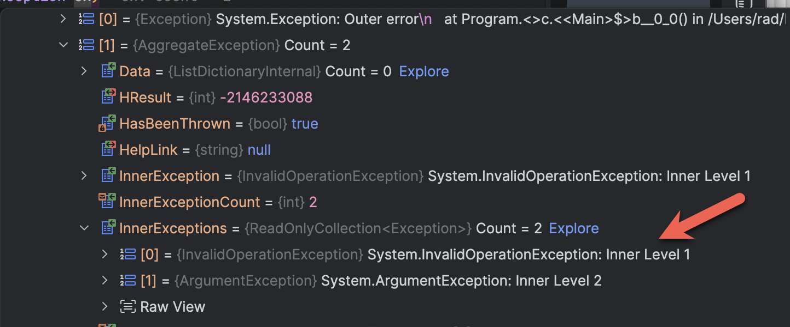

In a previous post, "[How To Deal With Aggregate Exceptions In C# & .NET]()", we looked at how to deal with [AggregateExceptions](https://learn.microsoft.com/en-us/dotnet/api/system.aggregateexception?view=net-10.0).

In this post, we will look at how to deal with **nested** `AggregateExceptions`.

Take this example:

```c#
var task = Task.WhenAll(
    Task.Run(() => throw new Exception("Outer error")),
    Task.Run(() => throw new AggregateException(new InvalidOperationException("Inner Level 1"),
        new ArgumentException("Inner Level 2")
    )));
try
{
    task.Wait();
}
catch (AggregateException ex)
{
    Console.WriteLine(ex.InnerExceptions.Count);
}
```

Here we are doing the following:

1. Creating an outer [Task](https://learn.microsoft.com/en-us/dotnet/api/system.threading.tasks.task?view=net-10.0)
2. This task calls two **`Inner`** `Tasks`
3. One throws a simple `Exception`
4. The other throws an `AggregateException`
5. The `Exception` handler then prints the **inner exceptions** it has found

The code will print the following:

```plaintext
2
```

Which is technically true: there are **two** `Exceptions` for each child task.

Let us look with the **debugger**:

The first child task has a **single** inner `Exception`.


The second child task, however, has **two**:



Thus, there are actually **three** exceptions, not **two**.

To access all the exceptions, we call the [Flatten](https://learn.microsoft.com/en-us/dotnet/api/system.aggregateexception.flatten?view=net-10.0) method of the `AggregateException`.

Our code will now look lile this:

```c#
var task = Task.WhenAll(
    Task.Run(() => throw new Exception("Outer error")),
    Task.Run(() => throw new AggregateException(new InvalidOperationException("Inner Level 1"),
        new ArgumentException("Inner Level 2")
    )));
try
{
    task.Wait();
}
catch (AggregateException ex)
{
    var flattened = ex.Flatten();
    foreach (var innerException in flattened.InnerExceptions)
        Console.WriteLine(innerException.Message);
}
```

This will print the following:

```plaintext
Outer error
Inner Level 1
Inner Level 2
```

### TLDR

**You can call `Flatten()` on an `AggregageException` to get a list of all the `InnerExceptions`, no matter how nested.**

The code is in my [GitHub](https://github.com/conradakunga/BlogCode/tree/master/2025-11-22%20-%20NestedExceptions).

Happy hacking!
