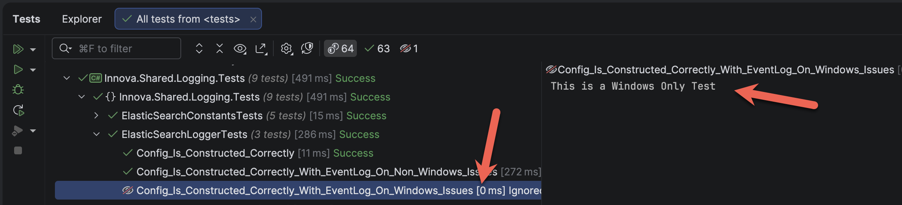
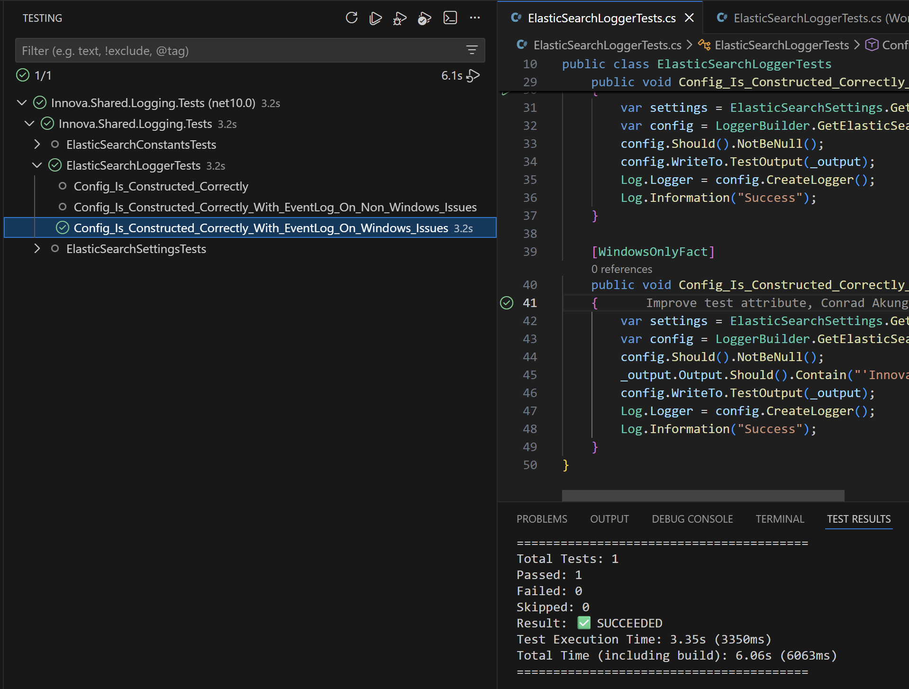

Yesterday's post, "[Writing Operating Specific Test Assertion For xUnit In C# & .NET]()", discussed how to write an assertion that runs only under a specific condition: **the operating system is Windows**.

If you have **many** of these tests, it can become **repetitive** and **annoying** to **keep specifying the condition** for each assertion in code.

A solution to this is to create an **attribute at the method level**, such that the entire test is run (or skipped) depending on the attribute.

It will look like this:

```c#
[AttributeUsage(AttributeTargets.Method)]
public sealed class WindowsOnlyFactAttribute : FactAttribute
{
    public WindowsOnlyFactAttribute()
    {
        if (!OperatingSystem.IsWindows())
        {
            Skip = "This is a Windows Only Test";
        }
    }
}
```

You will then use it like this:

```c#
[WindowsOnlyFact]
public void Config_Is_Constructed_Correctly_With_EventLog_On_Windows_Issues()
{
    var settings = ElasticSearchSettings.GetSettings(TestConstants.ConnectionString, "Innova Suiter", "1.0", true);
    var config = LoggerBuilder.GetElasticSearchLogger(settings, _output);
    config.Should().NotBeNull();
    _output.Output.Should().Contain("Applicatiom is not registered as an event source");
}
```

When I look at my test runner (when running under macOS), I see the following:



If I run the same test under Windows, I get the following:



Here we can see that it ran.

### TLDR

**We can use an `xUnit` `attribute` to designate tests as platform-specific (Windows).**

The code is in my [GitHub](https://github.com/conradakunga/BlogCode/tree/master/xUnitExtensions).

Happy hacking!
