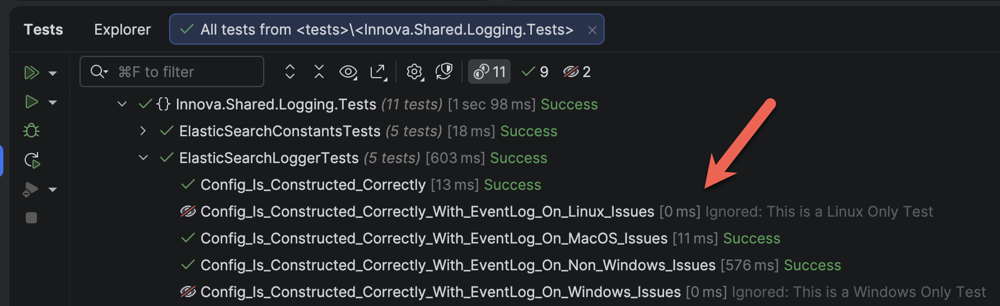
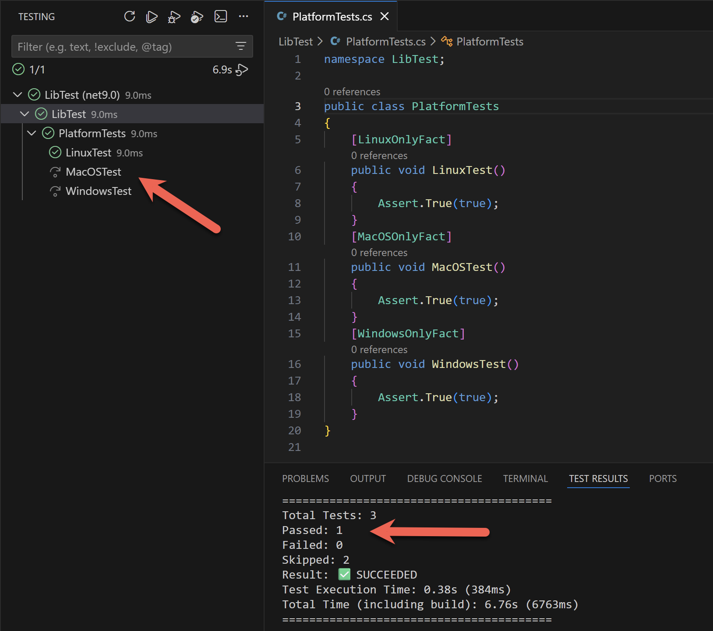

Yesterday's post, "[Writing A macOS-only method-level attribute for xUnit in C# & .NET]()", looked at how to write an attribute for the [xUnit](https://xunit.net/) test framework to mark a test as only to be run if the platform it is running under is **macOS**.

This is in addition to an earlier post, "[Writing A Windows-only method-level attribute for xUnit in C# & .NET]()", where we did the same for **Windows**.

In this post, we will do the same for **Linux**.

We will leverage the same technique as before and use the [OperatingSystem](https://learn.microsoft.com/en-us/dotnet/api/system.operatingsystem?view=net-10.0) class to determine the **current operating system**.

The complete attribute will look like this:

```c#
using Xunit;

namespace Rad.xUnit.Extensions;

/// <summary>
/// Marks a test as only runnable in Linux
/// </summary>
[AttributeUsage(AttributeTargets.Method)]
public sealed class LinuxOnlyFactAttribute : FactAttribute
{
    public LinuxOnlyFactAttribute()
    {
        if (!OperatingSystem.IsLinux())
        {
            Skip = "This is a Linux Only Test";
        }
    }
}
```

You use it like this:

```c#
[LinuxOnlyFactAttribute]
public void Config_Is_Constructed_Correctly_With_EventLog_On_Linux_Issues()
{
  //
  // Test code here
  //
}
```

If we run this test on **macOS**:



We can see that it was skipped.

If we run the tests under Linux:



We can see that the **Windows** and **macOS** tests were skipped, but the **Linux** test was run.

### TLDR

**We can use an `xUnit` `attribute` to designate tests as platform-specific (Linux).**

The code is in my [GitHub](https://github.com/conradakunga/BlogCode/tree/master/xUnitExtensions).

Happy hacking!
