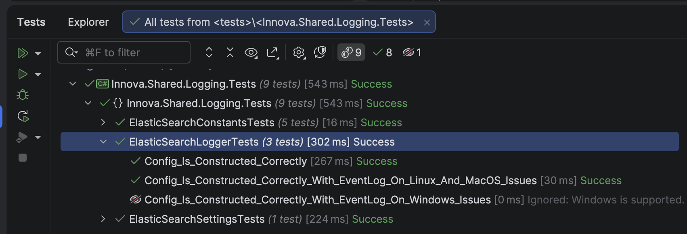
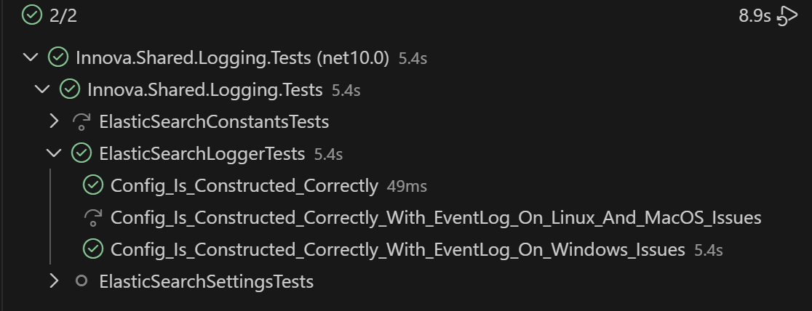

In a series of previous posts ("[Writing A Windows-only method-level attribute for xUnit in C# & .NET]()", "[Writing A macOS-only method-level attribute for xUnit in C# & .NET]()", and "[Writing A Linux-only method-level attribute for xUnit in C# & .NET]()"), we looked at how to write [attributes](https://learn.microsoft.com/en-us/dotnet/csharp/advanced-topics/reflection-and-attributes/) that we can decorate unit tests that we want to be run only under a particular operating system using the [xUnit](https://xunit.net/) test framework.

The resulting solutions, `LinuxOnlyFactAttribute`, `MacOSOnlyFactAttribute`, and `LinuxOnlyFactAttribute` worked well for this.

However, it can be **tedious** having to create a new attribute for **each operating system** that we want to support, and there are other variants that we might want to support - for example, [watchOS](https://www.apple.com/in/os/watchos/), [tvOS](https://developer.apple.com/tvos/), [Android](https://www.android.com/intl/en_uk/), etc.

A much more **flexible** option is to create an `enum` that we can pass to a **generic attribute** indicating the operating system we want the test to run under.

The `enum` would look like this:

```c#
[Flags]
public enum OSEnum
{
  Windows = 1,
  macOS = 2,
  Linux = 4,
  Android = 8,
  iOS = 16,
  tvOS = 32,
  watchOS = 64
}
```

Note that we are using [Flags](https://learn.microsoft.com/en-us/dotnet/fundamentals/runtime-libraries/system-flagsattribute) so we can **combine values** to specify **multiple** operating systems.

The `attribute` itself would look like this:

```c#
[AttributeUsage(AttributeTargets.Method)]
public sealed class OperatingSystemFactAttribute : FactAttribute
{
    public OperatingSystemFactAttribute(OSEnum os)
    {
        var isMatch = (os.HasFlag(OSEnum.Windows) && OperatingSystem.IsWindows()) ||
                      (os.HasFlag(OSEnum.macOS) && OperatingSystem.IsMacOS()) ||
                      (os.HasFlag(OSEnum.Android) && OperatingSystem.IsAndroid()) ||
                      (os.HasFlag(OSEnum.iOS) && OperatingSystem.IsIOS()) ||
                      (os.HasFlag(OSEnum.tvOS) && OperatingSystem.IsTvOS()) ||
                      (os.HasFlag(OSEnum.watchOS) && OperatingSystem.IsWatchOS());

        if (!isMatch)
        {
            Skip = $"{os} is supported. Current operating system does not match.";
        }
    }
}
```

We then **decorate** our tests like this:

```c#
[OperatingSystemFact(OSEnum.Windows)]
public void Config_Is_Constructed_Correctly_With_EventLog_On_Windows_Issues()
{
    var settings = ElasticSearchSettings.GetSettings(TestConstants.ConnectionString, "Innova Suiter", "1.0", true);
    var config = LoggerBuilder.GetElasticSearchLogger(settings, _output);
    config.Should().NotBeNull();
    _output.Output.Should().Contain("'Innova Suiter' is not registered as an event source");
    config.WriteTo.TestOutput(_output);
    Log.Logger = config.CreateLogger();
    Log.Information("Success");
}
```

If we need to specify **more than one** operating system, we do it like this:

```c#
[OperatingSystemFact(OSEnum.Linux | OSEnum.macOS)]
public void Config_Is_Constructed_Correctly_With_EventLog_On_Linux_And_MacOS_Issues()
{
    var settings = ElasticSearchSettings.GetSettings(TestConstants.ConnectionString, "Innova Suiter", "1.0", true);
    var config = LoggerBuilder.GetElasticSearchLogger(settings, _output);
    config.Should().NotBeNull();
    config.WriteTo.TestOutput(_output);
    Log.Logger = config.CreateLogger();
    Log.Information("Success");
}
```

If we run these tests on **macOS**:



We can see here that the **Windows** test was **skipped**.

If we run the same on **Windows**:



Here, we see that the **Linux & macOS** tests were **skipped**, but the **Windows** test was run.

### TLDR

**We can write a generic attribute that accepts one or more operating system `enum` values to indicate the supported operating systems under which the test should run.**

The code is in my [GitHub](https://github.com/conradakunga/BlogCode/tree/master/xUnitExtensions).

Happy hacking!
