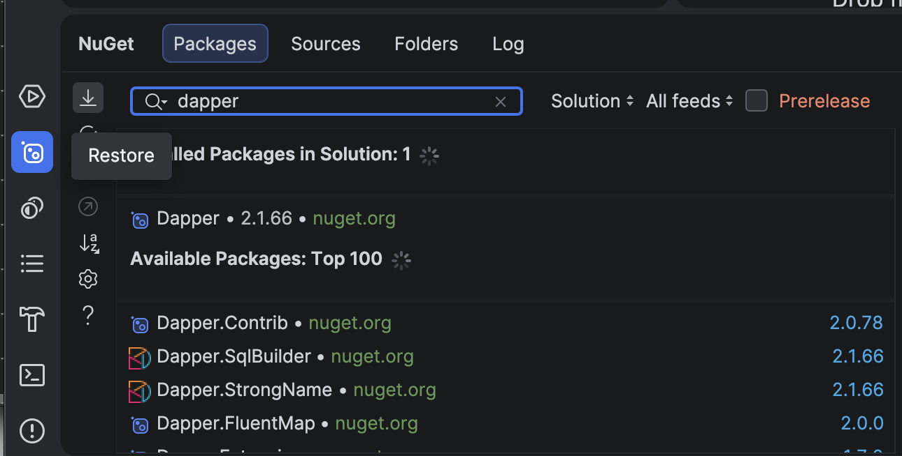
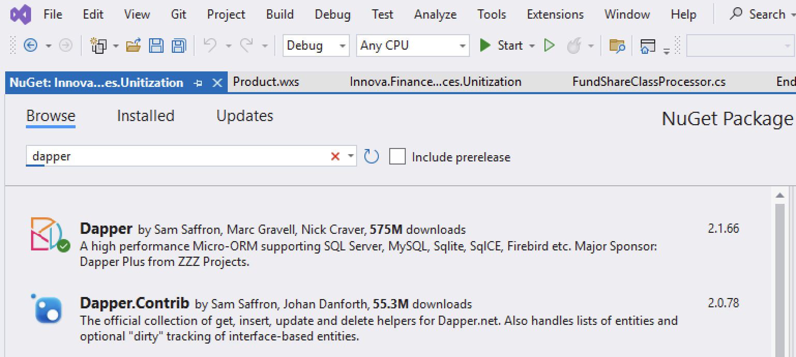
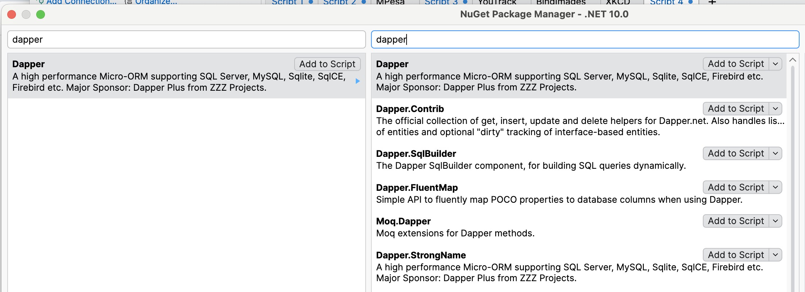
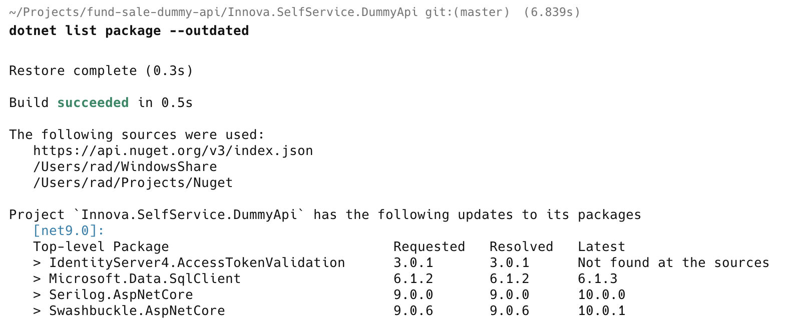
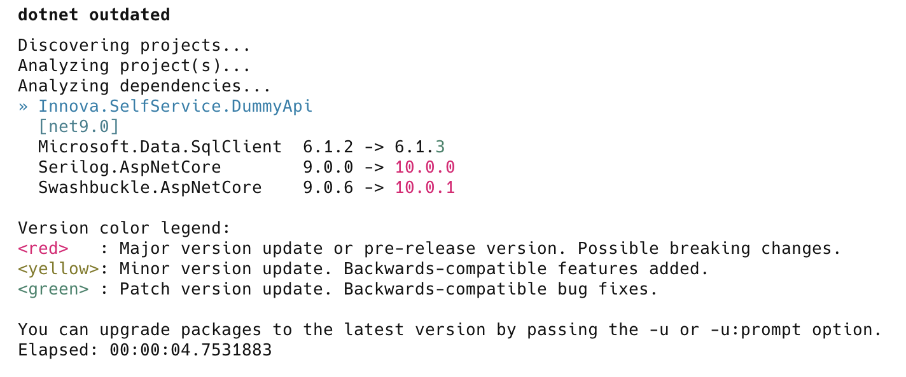
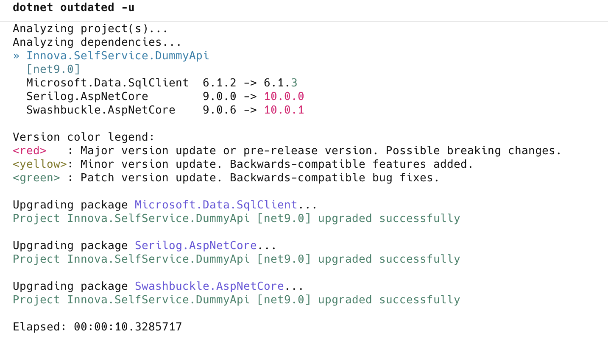
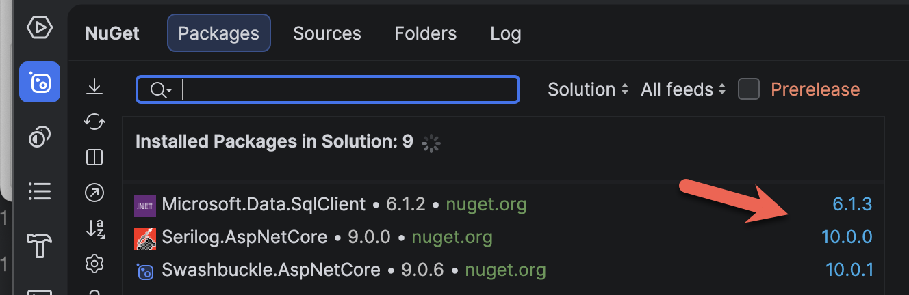

Adding a Nuget [package](https://www.nuget.org/) to a .NET project is a straightforward affair.

You'd typically do it via the command like this:

```bash
nuget add package Dapper
```

Your favourite IDE offers the same using some sort of UI.

[JetBrains](https://www.jetbrains.com/) [Rider](https://www.jetbrains.com/rider/) looks like this:



[Visual Studio](https://visualstudio.microsoft.com/) looks like this:



[LINQPad](https://www.linqpad.net/) looks like this:



The challenge arises when these packages are **updated**.

**How do you know about it?**

There are a number of ways:

## Native .NET Tool

The first way is to use the built-in .NET tool and run the following command in the project folder:

```bash
dotnet list package --outdated
```

This will print something like this:

```plaintext
Build succeeded in 0.5s

The following sources were used:
   https://api.nuget.org/v3/index.json
   /Users/rad/WindowsShare
   /Users/rad/Projects/Nuget

Project `Innova.SelfService.DummyApi` has the following updates to its packages
   [net9.0]: 
   Top-level Package                            Requested   Resolved   Latest                  
   > IdentityServer4.AccessTokenValidation      3.0.1       3.0.1      Not found at the sources
   > Microsoft.Data.SqlClient                   6.1.2       6.1.2      6.1.3                   
   > Serilog.AspNetCore                         9.0.0       9.0.0      10.0.0                  
   > Swashbuckle.AspNetCore                     9.0.6       9.0.6      10.0.1     
```



The challenge with this method is that it will tell you what is **outdated**, but it **doesn't offer any way to update**. You have to do that **yourself** - either by re-running the `dotnet add package` command or **manually editing** the `.csproj` to amend the version number.

## .NET Outdated Tool

The better way is to use the .[NET outdated](https://github.com/dotnet-outdated/dotnet-outdated) tool.

You install it like so:

```bash
dotnet tool install --global dotnet-outdated-tool
```

Or update it to the latest version like so:

```bash
dotnet tool update --global dotnet-outdated-tool
```

You then run it like so to see the outdated packages:

```bash
dotnet outdated
```

It will produce output like this:

```plaintext
Discovering projects...
Analyzing project(s)...
Analyzing dependencies...
» Innova.SelfService.DummyApi
  [net9.0]
  Microsoft.Data.SqlClient  6.1.2 -> 6.1.3 
  Serilog.AspNetCore        9.0.0 -> 10.0.0
  Swashbuckle.AspNetCore    9.0.6 -> 10.0.1

Version color legend:
<red>   : Major version update or pre-release version. Possible breaking changes.
<yellow>: Minor version update. Backwards-compatible features added.
<green> : Patch version update. Backwards-compatible bug fixes.
```



This tool has the additional benefit that it can also **upgrade** the packages.

```bash
dotnet oudated -u
```

This will produce output like this:



## IDE Update

Your IDE can also allow you to see and upgrade outdated packages.

**JetBrains Rider**, for instance, would look like this:



You do, however, have to update the packages **one by one**, unlike the `dotnet outdated` tool that can upgrade them **all at once**.

### TLDR

**There are various ways to update your project's nuget packages. The simplest is the `dotnet outdated tool`**
