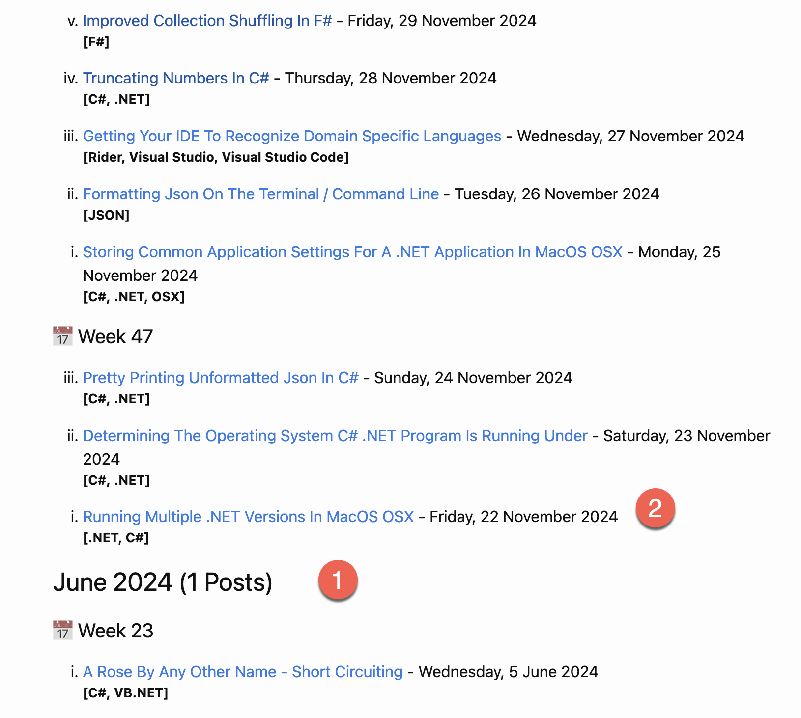
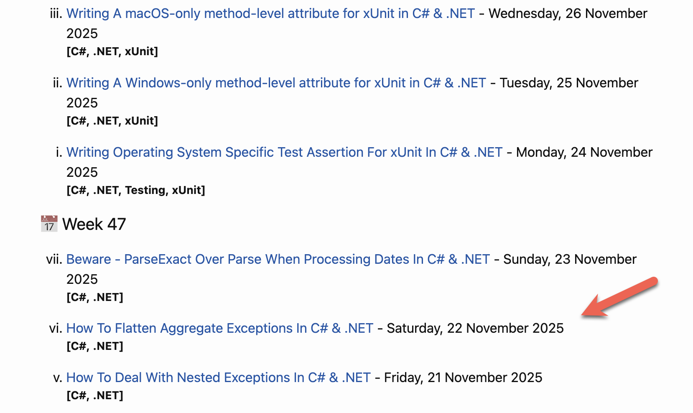
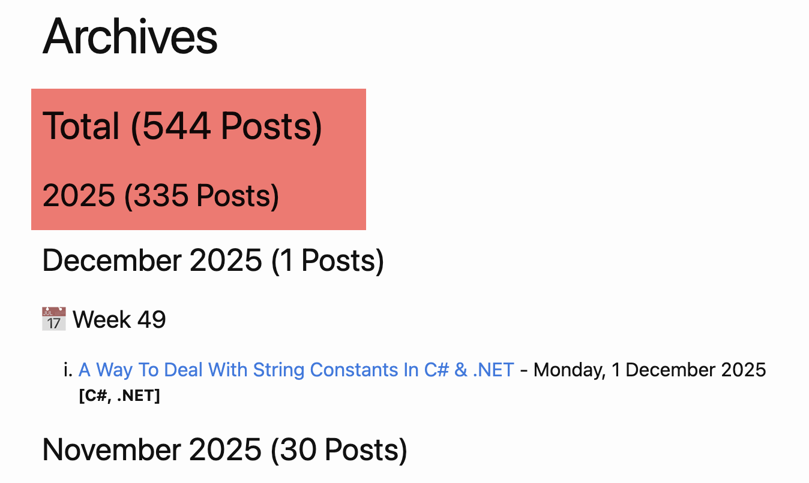

I had not noticed until earlier today that I had hit a significant **milestone**.

Last year, I began a **journey**.

On **22 November 2024**, I decided to prove a point to myself - that I could sustain the schedule of writing a technical blog post daily, principally around development of software in  .NET.

I hit day 365 a week or two back!

It has been an enlightening experience for several reasons:

1. I have been forced to develop a **consistency** habit
2. I have had to **research** and **cross-reference** a lot of material
3. I had to (where appropriate) develop **working sample code**
4. Everything I have written is publicly available - the [blog](https://github.com/conradakunga/Blog) itself and the [source code](https://github.com/conradakunga/BlogCode)

What are the benefits?

1. I have developed a **reference** that I often use myself!
2. I believe the **quality** of my writing, technical and otherwise, has improved
3. I have **met a lot of people**, physically and virtually, thanks to this resource
4. From the analytics, I have created a well-used **resource** that is used every day
5. I like to think I have made my mark by **contributing my knowledge** to the world at large

As I write this, here is the current position:

Here's to many more!
