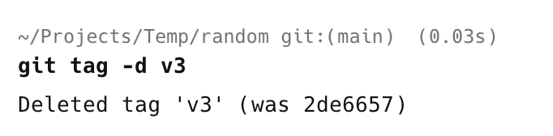

When working with the [git](https://git-scm.com/) source code control system, it is fairly standard practice to attach a **label to a specific commit**, typically for later **reference** and **retrieval**.

This is usually the case for version numbers that identify releases.

This is called a [tag](https://git-scm.com/book/en/v2/Git-Basics-Tagging).

To view **current** tags, you do it as follows:

```bash
git tag
```

This will list the current tags.


To **tag** a commit, you do it as follows:

```bash
git tag v3 -m "Version 3 (Tomcat)"
```

The version can be any `string` that you want.

If we now list, we should see the **new tag**.


There are times when you want to **delete** the tag. Perhaps it is **wrongly named**, or you have **changed your mind** about the version.

You would do it like this:

```bash
git tag -d v3
```

We pass the tag subcommand a `-d` parameter to signify **delete**, as well as the **tag** you want to **delete**. In this case, `v3`.

You will see the following in your terminal:



You will get a **confirmation** of the deleted tag.

**Note that only that tag is deleted, not the commit!**

### TLDR

**You can delete a git tag using the `git tag -d` command**

Happy hacking!
