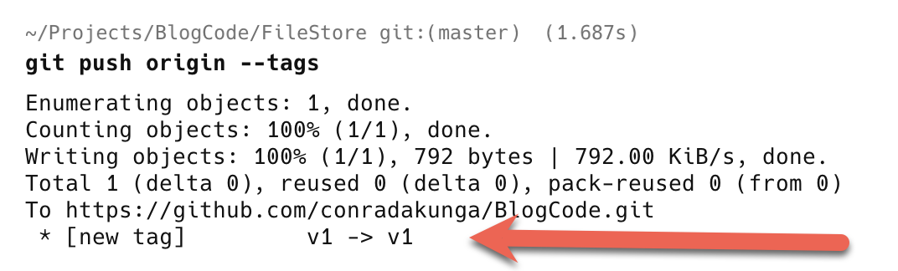
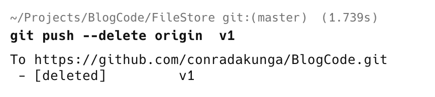

This is a follow-up to yesterday's post, "[How To Delete A Local Git Tag]()" when using the [git](https://git-scm.com/) source control management tool.

When using tags, you will generally tend to push them to the **remote**, so that **everyone can access them**.

You would typically do it like this:

```bash
git push origin --tags
```

You will see the following in your terminal.



When you delete a tag, it only gets deleted locally.

You also need to delete it remotely.

You do that as follows;

```bash
git push --delete origin  v1
```

Here we are using `git push` and passing the following:

1. The `--delete` subcommand
2. The **remote branch** to delete, in this case, `origin`
3. The **tag to delete**, in this case, `v1`

You should see something like the following:



Upon successful execution, we receive **confirmation**.

### TLDR

**To delete a remote tag, use the command git `push --delete origin  version`**

Happy hacking!
