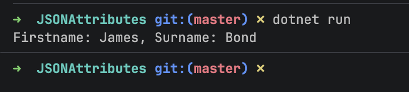
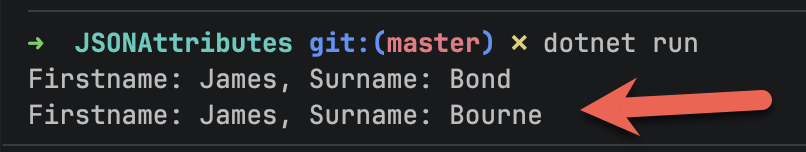
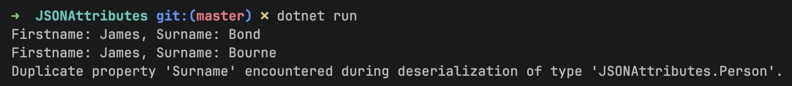

One of the realities of building software in the modern age is mitigating threats to the **security** and **integrity** of applications.

This is especially because most modern systems are connected via REST APIs, where data is passed around through `JSON`.

This is an obvious attack vector.

Take, for example, the following class:

```c#
public class Person
{
  public string Firstname { get; init; }
  public string Surname { get; init; }
}
```

Assume we had the following `JSON` produced from a REST endpoint:

```json
{
  "Firstname": "James",
  "Surname": "Bond",
}
```

We would typically deserialize the `JSON` like so:

```c#
using System.Text.Json;
using JSONAttributes;

const string json =
    """
    {
      "Firstname": "James",
      "Surname": "Bond"
    }
    """;
var person = JsonSerializer.Deserialize<Person>(json)!;
Console.WriteLine($"Firstname: {person.Firstname}, Surname: {person.Surname}");
```

If we run this code, we should see the following:



Now, suppose the `JSON` was in fact presented like this:

```json
{
  "Firstname": "James",
  "Surname": "Bond",
  "Surname": "Bourne"
}
```

Of note here is that the `Surname` attribute is **repeated** - once with ***Bond***, the second time with ***Bourne***.

If we deserialized this `JSON`:

```c#
const string jsonAttack =
    """
    {
      "Firstname": "James",
      "Surname": "Bond",
      "Surname": "Bourne"
    }
    """;

person = JsonSerializer.Deserialize<Person>(jsonAttack)!;
Console.WriteLine($"Firstname: {person.Firstname}, Surname: {person.Surname}");
```

We get the following result:



We can see here that the serializer has chosen ***Bourne*** over ***Bond***.

There is no way to know conclusively which `Surname` was meant.

The solution is to **reject** such input.

This can be accomplished using the [JsonSerializerOptions](https://learn.microsoft.com/en-us/dotnet/api/system.text.json.jsonserializeroptions?view=net-10.0) class, where we set the [AllowDuplicateProperties](https://learn.microsoft.com/en-us/dotnet/api/system.text.json.jsonserializeroptions.allowduplicateproperties?view=net-10.0#system-text-json-jsonserializeroptions-allowduplicateproperties) to false.

The code will look like this:

```c#
try
{
  person = JsonSerializer.Deserialize<Person>(jsonAttack, options)!;
  Console.WriteLine($"Firstname: {person.Firstname}, Surname: {person.Surname}");
}
catch (JsonException ex)
{
 Console.WriteLine(ex.Message);
}
```

If we run this code, we should see the following:



Here we can see that the serialization for the 3rd attempt **failed**.

### TLDR

**You can use the `JsonSerializerOptions` class, setting the `AllowDuplicateProperties` to `false` to prevent deserialization of `JSON` that has duplicate properties.**

The code is in my GitHub.

Happy hacking!
