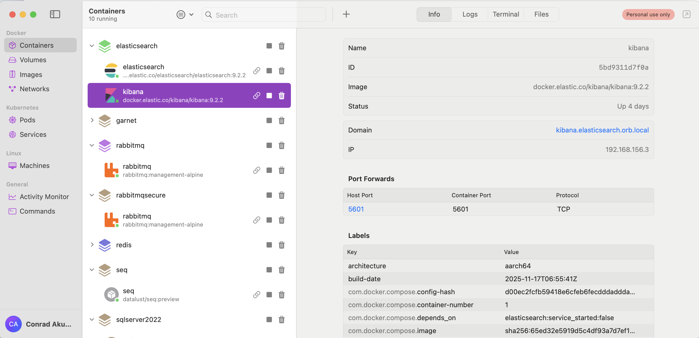
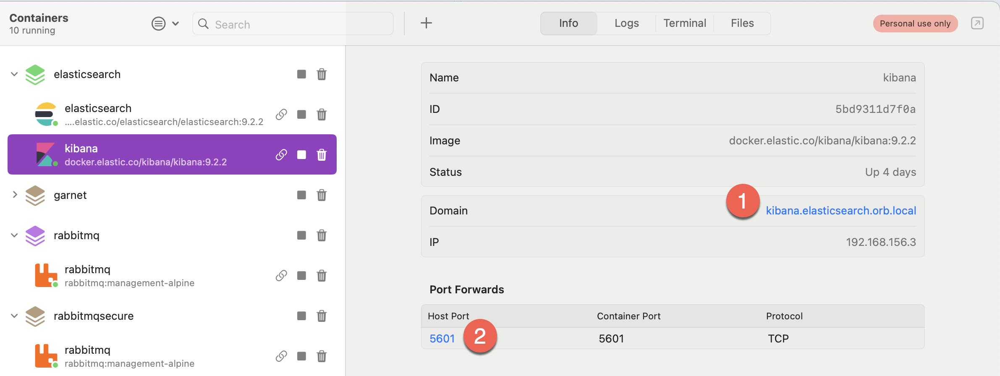
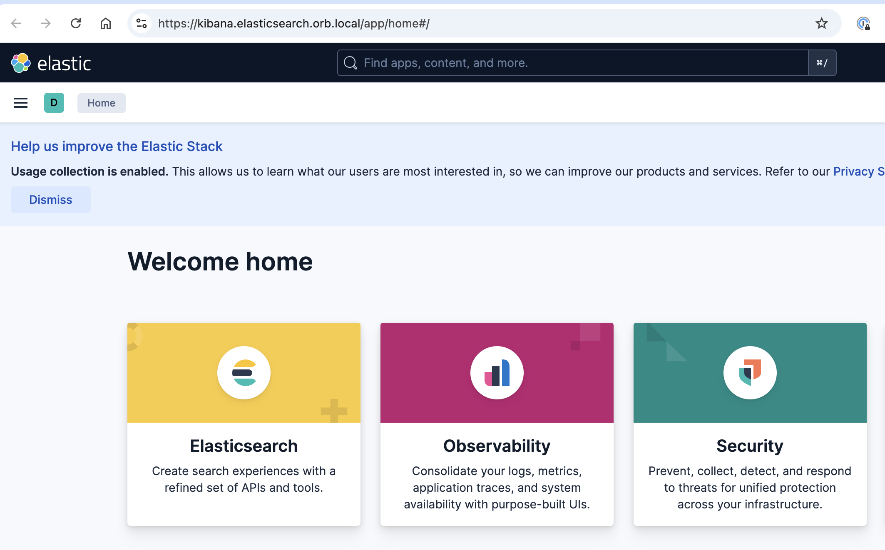
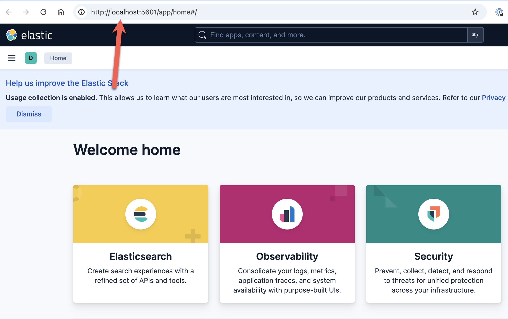

If you are a developer, you should be using [Docker](https://www.docker.com/) to quickly spin up **predictable**, **preconfigured** infrastructure, ranging from **database engines** to **message queues** to **utility** applications. You can then go ahead to **persist data** from these ephemeral tools if you want.

If you are using [macOS](https://en.wikipedia.org/wiki/MacOS), the tool of choice is [Orbstack](https://orbstack.dev/), which I have been using happily for many years.

One of the benefits of `Orbstack` is that (where applicable) it generates a working local URL for each container.

Take, for example, my [Kibana](https://www.elastic.co/kibana) container.

There are two **clickable** links:

1. This will launch `Kibana` using **Orbstack's generated URL.**

    

2. This will launch `Kibana` using a `localhost` URL with the **mapped port**.

    

This saves you from having to remember ports and URLs for each container.

### TLDR

**Orbstack generates (and exposes) clickable links for your running containers.**

Happy hacking!
