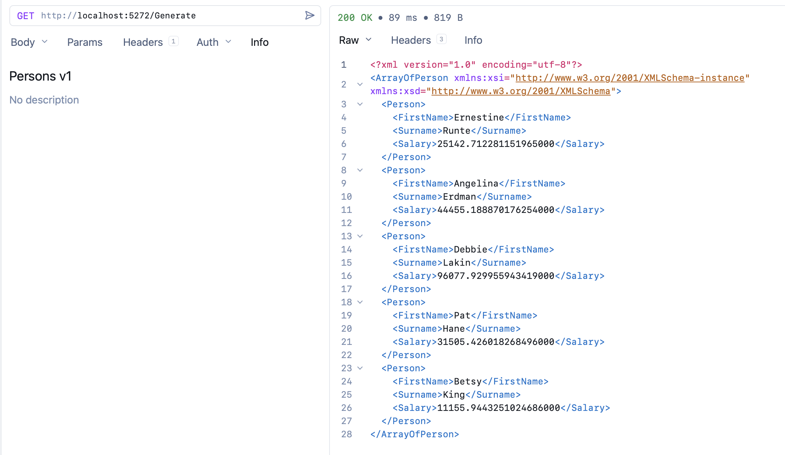

In two previous posts, "[Conditionally Output XML Or JSON Using ASP.NET Minimal API]()" and "[Improving ASP.NET Content Negotiation XML Serialization Performance Using A RecyclableMemoryStream]()", we looked at how to generate `XML` output on ASP.NET using [Minimal APIs](https://learn.microsoft.com/en-us/aspnet/core/fundamentals/minimal-apis?view=aspnetcore-10.0) and the [Carter](https://www.nuget.org/packages/carter) Library.

In this post, we will look at how you can still generate `XML` with the following constraints:

- You cannot (or don't want to) use **controllers**.
- You cannot (or don't want to) use `Carter`, or any other **external package**.

Let us take our sample `type`, the `Person`.

```c#
public sealed class Person
{
  public required string FirstName { get; init; }
  public required string Surname { get; init; }
  public required decimal Salary { get; init; }
}
```

Our sample API will produce a number of `Person` objects.

Given that we are using a minimal API, all the goodies we get for free when we use **controllers** are **unavailable**, such as automatic [content negotiation](https://developer.mozilla.org/en-US/docs/Web/HTTP/Guides/Content_negotiation).

We therefore **cannot configure serialization into the native pipeline**, so we have to do the serialization **ourselves**.

The code will look like this:

```c#
app.MapGet("/Generate", async (HttpContext ctx) =>
{
    var faker = new Faker<Person>().UseSeed(0)
        .RuleFor(person => person.FirstName, faker => faker.Person.FirstName)
        .RuleFor(person => person.Surname, faker => faker.Person.LastName)
        .RuleFor(person => person.Salary, faker => faker.Random.Decimal(10_000, 99_000));

    var serializer = new XmlSerializer(typeof(List<Person>));
    await using var ms = new MemoryStream();
    await using (var writer = XmlWriter.Create(
                     ms,
                     new XmlWriterSettings
                     {
                         Encoding = Encoding.UTF8,
                         Indent = true,
                         Async = true
                     }))
    {
        serializer.Serialize(writer, faker.Generate(5));
    }

    ms.Position = 0;
    await ms.CopyToAsync(ctx.Response.Body);
});
```

A couple of things to note here:

1. We are injecting the [HttpContext](https://learn.microsoft.com/en-us/dotnet/api/microsoft.aspnetcore.http.httpcontext?view=aspnetcore-10.0) so we can write directly to its **response stream**.
2. We are **serializing** the collection of `Person` objects into a [MemoryStream](https://learn.microsoft.com/en-us/dotnet/api/system.io.memorystream?view=net-10.0), rather than directly into the [HttpResponse](https://learn.microsoft.com/en-us/dotnet/api/microsoft.aspnetcore.http.httpresponse?view=aspnetcore-10.0) body. This is because the runtime **does not like synchronous operations**, and in fact **throws an exception if a synchronous method tries to manipulate the response body**.
3. Once we have the serialized data in the `MemoryStream`, we **asynchronously** write it to the **response body**.

If we run this code, we should see the following:



And thus, we can generate XML with our API.

### TLDR

**To generate `XML` using Minimal APIs without external libraries like `Carter`, you need to serialize yourself.**

The code is in my [Github](https://github.com/conradakunga/BlogCode/tree/master/2025-12-13%20-%20XML).

Happy hacking!
