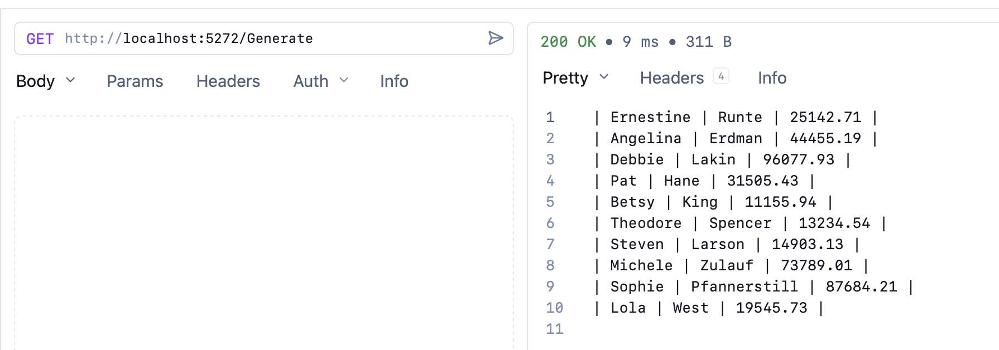
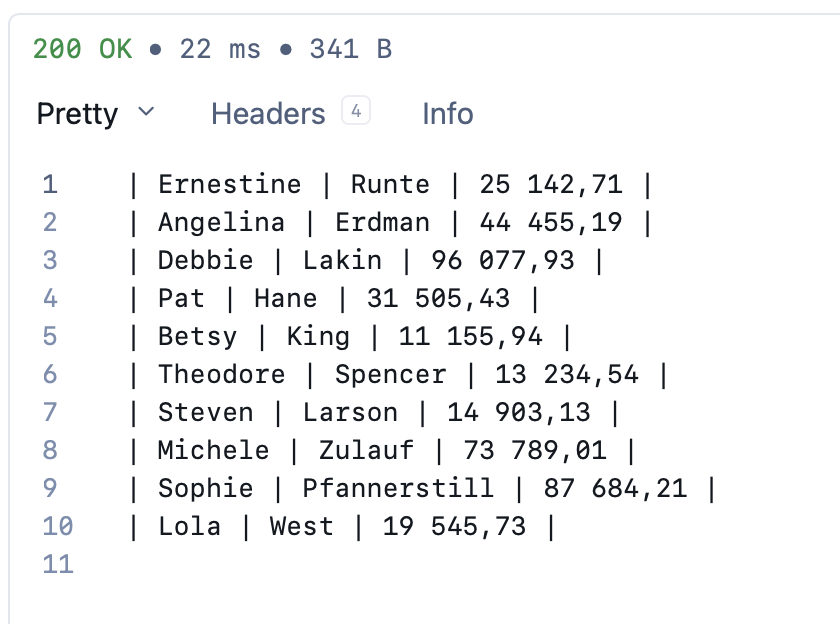
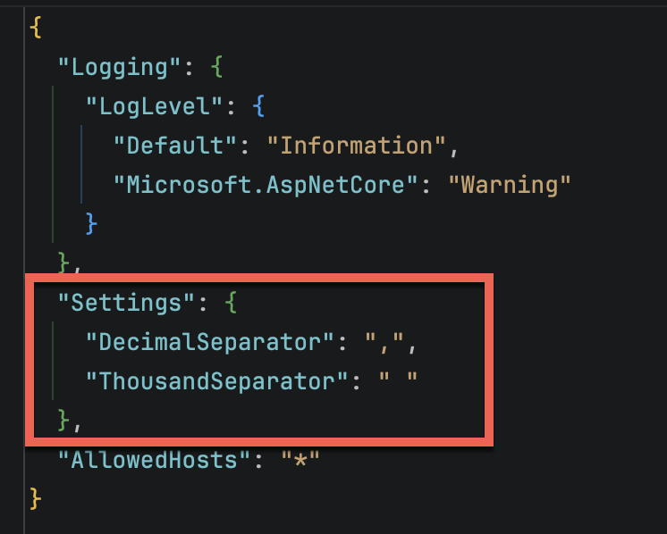

This article is part of the [2025 C# Advent Calendar.](https://www.csadvent.christmas/)

I participated in the 2024 [C# Advent](https://www.csadvent.christmas/archive/2024) and posted "[Customizing Object Equality In C# & .NET]()" and "[Caching In .NET Applications & The Hybrid Cache]()"

[Localization](https://developer.mozilla.org/en-US/docs/Glossary/Localization) and other regional concerns are among the problems you will frequently run into when developing applications for use across **different countries and locale**s.

Take, for example, this scenario.

You have a simple API that generates an **export** of some data, in a **custom format** dictated by the client.

The `type` the API deals with is as follows:

```c#
public sealed class Person
{
  public required string FirstName { get; init; }
  public required string Surname { get; init; }
  public required decimal Salary { get; init; }
}
```

This is exposed via a simple API as follows:

```c#
using System.Text;
using Bogus;

var builder = WebApplication.CreateBuilder(args);
var app = builder.Build();

app.MapGet("/Generate", () =>
{
    var faker = new Faker<Person>()
        .RuleFor(person => person.FirstName, faker => faker.Person.FirstName)
        .RuleFor(person => person.Surname, faker => faker.Person.LastName)
        .RuleFor(person => person.Salary, faker => faker.Random.Decimal(10_000, 99_000));
    var sb = new StringBuilder();
    foreach (var person in faker.Generate(10).ToList())
    {
        sb.AppendLine($"| {person.FirstName} | {person.Surname} | {person.Salary.ToString("0.00")} |");
    }

    return Results.Text(sb.ToString());
});

app.Run();
```

Here I am using the [Bogus](https://www.nuget.org/packages/bogus) library to generate 10 `Person` instances, and I am using a **seed** of `0` so we always get the same results. (You can use any other number as a seed)

If we run this code, we get the following results:



Here I am using the [Yaak](https://yaak.app/) client.

```plaintext
| Ernestine | Runte | 25142.71 |
| Angelina | Erdman | 44455.19 |
| Debbie | Lakin | 96077.93 |
| Pat | Hane | 31505.43 |
| Betsy | King | 11155.94 |
| Theodore | Spencer | 13234.54 |
| Steven | Larson | 14903.13 |
| Michele | Zulauf | 73789.01 |
| Sophie | Pfannerstill | 87684.21 |
| Lola | West | 19545.73 |
```

Suppose the consumer then gives you the following information:

> We have recently onboarded a new vendor for an upstream system, and they require the salary to use the comma as the decimal separator and the space as the thousand separator.

There are a number of solutions to this problem.

1. Find an **existing culture** that uses this format and use that inn our code
2. **Explicitly write code** to do this heavy lifting for us.

## Use an existing culture

From a quick search, the following countries indeed use this format:

- France
- Germany
- Switzerland
- Russia
- Sweden
- Finland
- Norway

Let us pick **France**.

We can update our code to use the [French locale](https://www.localeplanet.com/dotnet/fr-FR/index.html) internally like this:

```c#
app.MapGet("/v2/Generate", () =>
{
  // Create an instance of the french locale
  var french = new CultureInfo("fr-FR");
  var faker = new Faker<Person>().UseSeed(0)
    .RuleFor(person => person.FirstName, faker => faker.Person.FirstName)
    .RuleFor(person => person.Surname, faker => faker.Person.LastName)
    .RuleFor(person => person.Salary, faker => faker.Random.Decimal(10_000, 99_000));
  var sb = new StringBuilder();
  foreach (var person in faker.Generate(10).ToList())
  {
      // Format the salary
      sb.AppendLine($"| {person.FirstName} | {person.Surname} | {person.Salary.ToString("0,0.00", french)} |");
  }

  return Results.Text(sb.ToString());
});
```

This will output the following:



So far, so good.

There are, however, some **problems** with this approach.

1. If the **separators change**, you will need to find **another locale** that meets those requirements.
2. Even if the separators remain the same, if **additional fields** are added in the future, like `Date` and `Time`, you are stuck with the [French date and time formatting](https://en.wikipedia.org/wiki/Date_and_time_notation_in_France).

A better option is to **do it ourselves**.

## Explicit custom formatting 

Here we have two options:

1. Create a **completely new locale** and configure it as appropriate
2. Take an **existing locale and change** just the bits that we need.

The second option is simpler.

First, we will need to create a `class` that stores our **settings**.

```c#
public sealed class Settings
{
    [Required(AllowEmptyStrings = true)] public string DecimalSeparator { get; set; } = ".";
    [Required(AllowEmptyStrings = true)] public string ThousandSeparator { get; set; } = ",";
}
```

We are adding the [Required](https://learn.microsoft.com/en-us/dotnet/api/system.componentmodel.dataannotations.requiredattribute?view=net-10.0) attribute so that the **runtime will validate** that they are provided at startup. We are setting [AllowEmptyStrings](https://learn.microsoft.com/en-us/dotnet/api/system.componentmodel.dataannotations.requiredattribute.allowemptystrings?view=net-10.0#system-componentmodel-dataannotations-requiredattribute-allowemptystrings) to true; otherwise, the runtime will reject a space.

Next, we configure our ASP.NET pipeline to **register this class** as an injectable option.

```c#
var builder = WebApplication.CreateBuilder(args);
// Register our settings
builder.Services.AddOptions<Settings>()
    .Bind(builder.Configuration.GetSection(nameof(Settings)))
    .ValidateDataAnnotations()
    .ValidateOnStart();
```

Next, we update our **endpoint signature** to **inject** the options.

```c#
app.MapGet("/v3/Generate", (IOptions<Settings> options) =>
{
  // Fetch the settings into a variable
  var settings = options.Value;
  //
  // Code
  //
});
```

Next, we update the **endpoint body** to **clone an existing locale** and configure our behaviour using the injected `Settings`.

```c#
app.MapGet("/v3/Generate", (IOptions<Settings> options) =>
{
  var settings = options.Value;
  // We are cloning an existing one instead of creating a new one
  // to avoid the need to specify all the settings.
  var numberFormatInfo = (NumberFormatInfo)
  CultureInfo.InvariantCulture.NumberFormat.Clone();
  // Set the formats
  numberFormatInfo.NumberDecimalSeparator = settings.DecimalSeparator;
  numberFormatInfo.NumberGroupSeparator = settings.ThousandSeparator;
  var faker = new Faker<Person>().UseSeed(0)
    .RuleFor(person => person.FirstName, faker => faker.Person.FirstName)
    .RuleFor(person => person.Surname, faker => faker.Person.LastName)
    .RuleFor(person => person.Salary, faker => faker.Random.Decimal(10_000, 99_000));
  var sb = new StringBuilder();
  foreach (var person in faker.Generate(10).ToList())
  {
    sb.AppendLine(
    $"| {person.FirstName} | {person.Surname} | {person.Salary.ToString("0,0.00", numberFormatInfo)} |");
  }

  return Results.Text(sb.ToString());
});
```

Finally, we update the `appsettings.json` to add our new settings.

```c#
{
  "Logging": {
    "LogLevel": {
      "Default": "Information",
      "Microsoft.AspNetCore": "Warning"
    }
  },
  "Settings": {
    "DecimalSeparator": ".",
    "ThousandSeparator": ","
  },
  "AllowedHosts": "*"
}
```

This is the new section:



If we run this code, we should get the same result:


The benefit of this technique is that if we subsequently need to handle the formatting of things like dates, the same technique can be leveraged.

### TLDR

**You can control the formatting of values for exotic requests very flexibly by modifying existing locales to suit your purposes.**

The code is in my [Github](https://github.com/conradakunga/BlogCode/tree/master/2025-12-14%20-%20Separators).

Happy hacking!
